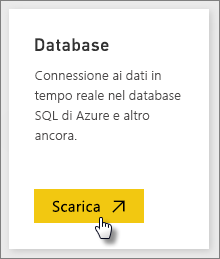
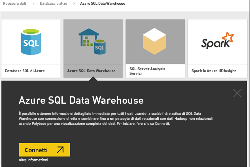
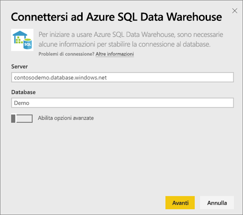
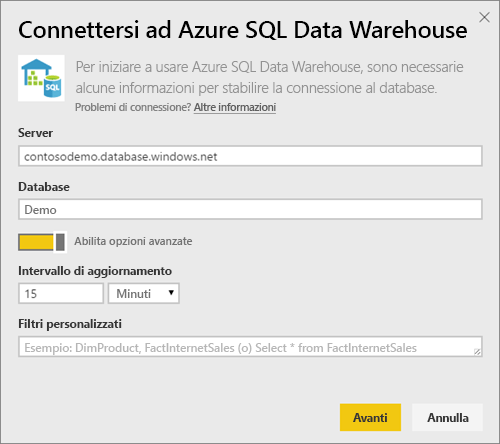
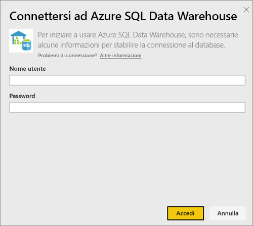
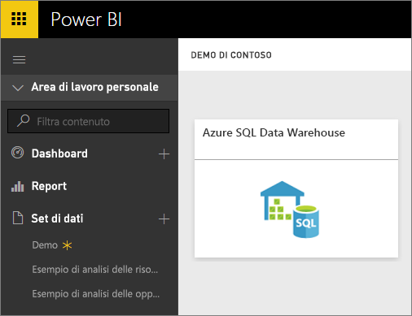
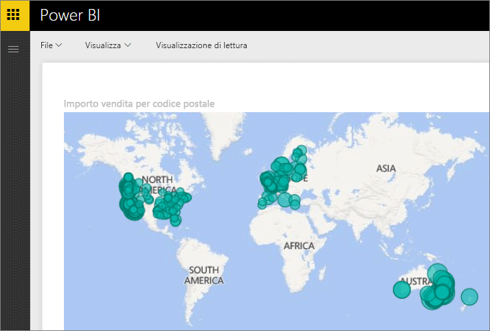
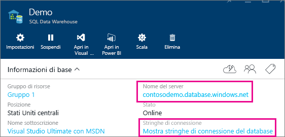

# Azure SQL Data Warehouse con DirectQuery
Azure SQL Data Warehouse con DirectQuery consente di creare report dinamici basati su dati e metriche già presenti in Azure SQL Data Warehouse. Con DirectQuery, le query vengono reinviate ad Azure SQL Data Warehouse in tempo reale durante l'esplorazione dei dati. Questa funzionalità, unita alla scalabilità di SQL Data Warehouse, consente agli utenti di creare in pochi minuti report dinamici in base a svariati terabyte di dati. Per di più, l'introduzione del pulsante **Apri in Power BI** consente agli utenti di connettere Power BI direttamente ad SQL Data Warehouse senza dover specificare manualmente le informazioni.

Quando si usa il connettore SQL Data Warehouse:

* Specificare il nome completo del server durante la connessione (vedere di seguito per i dettagli)
* Verificare che le regole firewall per il server siano configurate su "Consenti l'accesso a Servizi di Azure"
* A ogni azione, come la selezione di una colonna o l'aggiunta di un filtro, verrà inviata una query direttamente al data warehouse
* I riquadri vengono aggiornati all'incirca ogni 15 minuti.  L'aggiornamento non deve essere pianificato È possibile regolare questo intervallo nelle impostazioni avanzate al momento della connessione.
* La funzione Domande e risposte non è disponibile per i set di dati di DirectQuery
* Le modifiche allo schema non vengono selezionate automaticamente

Queste restrizioni e note possono cambiare dal momento che le esperienze vengono costantemente migliorate. La procedura per la connessione è illustrata di seguito.

## Uso del pulsante "Apri in Power BI"
Il modo più semplice per spostarsi tra SQL Data Warehouse e Power BI consiste nell'usare il pulsante **Apri in Power BI** nel portale di anteprima di Azure, che consente di iniziare a creare facilmente nuovi dashboard in Power BI.

1. Per iniziare, passare all'istanza di SQL Data Warehouse nel portale di anteprima di Azure. Si noti che al momento SQL Data Warehouse è presente solo nel portale di anteprima di Azure.
2. Fare clic sul pulsante **Apri in Power BI**
   
    
3. Se non è possibile accedere direttamente oppure non è disponibile un account di Power BI, sarà necessario eseguire l'accesso.
4. Si verrà reindirizzati alla pagina di connessione di SQL Data Warehouse, precompilata con le informazioni relative al proprio SQL Data Warehouse. Immettere le proprie credenziali e premere Connetti per creare una connessione.

## Connessione tramite Power BI
SQL Data Warehouse è elencato anche nella pagina Recupera dati di Power BI. 

1. Selezionare **Recupera dati** nella parte inferiore del riquadro di spostamento sinistro.  
   
    
2. In **Database**, selezionare **Recupera**.
   
    
3. Selezionare **SQL Data Warehouse**\>**Connetti**.
   
    
4. Immettere le informazioni necessarie per connettersi. Nella sezione in cui **trovare i parametri** descritta sotto, viene indicata la posizione dei dati nel portale di Azure.
   
    
   
    
   
    
   
   > [!NOTE]
   > Il nome utente sarà un utente che viene definito nell'istanza di Azure SQL Data Warehouse.
   > 
   > 
5. Analizzare il set di dati selezionando il nuovo riquadro oppure il set di dati appena creato, indicato dall'asterisco. Questo set di dati avrà lo stesso nome del proprio database.
   
    
6. È possibile esplorare tutte le tabelle e le colonne. Selezionando una colonna verrà inviata una query all'origine e verrà quindi creato dinamicamente l'oggetto visivo. I filtri verranno anche convertiti in query nel proprio data warehouse. Questi elementi visivi possono essere salvati in un nuovo report e aggiunti al proprio dashboard.
   
    

## Trovare i valori dei parametri
I nomi completi del server e del database sono disponibili nel portale di anteprima di Azure. Si noti che al momento SQL Data Warehouse è presente solo nel portale di anteprima di Azure.

> [!NOTE]
> Se il tenant di Power BI è nella stessa area di Azure SQL Data Warehouse non saranno applicati costi di uscita. Per sapere dove si trova il tenant di Power BI usare [queste istruzioni](https://docs.microsoft.com/en-us/power-bi/service-admin-where-is-my-tenant-located).
>

## Passaggi successivi
[Introduzione a Power BI](service-get-started.md)  
[Recuperare dati per Power BI](service-get-data.md)  
[Azure SQL Data Warehouse](https://azure.microsoft.com/en-us/documentation/services/sql-data-warehouse/)  

Altre domande? [Provare la community di Power BI](http://community.powerbi.com/)