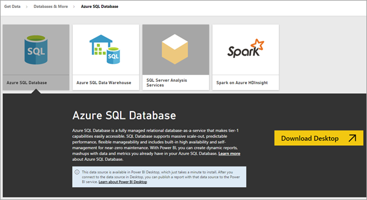
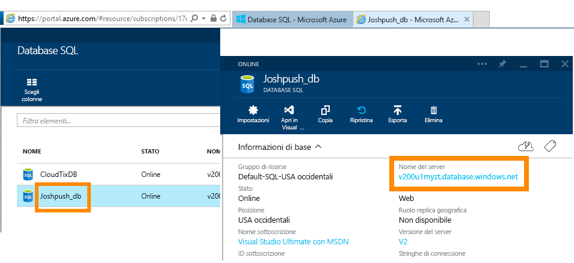
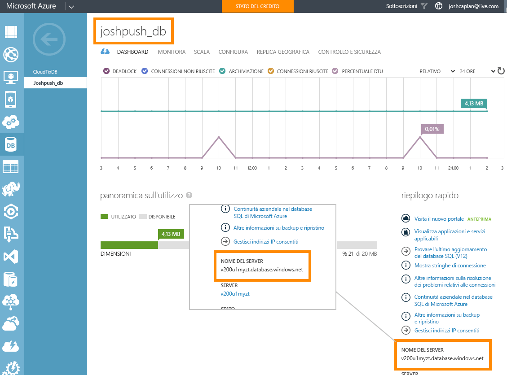

# Database SQL di Azure con DirectQuery
Informazioni su come connettersi direttamente al database SQL di Azure e creare report che usano dati in tempo reale. È possibile mantenere i dati nell'origine invece che in Power BI.

Con DirectQuery, le query vengono inviate nuovamente al database SQL di Azure durante l'esplorazione dei dati nella visualizzazione report. Si tratta di un'esperienza consigliata per gli utenti che hanno familiarità con i database e le entità cui si connettono.

**Note:**

* Specificare il nome completo del server durante la connessione (vedere di seguito per altri dettagli).
* Verificare che le regole firewall per il database siano impostate su "[Consenti l'accesso a Servizi di Azure](https://msdn.microsoft.com/library/azure/ee621782.aspx)".
* A ogni azione, come la selezione di una colonna o l'aggiunta di un filtro, verrà inviata una query al database.
* I riquadri vengono aggiornati all'incirca ogni 15 minuti. L'aggiornamento non deve essere pianificato. È possibile regolare questo intervallo nelle impostazioni avanzate al momento della connessione.
* La funzione Domande e risposte non è disponibile per i set di dati di DirectQuery
* Le modifiche allo schema non vengono selezionate automaticamente.

Queste restrizioni e note possono cambiare dal momento che le esperienze vengono costantemente migliorate. La procedura per la connessione è illustrata di seguito. 

## Power BI Desktop e DirectQuery
Per connettersi al database SQL di Azure tramite DirectQuery, è necessario usare Power BI Desktop. Questo approccio offre capacità e flessibilità aggiuntive. I report creati con Power BI Desktop potranno successivamente essere pubblicati nel servizio Power BI. Sono disponibili altre informazioni su come connettersi al [database SQL di Azure tramite DirectQuery](desktop-use-directquery.md) in Power BI Desktop. 

## Connessione tramite Power BI
Non è più possibile connettersi al database SQL di Azure direttamente dal servizio Power BI. Quando si seleziona il [connettore Database SQL di Azure](https://app.powerbi.com/getdata/bigdata/azure-sql-database-with-live-connect), verrà chiesto di stabilire la connessione dall'interno di Power BI Desktop. Si potranno quindi pubblicare i report di Power BI Desktop nel servizio Power BI. 

### Trovare i valori dei parametri
I nomi completi del server e del database sono disponibili nel portale di Azure.

## Passaggi successivi
[Usare DirectQuery in Power BI Desktop](desktop-use-directquery.md)  
[Introduzione a Power BI](service-get-started.md)  
[Recuperare dati per Power BI](service-get-data.md)  
Altre domande? [Provare la community di Power BI](http://community.powerbi.com/)

