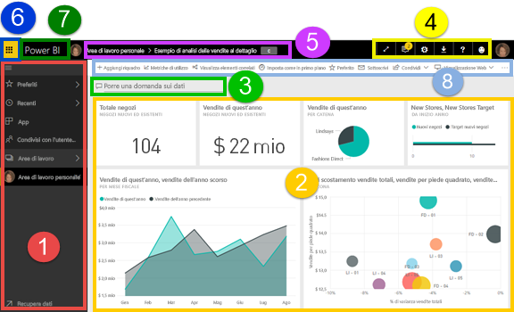
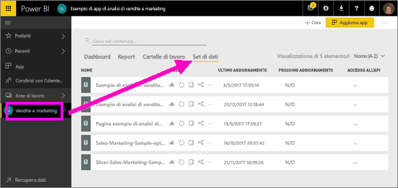
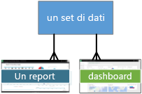
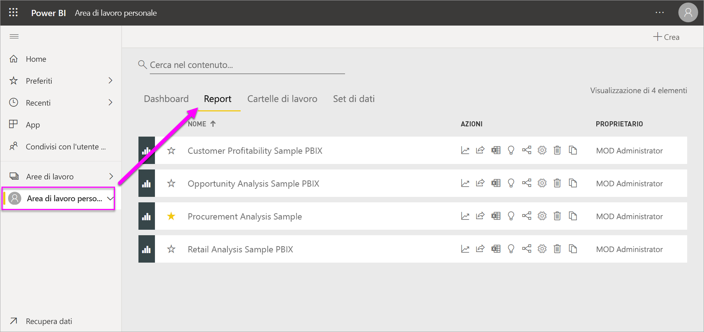
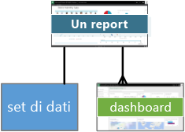
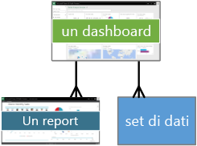
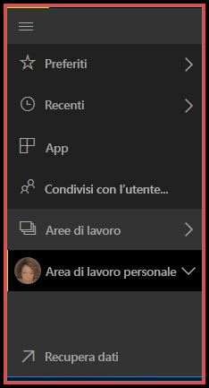
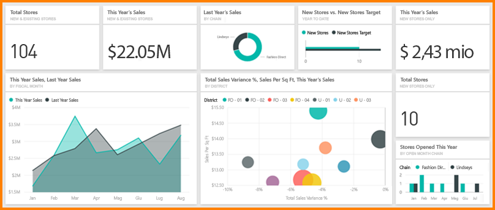
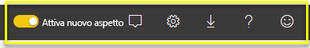

# Concetti di base sulle finestre di progettazione del servizio Power BI

Questo articolo presuppone che l'[iscrizione al servizio Power BI](service-self-service-signup-for-power-bi.md) sia già stata effettuata e che siano stati [aggiunti alcuni dati](service-get-data.md). Se non sono ancora presenti dati, è possibile installare un [pacchetto di contenuto di esempio di Power BI](sample-datasets.md#the-power-bi-samples-as-content-packs).

Quando si apre il servizio Power BI viene visualizzato un **_dashboard_**. I dashboard differenziano il servizio Power BI da Power BI Desktop.

Le principali funzionalità dell'interfaccia utente del servizio Power BI sono le seguenti:

1. riquadro di spostamento a sinistra
2. area di disegno (in questo caso, dashboard con riquadri)
3. Casella delle domande di Domande e risposte
4. pulsanti delle icone, inclusa la guida e i commenti e suggerimenti
5. titolo del dashboard (percorso di navigazione)
6. Icona di avvio delle app di Office 365
7. pulsante Home di Power BI
8. Pulsanti delle icone con etichette

Queste funzionalità verranno illustrate più avanti. Per il momento verranno presi in esame alcuni concetti di Power BI.

In alternativa, è possibile guardare questo video prima di leggere il resto di questo articolo.  Nel video si esamineranno i concetti di base e verrà fornita una panoramica del servizio Power BI.

<iframe width="560" height="315" src="https://www.youtube.com/embed/B2vd4MQrz4M" frameborder="0" allowfullscreen></iframe>

## Concetti di Power BI
I quattro elementi fondamentali di Power BI sono: **_dashboard_**, **_report_**, **_cartelle di lavoro_** e **_set di dati_**. Questi elementi sono organizzati in **_aree di lavoro_**. È importante comprendere le aree di lavoro prima di approfondire i quattro elementi fondamentali.

## Workspaces
Le aree di lavoro sono contenitori per i dashboard, i report, le cartelle di lavoro e i set di dati in Power BI. Sono disponibili due tipi di aree di lavoro, ovvero l'*Area di lavoro personale* e le *aree di lavoro per le app*. Che cos'è un'*app*? Un'*app* di Power BI è una raccolta di dashboard e report creati per visualizzare le metriche principali per l'organizzazione. Le app sono interattive ma non possono essere modificate.

- L'*Area di lavoro personale* è l'area di lavoro dedicata di ogni cliente Power BI per usare il contenuto personale. Solo l'utente può accedere all'Area di lavoro personale. È possibile condividere dashboard e report dall'Area di lavoro personale. Per collaborare a dashboard e report o creare un'app, è necessario usare un'area di lavoro per le app.      
-  Le *aree di lavoro per le app* vengono usate per collaborare e condividere il contenuto con i colleghi. Sono anche il luogo in cui si creano, pubblicano e gestiscono le app per l'organizzazione. È possibile considerarle come contenitori e aree di gestione temporanea per il contenuto che costituirà un'app di Power BI. È possibile aggiungere i colleghi alle aree di lavoro per le app e collaborare su dashboard, report, cartelle di lavoro e set di dati. Tutti i membri delle aree di lavoro per le app necessitano di licenze di Power BI Pro, ma gli utenti delle app, ovvero i colleghi che hanno accesso alle app, non devono necessariamente disporre di una licenza Pro.  

Per altre informazioni, vedere la sezione **Condividere il lavoro** del sommario, iniziando da [Come collaborare e condividere dashboard e report](service-how-to-collaborate-distribute-dashboards-reports.md)

Ora verranno approfonditi gli elementi fondamentali di Power BI. Poiché i dashboard o i report sono utili solo quando contengono dati, vengono ora descritti i **set di dati**.

## Set di dati
Un *set di dati* è una raccolta di dati che si *importa* o a cui si stabilisce una *connessione*. Power BI consente di connettersi a tutti i set di dati, importarli e riunirli in un'unica posizione.  

I set di dati sono associati alle *aree di lavoro* e un singolo set di dati può far parte di più aree di lavoro. Quando si apre un'area di lavoro, i set di dati associati sono elencati nella scheda **Set di dati**. Ogni set di dati elencato rappresenta una singola origine dati, ad esempio una cartella di lavoro di Excel in OneDrive, un set di dati in formato tabulare SSAS locale o un database di Salesforce. Sono supportate numerose origini dati differenti, che sono in continuo aumento. [Fare clic sul collegamento per visualizzare l'elenco dei tipi di set di dati utilizzabili con Power BI](service-get-data.md).

Nell'esempio seguente è stata selezionata l'area di lavoro per le app "Vendite e marketing" ed è stato fatto clic sulla scheda **Set di dati**.

**UN** set di dati...

* può essere usato più volte in una o in numerose aree di lavoro.
* può essere usato in report diversi.
* Le visualizzazioni di un unico set di dati possono essere usate in dashboard diversi.

  

Per [connettersi a un set di dati o importarlo](service-get-data.md), selezionare **Recupera dati** (nella parte inferiore della barra di spostamento) oppure selezionare **+ Crea > Set di dati** nell'angolo in alto a destra. Seguire le istruzioni per la connessione o l'importazione dell'origine specifica e aggiungere il set di dati all'area di lavoro attiva. I nuovi set di dati sono contrassegnati con un asterisco giallo. Le operazioni effettuate in Power BI non comportano la modifica del set di dati sottostante.

Se si [fa parte di un'**_area di lavoro per le app_**](service-collaborate-power-bi-workspace.md), i set di dati aggiunti da un membro dell'area di lavoro sono disponibili per gli altri membri dell'area di lavoro.

I set di dati possono essere aggiornati, rinominati, esplorati e rimossi. Usare un set di dati per creare un report da zero o tramite l'esecuzione di [informazioni rapide](service-insights.md).  Per visualizzare i report e i dashboard che già usano un set di dati, selezionare **Visualizza elementi correlati**. Per esplorare un set di dati, selezionarlo. Il set di dati viene quindi aperto nell'editor di report in cui è possibile approfondire l’analisi dei dati e creare visualizzazioni. Passiamo all'argomento successivo, ossia i report.

### Approfondimento
* [Che cos'è Power BI Premium?](service-premium.md)
* [Recuperare dati per Power BI](service-get-data.md)
* [Set di dati di esempio per Power BI](sample-datasets.md)

## Report
Un report di Power BI è costituito da una o più pagine di visualizzazioni (grafici e diagrammi come grafici a linee, grafici a torta, mappe ad albero e molti altri). Le visualizzazioni sono dette anche **_oggetti visivi_**. Tutte le visualizzazioni in un report provengono da un unico set di dati. I report possono essere creati da zero all'interno di Power BI, importati con dashboard condivisi dai colleghi oppure essere creati quando l'utente si connette ai set di dati da Excel, Power BI Desktop, database, applicazioni SaaS e [app](service-get-data.md).  Ad esempio, quando si è connessi a una cartella di lavoro di Excel che contiene fogli di Power View, Power BI crea un report basato su tali fogli. Inoltre, quando ci si connette a un'applicazione SaaS, Power BI importa un report predefinito.

È possibile visualizzare e interagire con i report in due modi, ovvero in [Visualizzazione di lettura e Visualizzazione di modifica](service-reading-view-and-editing-view.md).  Solo la persona che ha creato il report, i comproprietari e gli utenti autorizzati possono usare tutte le funzionalità di esplorazione, progettazione, creazione e condivisione in **_Visualizzazione di modifica_**. Coloro che condividono il report possono esplorarlo e interagire in **_Visualizzazione di lettura_**.   

Quando si apre un'area di lavoro, i report associati sono elencati nella scheda **Report**. Ogni report elencato rappresenta una o più pagine di visualizzazioni basate su uno solo dei set di dati sottostanti. Per aprire un report, selezionarlo.

Quando si apre un'app, verrà visualizzato un dashboard.  Per accedere al report sottostante, selezionare un riquadro del dashboard (altre informazioni sui riquadri sono disponibili più avanti) che è stato aggiunto da un report. Tenere presente che non tutti i riquadri vengono aggiunti dai report, quindi è possibile dover fare clic su alcuni riquadri prima di trovare un report.

Per impostazione predefinita, il report viene aperto in Visualizzazione di lettura.  Selezionare **Modifica report** per aprire il report in Visualizzazione di modifica (se si hanno le autorizzazioni necessarie).

Nell'esempio seguente è stata selezionata l'area di lavoro per le app "Vendite e marketing" ed è stato fatto clic sulla scheda **Report**.

**UN** report

* è contenuto in una singola area di lavoro
* può essere associato a più dashboard all'interno dell'area di lavoro, ovvero i riquadri aggiunti da un report possono essere visualizzati in più dashboard.
* può essere creato usando i dati di un solo set di dati. Per ovviare a questa limitazione, è possibile usare Power BI Desktop per combinare più set di dati in un singolo report e importare tale report in Power BI.

  

### Approfondimento
* [Report nel servizio Power BI e in Power BI Desktop](service-reports.md)
* [Report nelle app Power BI per dispositivi mobili](mobile-reports-in-the-mobile-apps.md)

## Dashboard
Per *dashboard* si intende un elemento che viene creato nel **servizio Power BI** oppure creato da un collega nel **servizio Power BI** e condiviso con l'utente. Si tratta di una singola area di disegno che può contenere più riquadri e widget oppure non contenerne affatto. In ogni riquadro aggiunto da un report o da [Domande e risposte](power-bi-q-and-a.md) compare una singola [visualizzazione](power-bi-report-visualizations.md) che è stata creata da un set di dati e aggiunta al dashboard. È anche possibile aggiungere a un dashboard intere pagine del report come un singolo riquadro. Per aggiungere riquadri al dashboard esistono molti modi, che non possono essere tuttavia trattati in questo contesto. Per altre informazioni, vedere [Riquadri del dashboard in Power BI](service-dashboard-tiles.md).

Perché creare i dashboard?  Ecco solo alcuni dei motivi:

* per visualizzare a colpo d'occhio tutte le informazioni necessarie per prendere decisioni
* per monitorare le informazioni più importanti sull'attività aziendale
* per garantire che tutti i collaboratori accedano alla stessa pagina, nonché visualizzino e usino le stesse informazioni
* per monitorare lo stato di un'azienda, di un prodotto, di una business unit, di una campagna di marketing e così via
* per creare una visualizzazione personalizzata di un dashboard più esteso, contenente solo le metriche cui si è maggiormente interessati

Quando si apre un'area di lavoro, i dashboard associati sono elencati nella scheda **Dashboard**. Per aprire un dashboard, selezionarlo. Quando si apre un'app, verrà visualizzato un dashboard.  Ogni dashboard elencato rappresenta una visualizzazione personalizzata di alcuni subset di set di dati sottostanti.  Se si è proprietari del dashboard, sarà anche possibile accedere ai set di dati e ai report sottostanti.  Se il dashboard è stato condiviso da altri con l'utente, sarà possibile interagire con il dashboard e con i report sottostanti, ma non sarà possibile salvare le modifiche.

È possibile [condividere un dashboard](service-share-dashboards.md) in molti modi diversi. Per condividere un dashboard e per visualizzare un dashboard condiviso è necessario disporre di Power BI Pro.

> [!NOTE]
> Le aggiunte e i riquadri sono trattati in modo più approfondito nella sezione relativa ai riquadri del dashboard.
>

**UN** dashboard...

* è associato a una singola area di lavoro
* consente di visualizzare visualizzazioni di set di dati diversi
* consente di visualizzare visualizzazioni di report diversi
* consente di visualizzare visualizzazioni aggiunte da altri strumenti (ad esempio Excel)

  

### Approfondimento
* [Creare un nuovo dashboard vuoto e recuperare alcuni dati](service-dashboard-create.md).
* [Duplicare un dashboard](service-dashboard-copy.md)
* [Creare una visualizzazione telefono di un dashboard](service-create-dashboard-mobile-phone-view.md)

## Cartelle di lavoro
Le cartelle di lavoro sono un tipo speciale di set di dati. Se la sezione **Set di dati** precedente è stata letta, si conoscerà già tutto ciò che serve sapere sulle cartelle di lavoro. Tuttavia, ci si potrebbe chiedere perché a volte Power BI classifica una cartella di lavoro di Excel come un **set di dati** e altre volte come una **cartella di lavoro**.

Quando nei file di Excel si seleziona **Recupera dati**, è possibile scegliere l'opzione *Importa* o *Connetti* per recuperare i dati del file. Quando si sceglie Connetti, la cartella di lavoro viene visualizzata in Power BI esattamente come in Excel Online. A differenza di Excel Online, però, sono disponibili alcune utilissime funzionalità per aggiungere elementi dai fogli di lavoro direttamente ai dashboard.

Non è possibile modificare la cartella di lavoro in Power BI. Se è necessario apportare modifiche, fare clic su Modifica e quindi scegliere se modificare la cartella di lavoro in Excel Online oppure aprirla in Excel nel computer. Le modifiche apportate vengono salvate nella cartella di lavoro in OneDrive.

### Approfondimento
* [Ottenere dati dai file delle cartelle di lavoro di Excel](service-excel-workbook-files.md)
* [Pubblicare in Power BI da Excel](service-publish-from-excel.md)

## Area di lavoro personale
Fino a qui sono stati illustrati gli elementi fondamentali e le aree di lavoro. Ora verranno esaminati in dettaglio l'interfaccia di Power BI e i componenti che costituiscono la pagina di destinazione del servizio Power BI.

### 1. **Riquadro di spostamento** (riquadro a sinistra)
Usare il riquadro di spostamento per individuare le aree di lavoro spostarsi tra queste e gli elementi fondamentali di Power BI, ovvero dashboard, report, cartelle di lavoro e set di dati.  

  

* Selezionare **Recupera dati** per [aggiungere set di dati, report e dashboard a Power BI](service-get-data.md).
* Espandere e comprimere la barra di spostamento con questa icona .
* Aprire o gestire il contenuto preferito selezionando **Preferiti**.
* Visualizzare e aprire il contenuto visitato di recente selezionando **Recenti**.
* Visualizzare, aprire o eliminare un'app selezionando **App**.
* Se un collega ha condiviso contenuto con l'utente, selezionare **Condiviso con me** per cercare e ordinare il contenuto per trovare le informazioni desiderate.
* Visualizzare e aprire le aree di lavoro selezionando **Aree di lavoro**.

Fare un singolo clic su

* un'icona o un'intestazione per aprire in Visualizzazione contenuto
* una freccia destra (>) per aprire il menu a comparsa per Preferiti, Recenti e Aree di lavoro.
* un'icona freccia di espansione () per visualizzare l'elenco scorrevole di dashboard, report, cartelle di lavoro e set di dati nell'**Area di lavoro personale**.
* un set di dati per esplorarlo

### 2. **Area di disegno**
Poiché è stato aperto un dashboard, nell'area di disegno vengono mostrati riquadri di visualizzazione. Se, ad esempio, fosse stato aperto l'editor di report, l'area di disegno mostrerebbe una pagina del report.

I dashboard sono costituiti da [riquadri](service-dashboard-tiles.md),  che vengono creati nella Visualizzazione di modifica dei report, Domande e risposte, altri dashboard e possono essere aggiunti da Excel, SSRS e così via. Un tipo speciale di riquadro chiamato [widget](service-dashboard-add-widget.md) viene aggiunto direttamente al dashboard. I riquadri visualizzati in un dashboard sono stati inseriti specificamente dall'autore o dal proprietario di un report,  con un'operazione nota come *aggiunta*.

Per altre informazioni, vedere **Dashboard** (sopra).

### 3. **Casella delle domande di Domande e risposte**
Uno dei modi per esplorare i dati consiste nel porre una domanda consentendo a Power BI di fornire una risposta sotto forma di visualizzazione. È possibile usare Domande e risposte per aggiungere contenuto a un dashboard o a un report.

Domande e risposte cerca una risposta nel set di dati connesso al dashboard,  ovvero il set di dati per cui è stato aggiunto almeno un riquadro al dashboard.

Non appena si inizia a digitare la domanda, viene visualizzata la pagina Domande e risposte. Durante la digitazione vengono visualizzate informazioni utili per porre la domanda corretta e trovare la risposta migliore con richieste di riformulazione, compilazione automatica, suggerimenti e altro ancora. Una volta ottenuta la visualizzazione, ovvero la risposta desiderata, è possibile aggiungerla al dashboard. Per altre informazioni, vedere [Domande e risposte in Power BI](power-bi-q-and-a.md).

### 4. **Pulsanti delle icone**
Le icone nell'angolo in alto a destra consentono di accedere alle impostazioni, alle notifiche, ai download e alla Guida e di inviare commenti e suggerimenti al team di Power BI. Selezionare la doppia freccia per aprire il dashboard in modalità **schermo intero**.  

### 5. **Titolo del dashboard** (percorso di navigazione)
Non sempre è facile individuare quali sono le aree di lavoro e i dashboard attivi, di conseguenza Power BI crea automaticamente un percorso di navigazione.  In questo esempio viene mostrata l'area di lavoro (Area di lavoro personale) e il titolo del dashboard (Retail Analysis Sample).  Se si aprisse un report, il nome del report verrebbe aggiunto alla fine del percorso di navigazione.  Ogni sezione del percorso è un collegamento ipertestuale attivo.  

Si noti l'icona "C" dopo il titolo del dashboard. Significa che questo dashboard presenta un [tag di classificazione dati](service-data-classification.md) "Confidential" (Riservati). Il tag identifica il livello di sensibilità e sicurezza dei dati. Se l'amministratore ha abilitato la classificazione dei dati, per ogni dashboard verrà impostato un tag predefinito. I proprietari dei dashboard possono modificare il tag in base al livello di sicurezza appropriato per il dashboard.

### 6. **Icona di avvio delle app di Office 365**
L'icona di avvio delle app consente di avviare tutte le app di Office 365 con un clic. Da qui è possibile avviare rapidamente le app per posta elettronica, documenti, calendario e altre ancora.

### 7. **Home page di Power BI**
Se si seleziona **Power BI** viene nuovamente visualizzata la home page di Power BI.

   

### 8. **Pulsanti delle icone con etichette**
Questa area della schermata contiene opzioni aggiuntive per interagire con il contenuto, in questo caso con il dashboard.  Oltre alle icone con etichette visualizzate, è possibile selezionare i puntini di sospensione per visualizzare altre opzioni per duplicare, stampare, aggiornare il dashboard ed eseguire altre operazioni.

   

## Passaggi successivi
[Che cos'è Power BI?](power-bi-overview.md)  
[Navigazione nel servizio Power BI](service-the-new-power-bi-experience.md)
[Video di Power BI](videos.md)  
[Presentazione dell'editor di report](service-the-report-editor-take-a-tour.md)

Altre domande? [Provare a rivolgersi alla community di Power BI](http://community.powerbi.com/)
