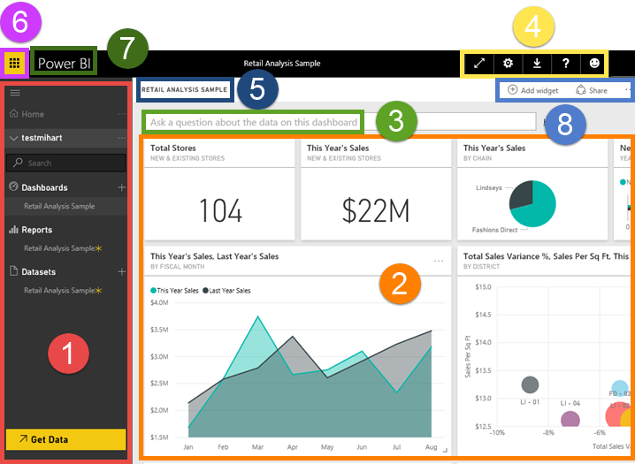
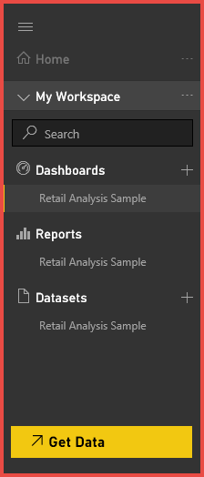

# Power BI - Concetti di base per il servizio Power BI
<!-- Shared newnav Include -->
[!INCLUDE [newnavbydefault](./includes/newnavbydefault.md)]

Questo articolo presuppone che si sia già [iscritti a Power BI](service-self-service-signup-for-power-bi.md) e che siano stati [aggiunti alcuni dati](service-get-data.md).

Quando si apre il servizio Power BI, si noterà un ***dashboard***. I dashboard differenziano il servizio Power BI da Power BI Desktop.

Le principali funzionalità dell'interfaccia utente del servizio Power BI sono le seguenti:

1. Barra di spostamento
2. dashboard con riquadri
3. Casella delle domande di Domande e risposte
4. pulsanti per Guida e Commenti e suggerimenti
5. titolo del dashboard
6. Icona di avvio delle app di Office 365
7. Pulsanti Home page di Power BI
8. altre azioni del dashboard

Questi elementi verranno illustrati più avanti. Per il momento verranno presi in esame alcuni concetti di Power BI.

In alternativa, è possibile guardare questo video prima di leggere il resto di questo articolo.  Nel video si esamineranno i concetti di base e verrà fornita una panoramica del servizio Power BI.

<iframe width="560" height="315" src="https://www.youtube.com/embed/B2vd4MQrz4M" frameborder="0" allowfullscreen></iframe>

## Concetti di Power BI
***Dashboard***, ***report*** e ***set di dati*** costituiscono i tre elementi centrali di Power BI. Anche se è possibile avere dashboard e report vuoti, per essere utili questi elementi devono contenere dati. Il primo argomento è costituito dai **set di dati**.

## Set di dati
Un *set di dati* è una raccolta di dati che si *importa* o a cui si stabilisce una *connessione*. Power BI consente di connettersi a tutti i set di dati, importarli e riunirli in un'unica posizione.  

Nella barra di spostamento i set di dati a cui si è connessi o che sono stati importati sono elencati in **Set di dati**. Ogni set di dati elencato rappresenta una singola origine dati, ad esempio una cartella di lavoro di Excel in OneDrive, un set di dati in formato tabulare SSAS locale o un database di Salesforce. Sono supportate numerose origini dati differenti, che sono in continuo aumento. [Fare clic sul collegamento per visualizzare l'elenco dei tipi di set di dati utilizzabili con Power BI](service-get-data.md).

**UN** set di dati...

* può essere usato più volte.
* può essere usato in report diversi.
* Le visualizzazioni di un unico set di dati possono essere usate in dashboard diversi.
  
  

Per [connettersi a un set di dati o importarlo](service-get-data.md), selezionare **Recupera dati** (nella parte inferiore della barra di spostamento) oppure selezionare l'icona del simbolo più (+) accanto all'intestazione **Set di dati**. Seguire le istruzioni per la connessione o l'importazione dell'origine specifica e aggiungere il set di dati alla propria area di lavoro. I nuovi set di dati sono elencati nella barra di spostamento a sinistra e contrassegnati con un asterisco giallo. Le operazioni effettuate in Power BI non comportano la modifica del set di dati sottostante.

Se si [fa parte di un'***area di lavoro per le app***](service-collaborate-power-bi-workspace.md), i set di dati aggiunti da un membro dell'area di lavoro sono disponibili per gli altri membri dell'area di lavoro.

I set di dati possono essere aggiornati, rinominati, esplorati, usati per creare report e rimossi. Per esplorare un set di dati, selezionarlo. Il set di dati viene quindi aperto nell'editor di report in cui è possibile approfondire l’analisi dei dati e creare visualizzazioni. Passiamo all'argomento successivo, ossia i report.

### Approfondimento:
* [Power BI Premium: di cosa si tratta?](service-premium.md)
* [Recuperare dati per Power BI](service-get-data.md)
* [Set di dati di esempio e pacchetti di contenuto per Power BI](sample-datasets.md)

## Relazioni
Un report di Power BI è costituito da una o più pagine di visualizzazioni (grafici e diagrammi quali grafici a linee, grafici a torta, mappe ad albero e molti altri). Le visualizzazioni sono anche dette ***oggetti visivi***. Tutte le visualizzazioni in un report provengono da un unico set di dati. I report possono essere creati da zero all'interno di Power BI o importati con dashboard condivisi con i colleghi oppure essere creati quando l'utente si connette ai set di dati da Excel, Power BI Desktop, database, applicazioni SaaS e [pacchetti di contenuto](service-organizational-content-pack-introduction.md).  Ad esempio, quando si è connessi a una cartella di lavoro di Excel che contiene fogli di Power View, Power BI crea un report basato su tali fogli. Inoltre, quando ci si connette a un'applicazione SaaS, Power BI importa un report predefinito.

È possibile visualizzare i report e interagirvi in due modi, ovvero in [Visualizzazione di lettura](service-report-open-in-reading-view.md) e in [Visualizzazione di modifica](service-interact-with-a-report-in-editing-view.md).  Solo la persona che ha creato il report, i comproprietari e gli utenti autorizzati possono utilizzare tutte le funzionalità di esplorazione, progettazione, creazione e condivisione in ***Visualizzazione di modifica***. Coloro che condividono il report possono esplorarlo e interagire in ***Visualizzazione di lettura***.   

Nel riquadro di spostamento i report sono elencati in **Report**. Ogni report elencato rappresenta una o più pagine di visualizzazioni basate su uno dei set di dati sottostanti. Per aprire un report, è sufficiente selezionarlo. Per impostazione predefinita, il report viene aperto in Visualizzazione di lettura.  Selezionare **Modifica report** per aprire il report in Visualizzazione di modifica (se si hanno le autorizzazioni necessarie).  Se un dashboard condiviso contiene report, il report elencato nel riquadro di spostamento NON sarà visibile. È invece possibile aprire i report condivisi direttamente dal dashboard condiviso selezionando un riquadro del dashboard (altre informazioni a riguardo più avanti).

**UN** report

* può essere associato a più dashboard, ovvero i riquadri aggiunti da un report possono essere visualizzati in più dashboard.
* può essere creato usando i dati di un solo set di dati. Per ovviare a questa limitazione, è possibile usare Power BI Desktop per combinare più set di dati in un unico report e importare tale report in Power BI.
  
  

## Dashboard
Per *dashboard* si intende un elemento che viene creato dall'utente oppure creato e condiviso da un collega. Si tratta di una singola area di disegno che può contenere più riquadri e widget oppure non contenerne affatto. In ogni riquadro compare una singola [visualizzazione](power-bi-report-visualizations.md) che è stata creata da un set di dati e aggiunta al dashboard. Per aggiungere riquadri al dashboard esistono molti modi, che non possono essere tuttavia trattati in questo contesto. Per altre informazioni, vedere [Riquadri del dashboard in Power BI](service-dashboard-tiles.md). 

I dashboard dell'utente sono elencati in **Dashboard** nella barra di spostamento. L'utente può accedere a tali dashboard senza che li abbia necessariamente creati. Ogni dashboard elencato rappresenta una visualizzazione personalizzata di alcuni subset di set di dati sottostanti.  Se si è proprietari del dashboard, sarà anche possibile accedere ai set di dati sottostanti che verranno visualizzati nella barra di spostamento in **Set di dati**.  Se il dashboard è stato condiviso, accanto al dashboard compare l'icona  che indica la condivisione. A seconda del tipo di condivisione, sarà possibile o meno visualizzare i set di dati sottostanti elencati nella barra di spostamento.

> [!NOTE]
> Le aggiunte e i riquadri sono trattati in modo più approfondito nella sezione relativa ai riquadri del dashboard.
> 
> 

**UN** dashboard...

* consente di visualizzare visualizzazioni di set di dati diversi
* consente di visualizzare visualizzazioni di report diversi
* consente di visualizzare visualizzazioni aggiunte da altri strumenti (ad esempio Excel)
  
  

### Approfondimento:
**È possibile [creare un dashboard da zero](service-dashboard-create.md)**, ovvero creare un nuovo dashboard vuoto e recuperare alcuni dati. 

**L'utente o un collega può creare un dashboard e [condividerlo](service-share-dashboards.md)**. Quando si accetta l'invito, il dashboard condiviso, nonché il report e il set di dati associati, vengono aggiunti alla barra di spostamento. Power BI Pro è necessario per condividere un dashboard e visualizzare un dashboard condiviso.

**I dashboard vengono talvolta importati con il set di dati o creati durante la connessione al set di dati**. Ad esempio, durante la procedura guidata **Recupera dati** per Salesforce viene chiesto se creare un dashboard e/o un report dal set di dati. 

**Perché creare i dashboard?**  Ecco solo alcuni dei motivi:

* per visualizzare a colpo d'occhio tutte le informazioni necessarie per prendere decisioni
* per monitorare le informazioni più importanti sulle attività
* per garantire che tutti i collaboratori accedano alla stessa pagina, nonché visualizzino e usino le stesse informazioni
* per monitorare lo stato di un'azienda, di un prodotto, di una business unit, di una campagna di marketing e così via
* per creare una visualizzazione personalizzata di un dashboard più esteso, contenente solo le metriche cui si è maggiormente interessati

## Area di lavoro
Torniamo al dashboard di Power BI e all’area di lavoro. Vediamo ora nel dettaglio i componenti che costituiscono la pagina di destinazione del servizio Power BI.

### 1. **Barra di spostamento**
Usare la barra di spostamento per spostarsi tra i blocchi predefiniti di Power BI, ovvero dashboard, report e set di dati.  

  

* Selezionare **Recupera dati** per [aggiungere set di dati, report e dashboard a Power BI](service-get-data.md).
* Espandere e comprimere la barra di spostamento con questa icona .
* Usare **Cerca** per cercare elementi specifici nella barra di spostamento.
* Selezionare l'icona del simbolo più  per creare un nuovo dashboard oppure recuperare un nuovo set di dati.
* I **dashboard, report** e i **set di dati** elencati sono quelli disponibili.  I dashboard condivisi sono disponibili in sola lettura e sono contraddistinti dall'icona .
* I nomi di dashboard, report e set di dati sono in genere uguali al nome del file di set di dati sottostante, ma è possibile [rinominarli](service-rename.md).
* Fare clic con il pulsante destro del mouse su un dashboard, report o set di dati per visualizzare il menu sensibile al contesto. 
  
  

Fare un singolo clic su

* un'intestazione per comprimerla o espanderla
* un dashboard per visualizzarlo
* un report per aprirlo in Visualizzazione di lettura
* un set di dati per esplorarlo

### 2. **Dashboard con riquadri**
I dashboard sono costituiti da [riquadri](service-dashboard-tiles.md),  I riquadri vengono creati nella Visualizzazione di modifica dei report, Domande e risposte, altri dashboard e possono essere aggiunti da Excel, SSRS e così via. Un tipo speciale di riquadro chiamato [widget](service-dashboard-add-widget.md) viene aggiunto direttamente al dashboard. I riquadri visualizzati in un dashboard sono stati inseriti specificamente dall'autore o dal proprietario di un report,  con un'operazione nota come *aggiunta*.

Per altre informazioni, vedere **Dashboard** (sopra).

### 3. **Casella delle domande di Domande e risposte**
Uno dei modi per esplorare i dati consiste nel porre una domanda consentendo a Power BI di fornire una risposta sotto forma di visualizzazione. Non è possibile usare Domande e risposte per aggiungere contenuto a un report, ma solo per aggiungere contenuto ai dashboard sotto forma di sezioni.

Domande e risposte cerca una risposta nel set di dati connesso al dashboard,  ovvero il set di dati per cui è stato aggiunto almeno un riquadro al dashboard.

Non appena si inizia a digitare la domanda, viene visualizzata la pagina Domande e risposte. Durante la digitazione vengono visualizzate informazioni utili per porre la domanda corretta e trovare la risposta migliore con richieste di riformulazione, compilazione automatica, suggerimenti e altro ancora. Una volta ottenuta la visualizzazione, ovvero la risposta desiderata, è possibile aggiungerla al dashboard. Per altre informazioni, vedere [Domande e risposte in Power BI](service-q-and-a.md).

### 4. **Schermo intero, Notifiche, Impostazioni, Download, Guida e suggerimenti**
Le icone nell'angolo in alto a destra consentono di accedere alle impostazioni, alle notifiche, ai download e alla Guida e di inviare commenti e suggerimenti al team di Power BI. Selezionare la doppia freccia per aprire il dashboard in modalità **schermo intero**.  

### 5. **Titolo del dashboard** (per sapere quale dashboard è attivo)
Non è sempre semplice scoprire quale sia il dashboard attivo.  Il titolo del dashboard viene visualizzato nella pagina di visualizzazione del dashboard, nella pagina Domande e risposte, nella Visualizzazione di lettura e nella Visualizzazione di modifica del report e infine quando si apre il set di dati.   

### 6. **Icona di avvio delle app di Office 365**
L'icona di avvio è progettata per accedere facilmente alle app di Office 365.

### 7. **Home page di Power BI**
Selezionare questo pulsante per tornare al dashboard visualizzato più di recente.

   

### 8. **Opzioni**
Questa area di lavoro contiene icone per interagire con il dashboard.  Oltre ad **Aggiungere un riquadro**, **Preferiti** e **Condividi**, è possibile selezionare i puntini di sospensione per visualizzare altre opzioni con cui duplicare, stampare e aggiornare il dashboard.

   

## Passaggi successivi
[Introduzione a Power BI](service-get-started.md)  
[Video di Power BI](videos.md)  
[Power BI Premium: di cosa si tratta?](service-premium.md)

Altre domande? [Provare a rivolgersi alla community di Power BI](http://community.powerbi.com/)

