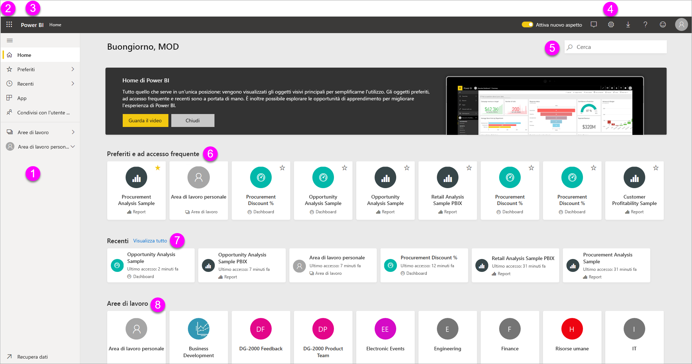

# Concetti di base sulle finestre di progettazione del servizio Power BI

L'obiettivo di questo articolo è consentire agli utenti di orientarsi meglio all'interno nel servizio Power BI: che cosa sono i diversi elementi, come interagiscono e come è possibile usarli. È possibile sfruttare al meglio queste informazioni se è già stata effettuata l'[iscrizione al servizio Power BI](service-self-service-signup-for-power-bi.md) e sono già stati [aggiunti alcuni dati](service-get-data.md). Il flusso di lavoro tipico di un progettista inizia in genere dalla creazione di report in Power BI Desktop. I report vengono poi pubblicati nel servizio Power BI, dove è possibile continuare a modificarli. È anche possibile creare dashboard basati sui report nel servizio Power BI. 

Per questo articolo, se non sono ancora disponibili report personali, provare a installare un [pacchetto di contenuto di esempio di Power BI](sample-datasets.md#the-power-bi-samples-as-content-packs).

Quando si apre il servizio Power BI in un browser, si inizia dalla schermata Home. Ecco gli elementi che potrebbero essere visualizzati:

1. Riquadro di spostamento
2. Icona di avvio delle app di Office 365
3. pulsante Home di Power BI
4. Pulsanti delle icone, tra cui Impostazioni, Guida e Commenti e suggerimenti
5. Casella di ricerca
6. Dashboard, report e aree di lavoro preferiti e usati di frequente
7. Dashboard, report e aree di lavoro recenti
8. Aree di lavoro personali

L'utente e gli utenti finali dei report e dei dashboard hanno la stessa esperienza di avvio del servizio Power BI in un browser.

Queste funzionalità verranno illustrate più avanti. Per il momento verranno presi in esame alcuni concetti di Power BI. In alternativa, è possibile guardare questo video prima di tutto.  Nel video vengono presentati i concetti di base e viene offerta una panoramica del servizio Power BI.

<iframe width="560" height="315" src="https://www.youtube.com/embed/B2vd4MQrz4M" frameborder="0" allowfullscreen></iframe>

## Concetti di Power BI
I cinque elementi fondamentali di Power BI sono: *dashboard*, *report*, *cartelle di lavoro*, *set di dati* e *flussi di dati*. Sono tutti organizzati in *aree di lavoro* e vengono creati nelle *capacità*.  È importante comprendere i concetti di capacità e area di lavoro prima di approfondire i cinque elementi fondamentali.

## Capacities
Le capacità sono un concetto chiave di Power BI e rappresentano un set di risorse (archiviazione, processore e memoria) usate per ospitare e distribuire i contenuti di Power BI. Le capacità sono _condivise_ o _dedicate_. Una capacità condivisa è condivisa con altri clienti Microsoft, mentre una capacità dedicata è dedicata interamente a un singolo cliente. Le capacità dedicate richiedono una [sottoscrizione](service-premium-what-is.md) e sono descritte in modo completo nell'articolo [Gestire le capacità Premium](service-premium-capacity-manage.md).

Per impostazione predefinita, le aree di lavoro vengono create in una capacità condivisa. Nella capacità condivisa i carichi di lavoro vengono eseguiti in risorse di calcolo condivise con altri clienti. Poiché la capacità deve condividere le risorse, vengono imposte limitazioni per garantire un'equa distribuzione, ad esempio le dimensioni massime del modello (1 GB) e la frequenza di aggiornamento giornaliero massima (otto volte al giorno).

## Aree di lavoro
Le aree di lavoro vengono create nelle capacità. Sono essenzialmente contenitori per dashboard, report, cartelle di lavoro, set di dati e flussi di dati in Power BI.

Le aree di lavoro sono di due tipi: *Area di lavoro personale* e *aree di lavoro*.

- L'*Area di lavoro personale* è l'area di lavoro dedicata di ogni cliente Power BI per usare il contenuto personale. Solo l'utente può accedere all'Area di lavoro personale. È possibile condividere dashboard e report dall'Area di lavoro personale. Per collaborare a dashboard e report o creare un'app, è necessario usare un'area di lavoro.      
-  Le *aree di lavoro* vengono usate per collaborare e condividere il contenuto con i colleghi. È possibile aggiungere i colleghi alle aree di lavoro e collaborare su dashboard, report, cartelle di lavoro e set di dati. Con una sola eccezione, tutti i membri dell'area di lavoro devono avere una licenza di Power BI Pro. Altre informazioni sulle [nuove aree di lavoro](service-create-the-new-workspaces.md). 

    Le aree di lavoro sono anche la posizione in cui si creano, pubblicano e gestiscono le *app* per l'organizzazione. È possibile considerarle come contenitori e aree di staging per il contenuto che costituirà un'app di Power BI. Che cos'è un'*app*? È una raccolta di dashboard e report creati per offrire le metriche principali agli utenti finali di Power BI nell'organizzazione. Le app sono interattive ma gli utenti finali non possono modificarle. Gli utenti delle app, ovvero i colleghi che hanno accesso alle app, non devono necessariamente avere una licenza Pro.  

Per altre informazioni sulla condivisione in generale, iniziare con [Modalità per la condivisione del lavoro in Power BI](service-how-to-collaborate-distribute-dashboards-reports.md).

Ora verranno approfonditi i cinque elementi fondamentali di Power BI.

## Flussi di dati
Un *flusso di dati* consente alle organizzazioni di unificare i dati provenienti da origini diverse. Sono facoltativi e vengono spesso usati in progetti complessi o di grandi dimensioni. Rappresentano i dati preparati e sottoposti a staging per l'uso da parte dei set di dati. Tuttavia, non possono essere usati direttamente come origine per la creazione di report. Sfruttano l'ampia raccolta di connettori dati Microsoft, consentendo l'inserimento di dati da origini dati locali e basate sul cloud.

I flussi di dati vengono creati e gestiti solo nelle aree di lavoro, ma non nell'*area di lavoro personale*, e vengono archiviati come entità in Common Data Model (CDM) in Azure Data Lake Storage Gen2. In genere, sono pianificati per l'aggiornamento ricorrente per archiviare dati aggiornati. Sono ideali per preparare i dati per l'uso e per il potenziale riutilizzo da parte dei set di dati. Per altre informazioni, vedere l'articolo [Preparazione dei dati self-service in Power BI](service-dataflows-overview.md).

Poiché i dashboard o i report sono utili solo quando contengono dati, verranno di seguito presentati i **set di dati**.

## Set di dati
Un *set di dati* è una raccolta di dati che si *importa* o a cui si stabilisce una *connessione*. Power BI consente di connettersi a tutti i set di dati, importarli e riunirli in un'unica posizione. I set di dati possono anche usare i flussi di dati come origine dati.

I set di dati sono associati alle *aree di lavoro* e un singolo set di dati può far parte di più aree di lavoro. Quando si apre un'area di lavoro, i set di dati associati sono elencati nella scheda **Set di dati**. Ogni set di dati elencato rappresenta una singola origine dati, ad esempio una cartella di lavoro di Excel in OneDrive, un set di dati in formato tabulare SSAS locale o un database di Salesforce. Sono supportate numerose origini dati differenti, che sono in continuo aumento. Visualizzare l'[elenco dei tipi di set di dati che è possibile usare con Power BI](service-get-data.md).

Nell'esempio seguente è stata selezionata l'area di lavoro "Sales and marketing" ed è stato fatto clic sulla scheda **Set di dati**.

**UN** set di dati...

* può essere usato più volte in una o in numerose aree di lavoro.
* può essere usato in report diversi.
* Le visualizzazioni di un unico set di dati possono essere usate in dashboard diversi.

  

Per [connettersi o importare un set di dati](service-get-data.md), selezionare **Recupera dati** nella parte inferiore del riquadro di spostamento. Seguire le istruzioni per la connessione o l'importazione dell'origine specifica e aggiungere il set di dati all'area di lavoro attiva. I nuovi set di dati sono contrassegnati con un asterisco giallo. Le operazioni effettuate in Power BI non comportano la modifica del set di dati sottostante.

I set di dati aggiunti da un membro dell'area di lavoro sono disponibili per gli altri membri dell'area di lavoro con ruolo *amministratore*, *membro* o *collaboratore*.

I set di dati possono essere aggiornati, rinominati, esplorati e rimossi. Usare un set di dati per creare un report da zero o tramite l'esecuzione di [informazioni rapide](service-insights.md).  Per visualizzare i report e i dashboard che già usano un set di dati, selezionare **Visualizza elementi correlati**. Per esplorare un set di dati, selezionarlo. Il set di dati viene quindi aperto nell'editor di report in cui è possibile in effetti esplorare i dati tramite la creazione di visualizzazioni.

Si passerà ora all'argomento successivo, ossia i report.

### Approfondimento
* [Set di dati nel servizio Power BI](service-datasets-understand.md)
* [Modalità del set di dati nel servizio Power BI](service-dataset-modes-understand.md)
* [Che cos'è Power BI Premium?](service-premium-what-is.md)
* [Recuperare dati per Power BI](service-get-data.md)
* [Set di dati di esempio per Power BI](sample-datasets.md)

## Report
Un report di Power BI è costituito da una o più pagine di visualizzazioni, ad esempio grafici a linee, mappe e mappe ad albero. Le visualizzazioni sono dette anche **_oggetti visivi_** . Tutte le visualizzazioni in un report provengono da un unico set di dati. I report possono essere creati da zero all'interno di Power BI, importati con dashboard condivisi dai colleghi oppure essere creati da Power BI quando l'utente si connette ai set di dati da Excel, Power BI Desktop, database e applicazioni SaaS.  Ad esempio, quando si è connessi a una cartella di lavoro di Excel che contiene fogli di Power View, Power BI crea un report basato su tali fogli. Inoltre, quando ci si connette a un'applicazione SaaS, Power BI importa un report predefinito.

È possibile visualizzare i report e interagire con essi in due modalità: *Visualizzazione di lettura* e *Visualizzazione di modifica*. Quando si apre un report, viene aperto in Visualizzazione di lettura. Se si hanno autorizzazioni di modifica, viene visualizzata l'opzione **Modifica report** nell'angolo in alto a sinistra ed è possibile visualizzare il report in Visualizzazione di modifica.  Se un report si trova in un'area di lavoro, tutti gli utenti con un ruolo *amministratore*, *membro* o *collaboratore* possono modificarlo. Questi utenti hanno accesso a tutte le funzionalità di esplorazione, progettazione, compilazione e condivisione della Visualizzazione di modifica per il report. Gli utenti con cui è stato condiviso il report possono esplorarlo e modificarlo in Visualizzazione di lettura.   

Quando si apre un'area di lavoro, i report associati sono elencati nella scheda **Report**. Ogni report elencato rappresenta una o più pagine di visualizzazioni basate su uno solo dei set di dati sottostanti. Per aprire un report, selezionarlo.

Quando si apre un'app viene visualizzato un dashboard.  Per accedere al report sottostante, selezionare un riquadro del dashboard (altre informazioni sui riquadri sono disponibili più avanti) che è stato aggiunto da un report. Tenere presente che non tutti i riquadri vengono aggiunti dai report, quindi è possibile dover fare clic su alcuni riquadri prima di trovare un report.

Per impostazione predefinita, il report viene aperto in Visualizzazione di lettura.  Selezionare **Modifica report** per aprire il report in Visualizzazione di modifica (se si hanno le autorizzazioni necessarie).

Nell'esempio seguente è stata selezionata l'area di lavoro "Sales and marketing" ed è stato fatto clic sulla scheda **Report**.

**UN** report

* è contenuto in una singola area di lavoro.
* può essere associato a più dashboard nell'area di lavoro. I riquadri aggiunti da tale report possono apparire in più dashboard.
* può essere creato usando i dati di un solo set di dati. Power BI Desktop consente di combinare più origini dati in un singolo set di dati di un report e importare tale report in Power BI.

  

### Approfondimento
- [Creare un report nel servizio Power BI importando un set di dati](service-report-create-new.md)
- [Ottimizzare report per le app per dispositivi mobili Power BI](desktop-create-phone-report.md)

## Dashboard
Per *dashboard* si intende un elemento che viene creato nel **servizio Power BI** oppure creato da un collega nel **servizio Power BI** e condiviso con l'utente. Si tratta di una singola area di disegno che può contenere più riquadri e widget oppure non contenerne affatto. In ogni riquadro aggiunto da un report o da [Domande e risposte](power-bi-q-and-a.md) compare una singola [visualizzazione](power-bi-report-visualizations.md) che è stata creata da un set di dati e aggiunta al dashboard. È anche possibile aggiungere a un dashboard intere pagine del report come un singolo riquadro. Per aggiungere riquadri al dashboard esistono molti modi, che non possono essere tuttavia trattati in questo contesto. Per altre informazioni, vedere [Riquadri del dashboard in Power BI](service-dashboard-tiles.md).

Perché creare i dashboard?  Ecco solo alcuni dei motivi:

* per visualizzare a colpo d'occhio tutte le informazioni necessarie per prendere decisioni.
* per monitorare le informazioni più importanti sull'attività aziendale.
* per assicurarsi che tutti i collaboratori siano sempre aggiornati e che visualizzino e usino le stesse informazioni.
* per monitorare lo stato di un'azienda, di un prodotto, di una business unit, di una campagna di marketing e così via
* per creare una visualizzazione personalizzata di un dashboard più ampio contenente solo le metriche a cui si è maggiormente interessati.

Quando si apre un'area di lavoro, i dashboard associati sono elencati nella scheda **Dashboard**. Per aprire un dashboard, selezionarlo. Quando si apre un'app, verrà visualizzato un dashboard.  Ogni dashboard elencato rappresenta una visualizzazione personalizzata di alcuni subset di set di dati sottostanti.  Se si è proprietari del dashboard, sarà anche possibile accedere ai set di dati e ai report sottostanti.  Se il dashboard è stato condiviso da altri con l'utente, sarà possibile interagire con il dashboard e con i report sottostanti, ma non sarà possibile salvare le modifiche.

È possibile [condividere un dashboard](service-share-dashboards.md) in molti modi diversi. Per condividere un dashboard e per visualizzare un dashboard condiviso è necessario disporre di Power BI Pro.

**UN** dashboard...

* è associato a una singola area di lavoro
* consente di visualizzare visualizzazioni di set di dati diversi
* consente di visualizzare visualizzazioni di report diversi
* consente di visualizzare visualizzazioni aggiunte da altri strumenti (ad esempio Excel)

  

### Approfondimento
* [Creare un dashboard vuoto e recuperare alcuni dati](service-dashboard-create.md).
* [Duplicare un dashboard](service-dashboard-copy.md)
* [Creare una visualizzazione telefono di un dashboard](service-create-dashboard-mobile-phone-view.md)

## Cartelle di lavoro
Le cartelle di lavoro sono un tipo speciale di set di dati. Se la sezione **Set di dati** precedente è stata letta, si conoscerà già tutto ciò che serve sapere sulle cartelle di lavoro. Tuttavia, ci si potrebbe chiedere perché a volte Power BI classifica una cartella di lavoro di Excel come un **set di dati** e altre volte come una **cartella di lavoro**.

Quando nei file di Excel si seleziona **Recupera dati**, è possibile scegliere l'opzione *Importa* o *Connetti* per recuperare i dati del file. Quando si sceglie Connetti, la cartella di lavoro viene visualizzata in Power BI esattamente come in Excel Online. A differenza di Excel Online, però, sono disponibili alcune utilissime funzionalità per aggiungere elementi dai fogli di lavoro direttamente ai dashboard.

Non è possibile modificare la cartella di lavoro in Power BI. Se è necessario apportare modifiche, fare clic su Modifica e quindi scegliere se modificare la cartella di lavoro in Excel Online oppure aprirla in Excel nel computer. Le modifiche apportate vengono salvate nella cartella di lavoro in OneDrive.

### Approfondimento
* [Ottenere dati dai file delle cartelle di lavoro di Excel](service-excel-workbook-files.md)
* [Pubblicare in Power BI da Excel](service-publish-from-excel.md)

## Un dashboard nell'Area di lavoro personale
Fino a qui sono stati illustrati gli elementi fondamentali e le aree di lavoro. Verranno ora esaminati i componenti che costituiscono l'esperienza del dashboard nel servizio Power BI.

### 1. **Riquadro di spostamento**
Usare il riquadro di spostamento per individuare le aree di lavoro e spostarsi tra queste e gli elementi fondamentali di Power BI, ovvero dashboard, report, cartelle di lavoro e set di dati.  

  

* Selezionare **Recupera dati** per [aggiungere set di dati, report e dashboard a Power BI](service-get-data.md).
* Espandere e comprimere la barra di spostamento con questa icona .
* Aprire o gestire il contenuto preferito selezionando **Preferiti**.
* Visualizzare e aprire il contenuto visitato di recente selezionando **Recenti**.
* Visualizzare, aprire o eliminare un'app selezionando **App**.
* Se un collega ha condiviso contenuto con l'utente, selezionare **Condiviso con me** per cercare e ordinare il contenuto per trovare le informazioni desiderate.
* Visualizzare e aprire le aree di lavoro selezionando **Aree di lavoro**.

Fare clic su questi elementi:

* un'icona o un'intestazione per aprire in Visualizzazione contenuto
* una freccia destra (>) per aprire il menu a comparsa per Preferiti, Recenti e Aree di lavoro.
* un'icona di freccia di espansione per visualizzare l'elenco scorrevole di dashboard, report, cartelle di lavoro e set di dati nell'**Area di lavoro personale**.

### 2. **Area di disegno**
Poiché è stato aperto un dashboard, nell'area di disegno vengono mostrati riquadri di visualizzazione. Se, ad esempio, fosse stato aperto l'editor di report, l'area di disegno mostrerebbe una pagina del report.

I dashboard sono costituiti da [riquadri](service-dashboard-tiles.md),  che vengono creati nella Visualizzazione di modifica dei report, Domande e risposte, altri dashboard e possono essere aggiunti da Excel, SSRS e così via. Un tipo speciale di riquadro chiamato [widget](service-dashboard-add-widget.md) viene aggiunto direttamente al dashboard. I riquadri visualizzati in un dashboard sono stati inseriti specificamente dall'autore o dal proprietario di un report,  con un'operazione nota come *aggiunta*.

Per altre informazioni, vedere [Dashboard](#dashboards) (sopra).

### 3. **Casella delle domande di Domande e risposte**
Uno dei modi per esplorare i dati consiste nel porre una domanda consentendo a Power BI di fornire una risposta sotto forma di visualizzazione. È possibile usare Domande e risposte per aggiungere contenuto a un dashboard o a un report.

Domande e risposte cerca una risposta nel set di dati connesso al dashboard,  ovvero il set di dati per cui è stato aggiunto almeno un riquadro al dashboard.

Non appena si inizia a digitare la domanda, viene visualizzata la pagina Domande e risposte. Durante la digitazione vengono visualizzate informazioni utili per porre la domanda corretta e trovare la risposta migliore con richieste di riformulazione, compilazione automatica, suggerimenti e altro ancora. Una volta ottenuta la visualizzazione, ovvero la risposta desiderata, è possibile aggiungerla al dashboard. Per altre informazioni, vedere [Domande e risposte in Power BI](power-bi-q-and-a.md).

### 4. **Icone nella barra di intestazione nera**
Le icone nell'angolo superiore destro consentono di accedere a impostazioni, notifiche, download e alla Guida, di attivare o disattivare il **nuovo aspetto** o di inviare commenti e suggerimenti al team di Power BI.  

### 5. **Titolo del dashboard** (percorso di navigazione)
Non sempre è facile individuare quali sono le aree di lavoro e i dashboard attivi, di conseguenza Power BI crea automaticamente un percorso di navigazione.  In questo esempio viene mostrata l'area di lavoro (Area di lavoro personale) e il titolo del dashboard (Retail Analysis Sample).  Se si aprisse un report, il nome del report verrebbe aggiunto alla fine del percorso di navigazione.  Ogni sezione del percorso è un collegamento ipertestuale attivo.  

Si noti l'icona "C" dopo il titolo del dashboard. Significa che questo dashboard presenta un [tag di classificazione dati](service-data-classification.md) "Confidential" (Riservati). Il tag identifica il livello di sensibilità e sicurezza dei dati. Se l'amministratore ha abilitato la classificazione dei dati, per ogni dashboard verrà impostato un tag predefinito. I proprietari dei dashboard possono modificare il tag in base al livello di sicurezza appropriato per il dashboard.

### 6. **Icona di avvio delle app di Office 365**
L'icona di avvio delle app consente di avviare tutte le app di Office 365 con un clic. Da qui è possibile avviare rapidamente le app per posta elettronica, documenti, calendario e altre ancora.

### 7. **Home page di Power BI**
Se si seleziona **Power BI** viene nuovamente visualizzata la home page di Power BI.

   

### 8. **Icone con etichetta nella barra dei menu grigia**
Questa area della schermata contiene opzioni aggiuntive per interagire con il contenuto, in questo caso con il dashboard.  Oltre alle icone con etichetta visualizzate, è possibile selezionare **Altre opzioni (...)** per visualizzare altre opzioni per duplicare, stampare, aggiornare il dashboard ed eseguire altre operazioni.

   

## Passaggi successivi
- [Che cos'è Power BI?](fundamentals/power-bi-overview.md)  
- [Video di Power BI](videos.md)  
- [Presentazione dell'editor di report](service-the-report-editor-take-a-tour.md)
- Altre domande? [Provare a rivolgersi alla community di Power BI](https://community.powerbi.com/)
