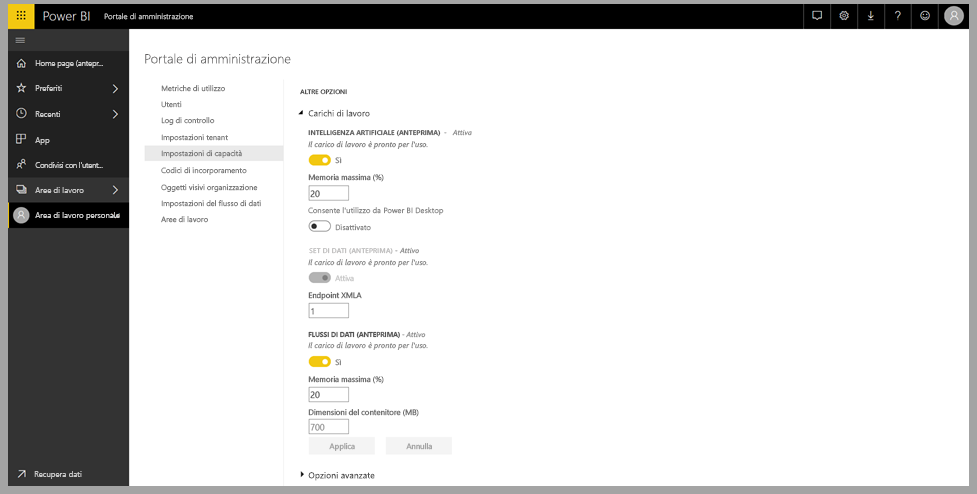
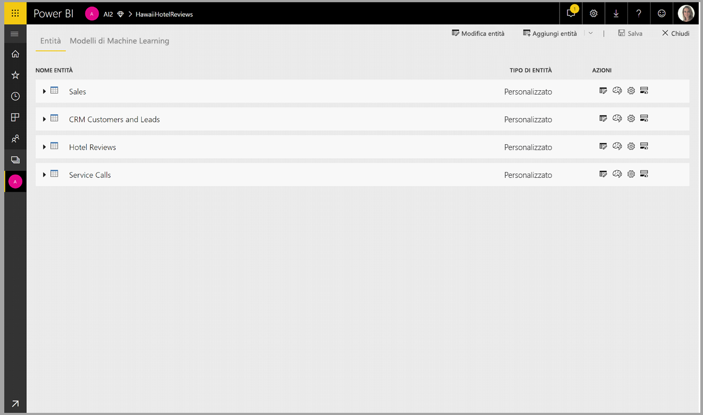
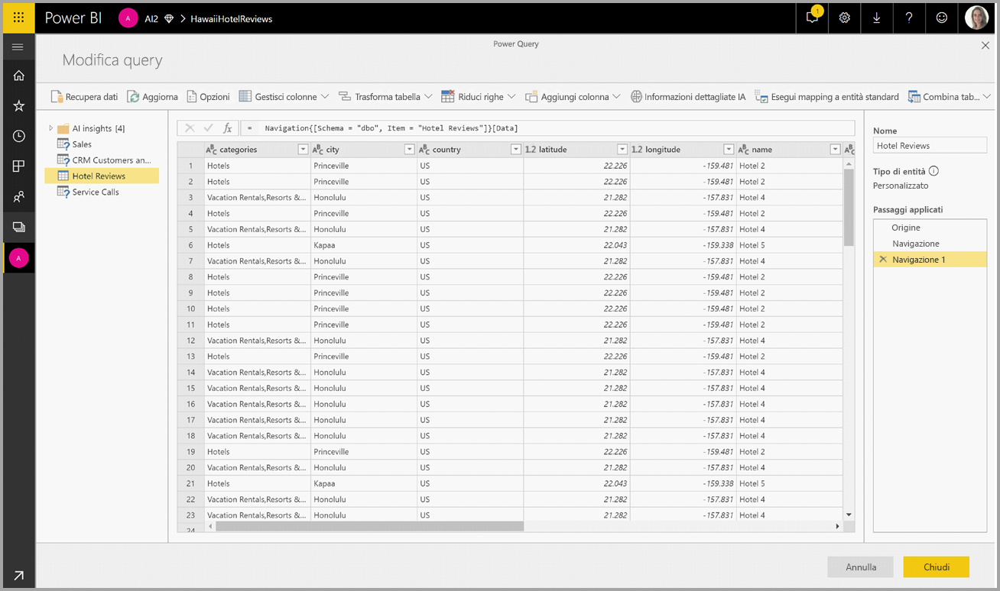
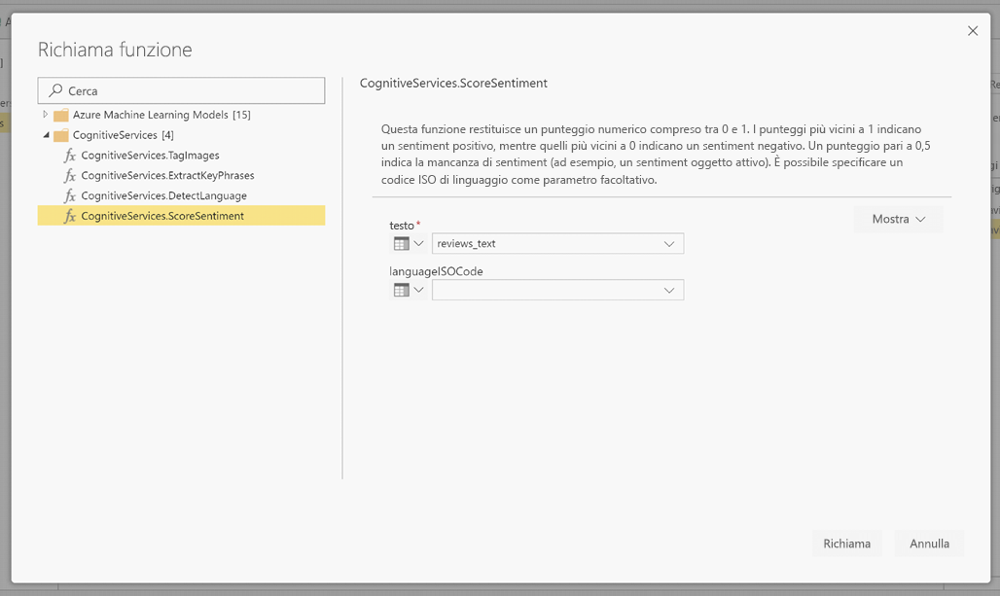
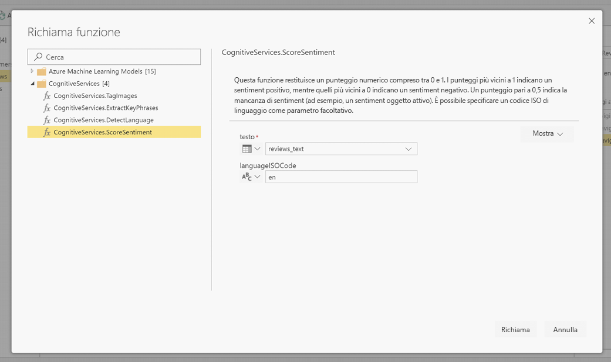
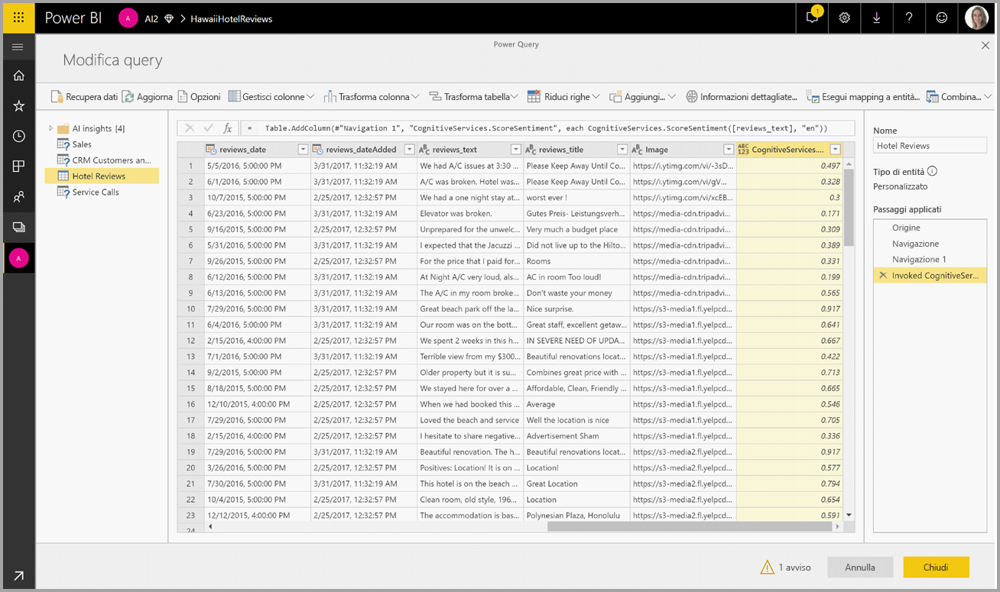
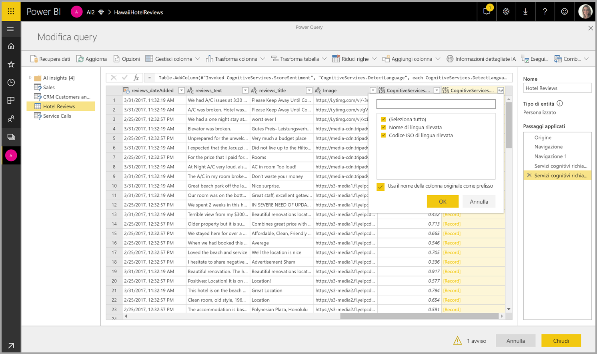

# Servizi cognitivi in Power BI (anteprima)

Con Servizi cognitivi in Power BI è possibile applicare diversi algoritmi dei [Servizi cognitivi di Azure](https://azure.microsoft.com/services/cognitive-services/) per arricchire i dati nella preparazione dei dati self-service per i flussi di dati.

I servizi attualmente supportati sono [Analisi del sentiment](https://docs.microsoft.com/azure/cognitive-services/text-analytics/how-tos/text-analytics-how-to-sentiment-analysis), [Estrazione frasi chiave](https://docs.microsoft.com/azure/cognitive-services/text-analytics/how-tos/text-analytics-how-to-keyword-extraction), [Rilevamento lingua](https://docs.microsoft.com/azure/cognitive-services/text-analytics/how-tos/text-analytics-how-to-language-detection) e [Assegnazione di tag alle immagini](https://docs.microsoft.com/azure/cognitive-services/computer-vision/concept-tagging-images). Le trasformazioni vengono eseguite nel servizio Power BI e non richiedono una sottoscrizione di Servizi cognitivi di Azure. Questa funzionalità richiede Power BI Premium.

## **Abilitazione delle funzionalità di intelligenza artificiale**

I servizi cognitivi sono supportati per i nodi della capacità Premium EM2, A2 o P1 e superiori. Per eseguire i servizi cognitivi viene usato un carico di lavoro di Intelligenza artificiale separato nella capacità. Durante l'anteprima pubblica questo carico di lavoro è disabilitato per impostazione predefinita. Prima di usare i servizi cognitivi in Power BI è necessario abilitare il carico di lavoro di Intelligenza artificiale nelle impostazioni della capacità nel portale di amministrazione. È possibile attivare il carico di lavoro di Intelligenza artificiale nella sezione Carichi di lavoro e definire la quantità massima di memoria che può essere utilizzata da questo carico di lavoro. Il limite consigliato per la memoria è pari al 20%. Il superamento di questo limite causa il rallentamento della query.

## **Iniziare a usare Servizi cognitivi in Power BI**

Le trasformazioni di Servizi cognitivi fanno parte della [preparazione dei dati self-service per i flussi di dati](https://powerbi.microsoft.com/blog/introducing-power-bi-data-prep-wtih-dataflows/). Per arricchire i dati con Servizi cognitivi, iniziare con la modifica di un flusso di dati.

Selezionare il pulsante **Informazioni dettagliate sull'intelligenza artificiale** sulla barra multifunzione superiore dell'editor di Power Query.

Nella finestra popup selezionare la funzione da usare e i dati da trasformare. In questo esempio viene assegnato un punteggio al sentiment di una colonna che contiene testo di recensioni.

**Cultureinfo** è un input facoltativo che specifica la lingua del testo. Questo campo prevede un codice ISO. Come input per Cultureinfo è possibile usare una colonna oppure un campo statico. In questo esempio la lingua scelta è l'inglese, specificato come "en" per l'intera colonna. Se si lascia vuoto questo campo, Power BI rileva automaticamente la lingua prima di applicare la funzione. Selezionare quindi **Richiama**.

Dopo il richiamo della funzione, il risultato viene aggiunto come nuova colonna alla tabella. Anche la trasformazione viene aggiunta come passaggio applicato nella query.

Se la funzione restituisce più campi di output, il richiamo della funzione aggiunge una nuova colonna con un record dei diversi campi di output.

Usare l'opzione di espansione per aggiungere uno o entrambi i valori come colonne ai dati.

## **Funzioni disponibili**

Questa sezione descrive le funzioni disponibili in Servizi cognitivi in Power BI.

### **Rileva lingua**

La funzione di rilevamento della lingua valuta l'input di testo e, per ogni campo, restituisce il nome della lingua e l'identificatore ISO. Questa funzione è utile per le colonne di dati che raccolgono testo arbitrario, la cui lingua è sconosciuta. La funzione accetta come input dati in formato testo.

Analisi del testo riconosce fino a 120 lingue. Per altre informazioni, vedere [Supporto lingua e area geografica per l'API Analisi del testo](https://docs.microsoft.com/azure/cognitive-services/text-analytics/text-analytics-supported-languages).

### **Estrazione frasi chiave**

La funzione **Estrazione frasi chiave** valuta il testo non strutturato e, per ogni campo di testo, restituisce un elenco di frasi chiave. La funzione richiede come input un campo di testo e accetta un input facoltativo per **Cultureinfo**. Vedere la sezione **Iniziare a usare Servizi cognitivi in Power BI** più indietro in questo articolo.

La funzione Estrazione frasi chiave funziona al meglio quando lavora su blocchi di testo di dimensioni maggiori, diversamente dalla funzione Analisi del sentiment che offre le migliori prestazioni su blocchi di testo più piccoli. Per ottenere risultati ottimali da entrambe le operazioni, ristrutturare gli input di conseguenza.

### **Analisi del sentiment**

La funzione **Analisi del sentiment** valuta l'input di testo e restituisce un punteggio del sentiment per ogni documento, compreso tra 0 (negativo) e 1 (positivo). Questa funzione è utile per rilevare il sentiment positivo e negativo in social media, recensioni dei clienti e forum di discussione.

Analisi del testo usa un algoritmo di classificazione di Machine Learning per generare un punteggio del sentiment compreso tra 0 e 1. I punteggi più vicini a 1 indicano un sentiment positivo, quelli più vicini a 0 indicano un sentiment negativo. Il modello è stato precedentemente sottoposto a training con un corpo di testo di grandi dimensioni con associazioni di sentiment. Attualmente non è possibile fornire dati di training personali. Il modello usa una combinazione di tecniche durante l'analisi del testo, tra cui elaborazione del testo, analisi delle parti del discorso, disposizione delle parole e associazioni di parole. Per altre informazioni sull'algoritmo, vedere [Introducing Text Analytics](https://blogs.technet.microsoft.com/machinelearning/2015/04/08/introducing-text-analytics-in-the-azure-ml-marketplace/) (Introduzione ad Analisi del testo).

L'analisi del sentiment viene eseguita sull'intero campo di input, a differenza dell'estrazione del sentiment per una particolare entità nel testo. In pratica, si è osservata una tendenza al miglioramento della precisione del punteggio quando i documenti contengono una o due frasi invece di un intero blocco di testo. Durante una fase di valutazione dell'obiettività, il modello determina se un campo di input nel suo insieme è obiettivo o contiene sentiment. Un campo di input prevalentemente obiettivo non passa alla fase di rilevamento del sentiment, producendo un punteggio di 0,50 senza ulteriore elaborazione. Per i campi di input che proseguono nella pipeline, la fase successiva genera un punteggio superiore o inferiore a 0,50, a seconda del grado di sentiment rilevato nel campo di input.

Attualmente la funzione Analisi del sentiment supporta le lingue seguenti: inglese, tedesco, spagnolo e francese. Altre lingue sono disponibili in anteprima. Per altre informazioni, vedere [Supporto lingua e area geografica per l'API Analisi del testo](https://docs.microsoft.com/azure/cognitive-services/text-analytics/text-analytics-supported-languages).

### **Assegnazione di tag alle immagini**

La funzione **Assegnazione di tag alle immagini** restituisce tag sulla base di più di 2.000 oggetti, esseri viventi, paesaggi e azioni riconoscibili. Quando i tag sono ambigui o non sono comunemente noti, l'output fornisce suggerimenti per chiarire il significato del tag nel contesto di un'ambientazione nota. I tag non sono organizzati come tassonomia e non esistono gerarchie di ereditarietà. Una raccolta di tag di contenuti costituisce la base della "descrizione" di un'immagine visualizzata come linguaggio leggibile formattato in frasi complete.

Dopo aver caricato un'immagine o specificato un URL di immagine, gli algoritmi di Visione artificiale restituiscono tag basati sugli oggetti, gli esseri viventi e le azioni identificati nell'immagine. L'assegnazione di tag non è limitata al soggetto principale, come la persona in primo piano, ma si estende all'ambiente (interno o esterno), all'arredamento, agli attrezzi, alle piante, agli animali, agli accessori e così via.

Questa funzione richiede un URL immagine o un campo base 64 come input. Attualmente la funzione di assegnazione di tag alle immagini supporta le lingue seguenti: inglese, spagnolo, giapponese, portoghese e cinese semplificato. Per altre informazioni, vedere [Supporto lingua e area geografica per l'API Analisi del testo](https://docs.microsoft.com/rest/api/cognitiveservices/computervision/tagimage/tagimage#uri-parameters).

## Passaggi successivi

Questo articolo ha fornito una panoramica dell'uso di Servizi cognitivi con il servizio Power BI. Potrebbero essere interessanti e utili anche gli articoli seguenti. 

* [Esercitazione: Richiamare un modello di Machine Learning Studio in Power BI (anteprima)](service-tutorial-invoke-machine-learning-model.md)
* [Integrazione di Azure Machine Learning in Power BI (anteprima)](service-machine-learning-integration.md)
* [Esercitazione: Uso di Servizi cognitivi in Power BI](service-tutorial-use-cognitive-services.md)

Per altre informazioni sui flussi di dati, è possibile leggere questi articoli:
* [Creare e usare flussi di dati in Power BI](service-dataflows-create-use.md)
* [Utilizzo di entità calcolate in Power BI Premium](service-dataflows-computed-entities-premium.md)
* [Uso di flussi di dati con origini dati locali](service-dataflows-on-premises-gateways.md)
* [Risorse per sviluppatori per flussi di dati di Power BI](service-dataflows-developer-resources.md)
* [Integrazione di flussi di dati e Azure Data Lake (anteprima)](service-dataflows-azure-data-lake-integration.md)