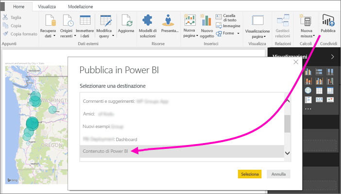
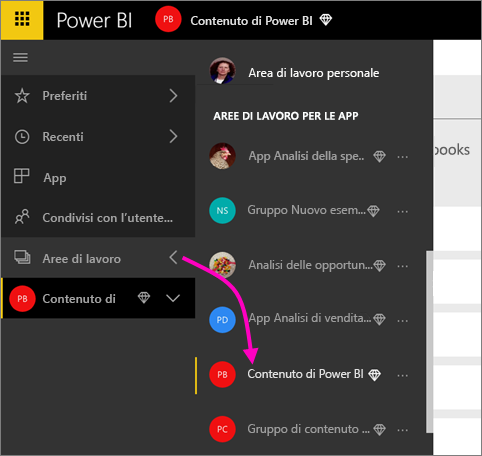
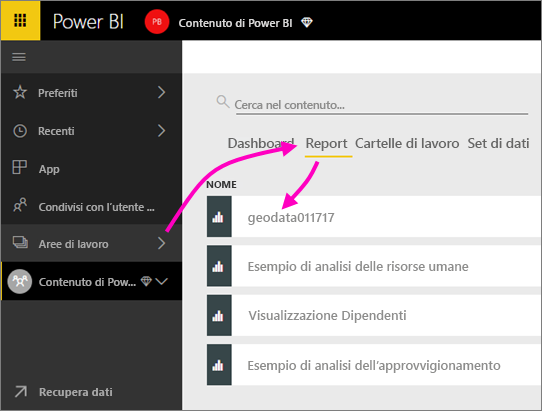
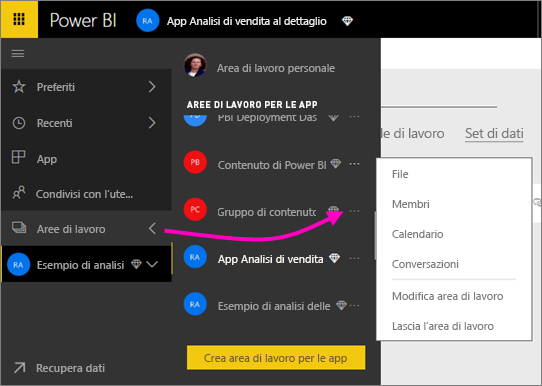
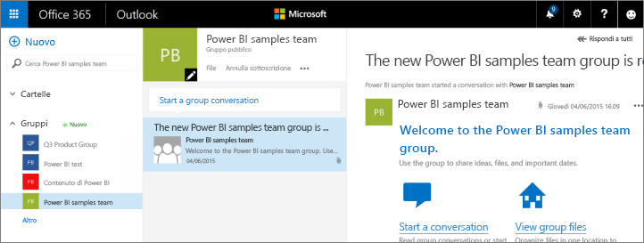
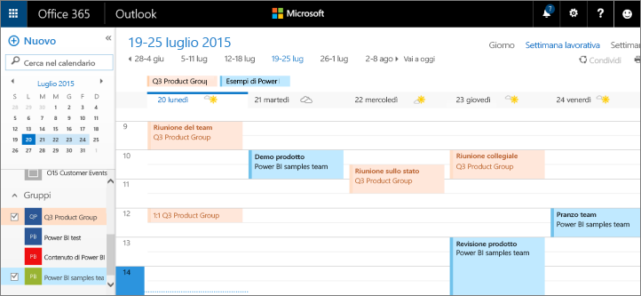

# Collaborare nell'area di lavoro per le app di Power BI
Le aree di lavoro per le app di Power BI sono la soluzione ideale per collaborare con i colleghi all'elaborazione di dashboard, report e set di dati per la creazione di *app*. Lo scopo delle aree di lavoro è proprio quello di incentivare la collaborazione. Una volta terminata la collaborazione con i colleghi all'elaborazione dei dashboard e dei report, è possibile creare un pacchetto contenente l'app e distribuirlo. Altre informazioni sulla [creazione di app e aree di lavoro per le app in Power BI](service-create-distribute-apps.md). 

La collaborazione non è limitata alle aree di lavoro in Power BI. Office 365 offre altri servizi di gruppo, come la condivisione di file in OneDrive for Business, le conversazioni in Exchange, i calendari e le attività condivisi e così via. Altre informazioni sui [gruppi in Office 365](https://support.office.com/article/Create-a-group-in-Office-365-7124dc4c-1de9-40d4-b096-e8add19209e9).

Le aree di lavoro per le app sono disponibili solo con [Power BI Pro](service-free-vs-pro.md).

## Collaborare ai file di Power BI Desktop nell'area di lavoro per le app
Dopo aver creato un file di Power BI Desktop, ogni membro dell'area di lavoro può collaborare alla sua elaborazione se questo viene pubblicato nell'area di lavoro per le app di Power BI.

1. In Power BI Desktop selezionare **Pubblica** nella barra multifunzione **Home** e quindi nella casella **Selezionare una destinazione** selezionare l'area di lavoro per le app.
   
    
2. Nel servizio Power BI fare clic sulla freccia accanto ad Aree di lavoro > selezionare l'area di lavoro per le app.
   
    
3. Selezionare la scheda Report, quindi selezionare il report.
   
    
   
    Da questo punto, è come qualsiasi altro report in Power BI. Tutti i membri dell'area di lavoro per le app possono [modificare il report](service-reports.md) e salvare i riquadri in un dashboard a propria scelta.

## Collaborare in Office 365
La collaborazione in Office 365 inizia nell'area di lavoro per le app in Power BI.

1. Nel servizio Power BI fare clic sulla freccia accanto ad Aree di lavoro > selezionare i puntini di sospensione (**…**) accanto al nome dell'area di lavoro per le app. 
   
   
2. Da questo menu, è possibile collaborare con il gruppo in vari modi: 
   
   * Avviare una [conversazione di gruppo in Office 365](service-collaborate-power-bi-workspace.md#have-a-group-conversation-in-office-365).
   * [Pianificare un evento](service-collaborate-power-bi-workspace.md#schedule-an-event-on-the-group-workspace-calendar) nel calendario dell'area di lavoro del gruppo dell'app.
   
   Il primo accesso all'area di lavoro del gruppo dell'app in Office 365 potrebbe richiedere alcuni minuti. Attendere 15-30 minuti, quindi aggiornare il browser.

## Avviare una conversazione di gruppo in Office 365
1. Selezionare i puntini di sospensione (…) accanto al nome dell'area di lavoro per le app \> **Conversazioni**. 
   
    
   
   Verrà aperto il sito per la posta elettronica e le conversazioni dell'area di lavoro del gruppo dell'app in Outlook per Office 365.
   
   
2. Altre informazioni sulle [conversazioni di gruppo in Outlook per Office 365](https://support.office.com/Article/Have-a-group-conversation-a0482e24-a769-4e39-a5ba-a7c56e828b22).

## Pianificare un evento nel calendario dell'area di lavoro del gruppo dell'app
1. Selezionare i puntini di sospensione (**…**) accanto al nome dell'area di lavoro per le app \> **Calendario**. 
   
   
   
   Verrà aperto il calendario dell'area di lavoro del gruppo dell'app in Outlook per Office 365.
   
   
2. Altre informazioni sui [calendari di gruppo in Outlook per Office 365](https://support.office.com/Article/Add-edit-and-subscribe-to-group-events-0cf1ad68-1034-4306-b367-d75e9818376a).

## Gestire un'area di lavoro per le app
Se si è proprietari o amministratori di un'area di lavoro per le app, è possibile aggiungere o rimuovere i membri dell'area di lavoro. Altre informazioni sulla [gestione dell'area di lavoro per le app di Power BI](service-manage-app-workspace-in-power-bi-and-office-365.md).

## Passaggi successivi
* [Creare app e aree di lavoro per le app in Power BI](service-create-distribute-apps.md)
* Altre domande? [Provare la community di Power BI](http://community.powerbi.com/)
* Per inviare commenti e suggerimenti, visitare il forum [Power BI Ideas](https://ideas.powerbi.com/forums/265200-power-bi)

