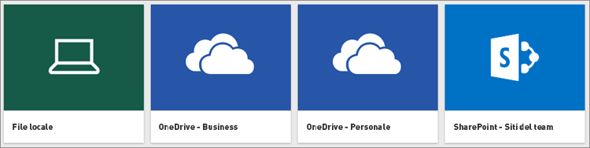

# Ottenere dati da file con valori delimitati da virgole (CSV)

I file con valori delimitati da virgole, spesso noti come file CSV, sono semplici file di testo contenenti righe di dati in cui ogni valore è separato da una virgola. Questi tipi di file possono contenere grandi quantità di dati all'interno di un file di dimensioni relativamente ridotte, il che li rende un'origine dati ideale per Power BI. È possibile scaricare un file CSV di esempio [qui](http://go.microsoft.com/fwlink/?LinkID=619356).

Se si ha un file CSV, è necessario scaricarlo nel sito Power BI come set di dati in cui è possibile iniziare l'esplorazione dei dati, creare alcuni dashboard e condividere informazioni con altri utenti.

>[!TIP]
>Molte organizzazioni generano un file CSV con dati aggiornati ogni giorno. Per assicurarsi che il set di dati in Power BI resti sincronizzata con il file aggiornato, verificare che il file venga salvato in OneDrive con lo stesso nome.

## La posizione di salvataggio del file fa la differenza
**Locale**: se si salva il file CSV in un'unità locale del computer o in un'altra posizione all'interno dell'organizzazione, da Power BI è possibile *importare* il file in Power BI. Il file in realtà rimane memorizzato nel disco locale, per cui non viene effettivamente importato in Power BI. Viene invece creato un nuovo set di dati in Power BI, in cui vengono caricati i dati dal file CSV.

**OneDrive for Business**: se si ha OneDrive for Business e si esegue l'accesso con lo stesso account con cui si accede a Power BI, questo è decisamente il modo più efficace per sincronizzare il file CSV in Excel con i set di dati, i report e i dashboard in Power BI. Dato che sia Power BI che OneDrive sono nel cloud, Power BI *si connette* al file in OneDrive all'incirca ogni ora. Se vengono rilevate modifiche, il set di dati, i report e i dashboard vengono aggiornati automaticamente in Power BI.

**OneDrive - Personale**: se si salvano i file nel proprio account OneDrive personale, si ottengono molti dei vantaggi offerti da OneDrive for Business. La differenza principale consiste nel fatto che quando ci si connette al file per la prima volta (scegliendo Recupera dati > File > OneDrive - Personale) è necessario accedere a OneDrive con il proprio account Microsoft, che in genere è diverso da quello usato per accedere a Power BI. Quando si accede a OneDrive con l'account Microsoft, assicurarsi di selezionare l'opzione Mantieni l'accesso. In questo modo, Power BI potrà connettersi al file circa ogni ora e verificare che il set di dati in Power BI sia sincronizzato.

**SharePoint - Siti del team**: il salvataggio dei file di Power BI Desktop in SharePoint - Siti del team corrisponde a grandi linee al salvataggio in OneDrive for Business. La differenza principale è rappresentata dalla modalità di connessione al file da Power BI. Si può specificare un URL o connettersi alla cartella radice.

## Importare o connettersi a un file CSV
>[!IMPORTANT]
>Le dimensioni dei file importati in Power BI non possono superare 1 gigabyte.

1. Nello strumento di navigazione di Power BI fare clic su **Recupera dati**.
   
   
2. In **File** fare clic su **Recupera**.
   
   
3. Trovare il file.
   
   

## Passaggi successivi
**Esplorare i dati**: una volta importati i dati dal file in Power BI, è possibile iniziare a esplorarli. Fare semplicemente clic con il pulsante destro del mouse sul nuovo set di dati e quindi scegliere **Esplora**.

**Pianifica aggiornamenti**: se il file viene salvato in un'unità locale, è possibile configurare l'aggiornamento pianificato in modo che il set di dati e i report in Power BI siano sempre aggiornati. Per altre informazioni, vedere [Aggiornamento dei dati in Power BI](refresh-data.md). Se il file viene salvato in OneDrive, Power BI verrà automaticamente sincronizzato con esso circa ogni ora.

