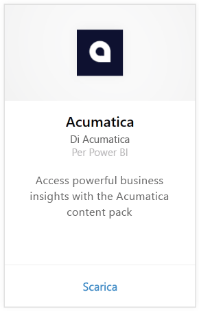
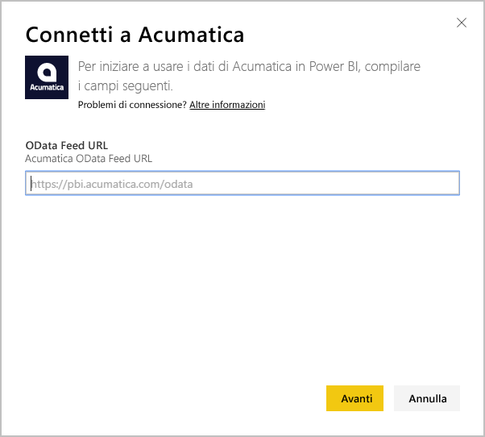
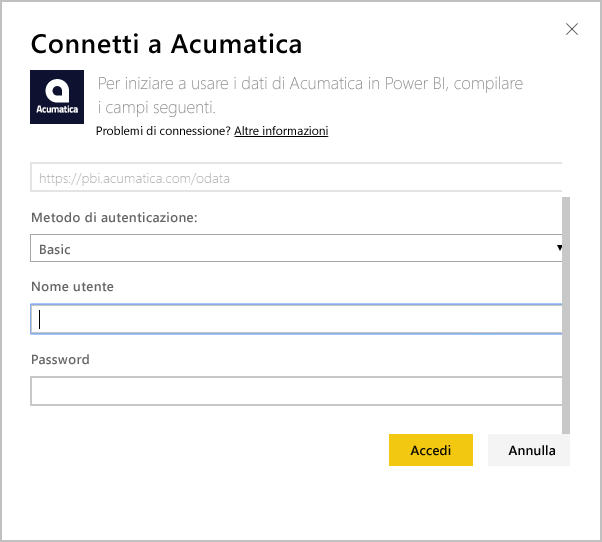
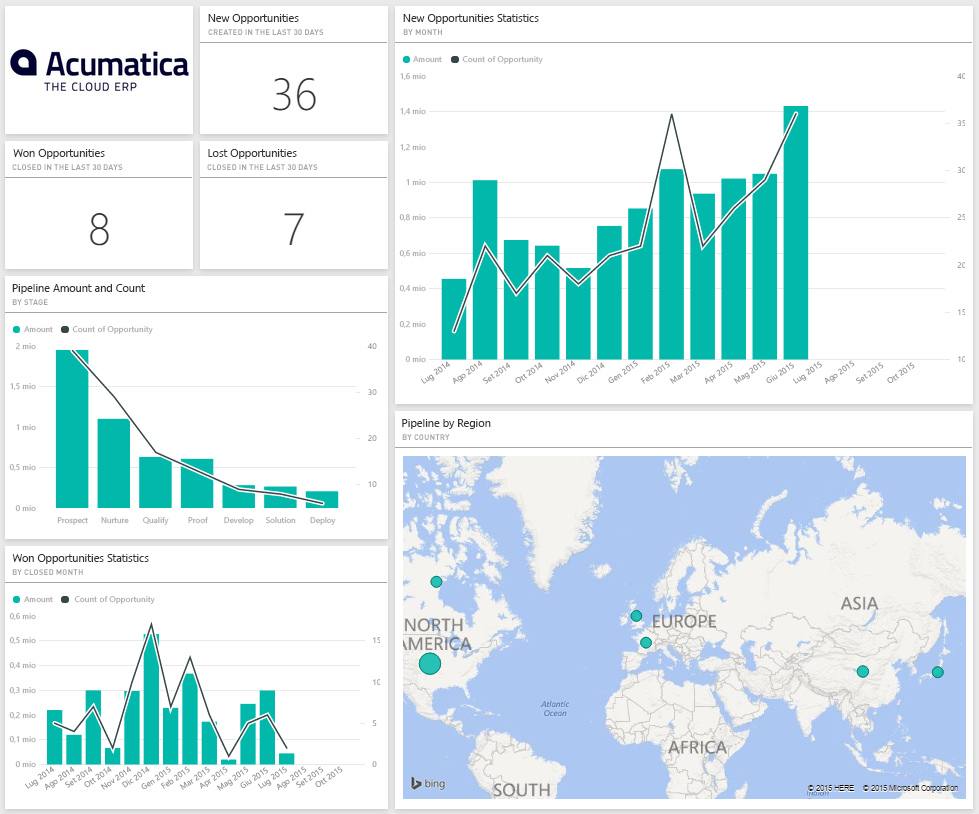
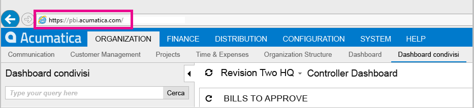
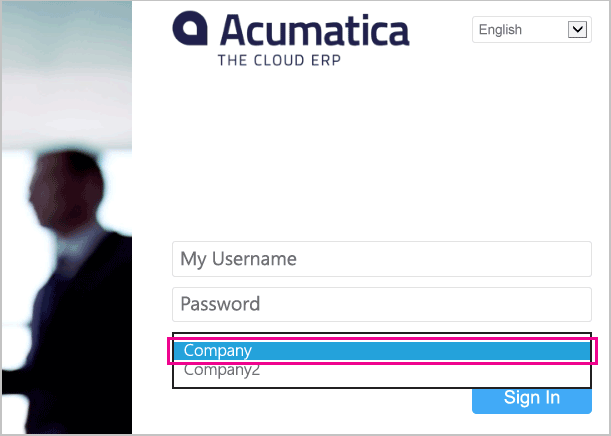

# Connettersi ad Acumatica con Power BI
Il pacchetto di contenuto Acumatica di Power BI consente di ottenere rapidamente informazioni sui dati relativi alle opportunità. Power BI recupera infatti i dati, inclusi quelli relativi alle opportunità, agli account e ai clienti, creando quindi un dashboard predefinito e report correlati basati su tali dati.

Connettersi al [pacchetto di contenuto Acumatica](https://app.powerbi.com/getdata/services/acumatica) oppure ottenere altre informazioni sull'[integrazione di Acumatica](https://powerbi.microsoft.com/integrations/acumatica) con Power BI.

>[!NOTE]
>Questo pacchetto di contenuto richiede Acumatica 5.2 o versioni successive.

## Come connettersi
1. Selezionare **Recupera dati** nella parte inferiore del riquadro di spostamento sinistro.
   
   
2. Nella casella **Servizi** selezionare **Recupera**.
   
   
3. Selezionare **Acumatica** \> **Recupera**.
   
   
4. Immettere l'endpoint OData di Acumatica. Un endpoint OData consente a un sistema esterno di richiedere i dati da Acumatica. L'endpoint OData di Acumatica è formattato come segue e deve usare HTTPS:
   
     https://[dominiosito]/OData/[NomeSocietà]
   
   Il nome dell'azienda è richiesto solo in caso di distribuzioni in più aziende. Altre informazioni sulla ricerca di questo parametro nell'account Acumatica sono disponibili di seguito.
   
   
5. In Metodo di autenticazione selezionare **Di base**. Immettere il nome utente e la password dall'account Acumatica, quindi fare clic su **Accedi**.
   
    
6. Dopo l'importazione dei dati in Power BI, nel riquadro di spostamento sinistro vengono visualizzati il nuovo dashboard, il nuovo report e il nuovo set di dati. I nuovi elementi sono contrassegnati con un asterisco \* giallo che scompare quando viene selezionato. Se si sceglie il dashboard, il layout risultante sarà simile al seguente:
   
    

**Altre operazioni**

* Provare a [porre una domanda nella casella Domande e risposte](power-bi-q-and-a.md) nella parte superiore del dashboard
* [Cambiare i riquadri](service-dashboard-edit-tile.md) nel dashboard.
* [Selezionare un riquadro](service-dashboard-tiles.md) per aprire il report sottostante.
* Anche se la pianificazione prevede che il set di dati venga aggiornato quotidianamente, è possibile modificare la frequenza di aggiornamento o provare ad aggiornarlo su richiesta usando **Aggiorna ora**

## Requisiti di sistema
Questo pacchetto di contenuto richiede Acumatica 5.2 o versioni successive. Rivolgersi all'amministratore per verificare la versione.

## Individuazione dei parametri
**Endpoint OData di Acumatica**

L'endpoint OData di Acumatica è formattato come segue e deve usare HTTPS:

    https://[sitedomain]/odata/[companyname]

Il dominio del sito applicazioni è disponibile nella barra degli indirizzi del browser quando si accede ad Acumatica. Nell'esempio seguente il dominio del sito è `https://pbi.acumatica.com` in modo che l'endpoint OData da fornire sarà `https://pbi.acumatica.com/odata`.

 

Il nome dell'azienda è richiesto solo in caso di distribuzioni in più aziende. Queste informazioni sono disponibili nella pagina di accesso di Acumatica.

## Risoluzione dei problemi
Se non è possibile eseguire l'accesso, verificare che l'endpoint OData di Acumatica fornito sia formattato correttamente.

    https://<application site domain>/odata/<company name>

In caso di problemi di connessione, verificare la versione di Acumatica con l'amministratore. Questo pacchetto di contenuto richiede la versione 5.2 o successive.

## Passaggi successivi
[Introduzione a Power BI](service-get-started.md)

[Recuperare dati in Power BI](service-get-data.md)

