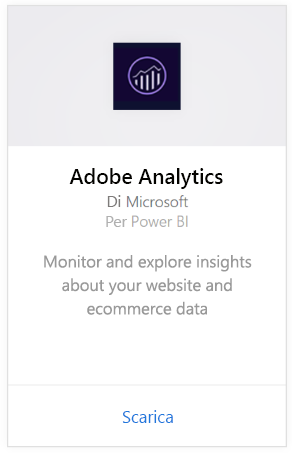
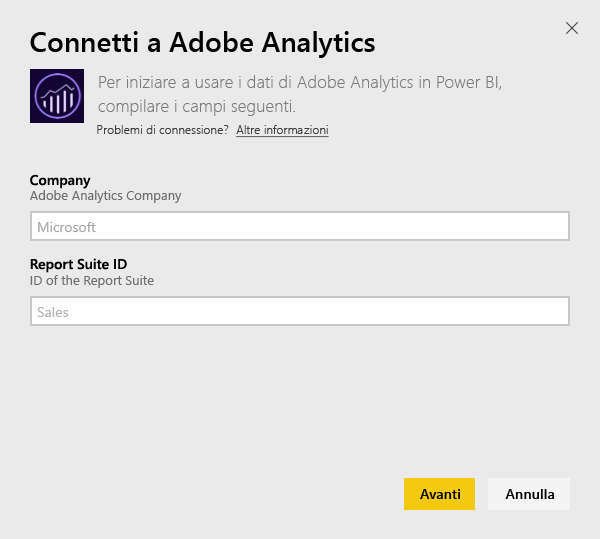
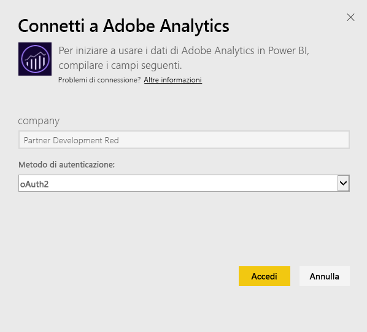
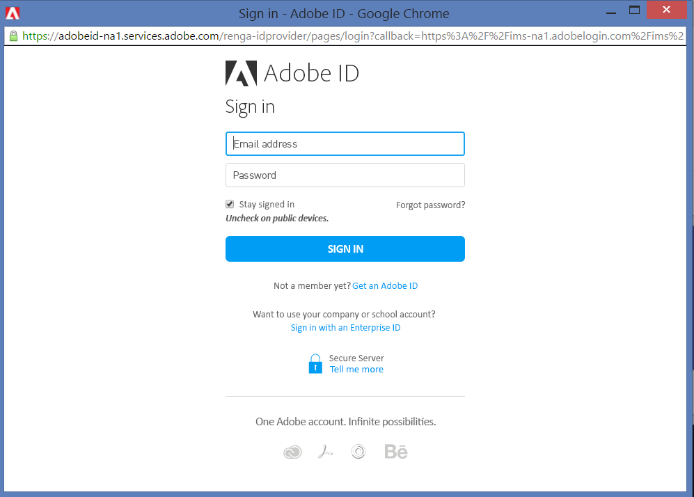
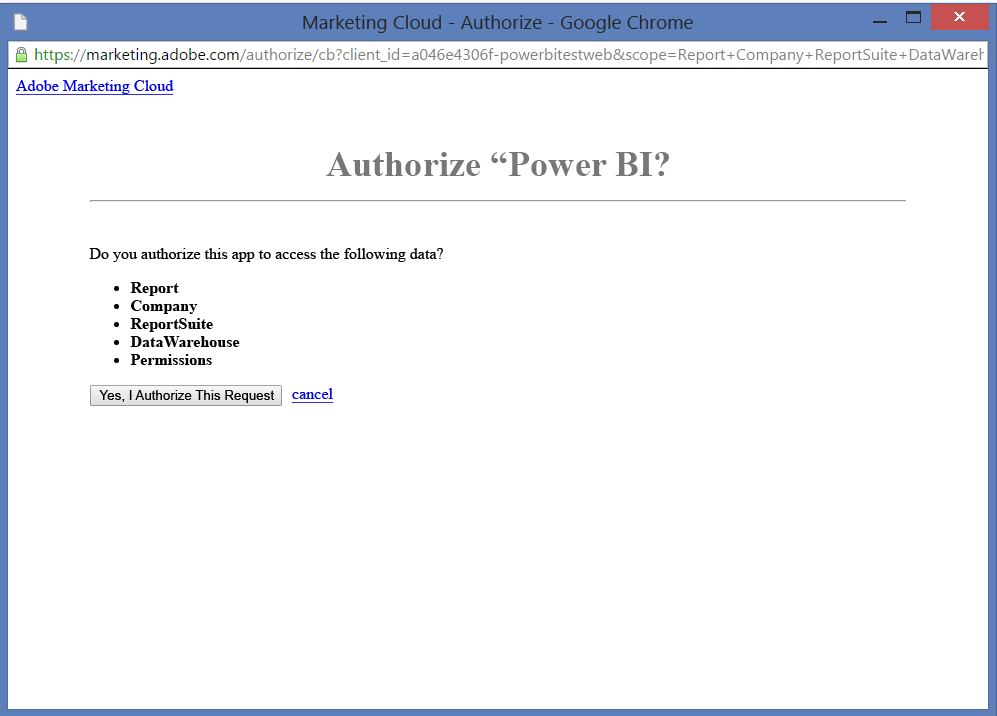
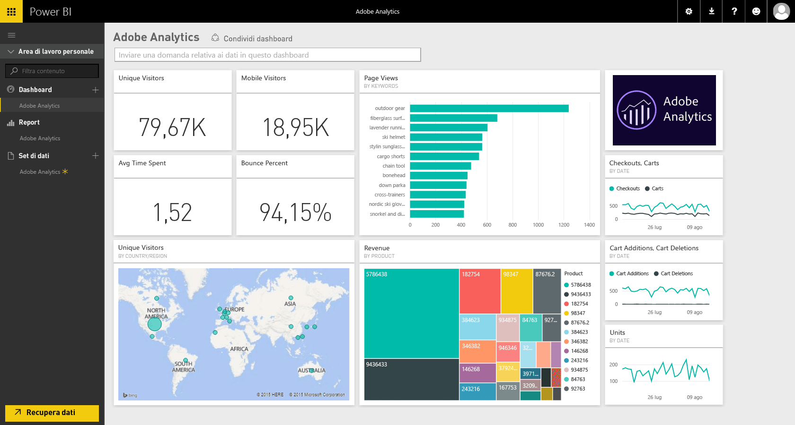
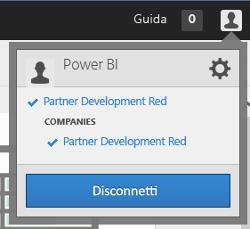
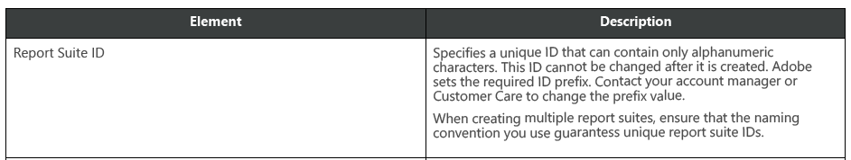

# Connettersi ad Adobe Analytics con Power BI
Per connettersi ad Adobe Analytics con Power BI, è necessario prima di tutto connettersi all'account di Adobe Analytics Marketing Cloud. Si ottiene un'app con un dashboard e un set di report di Power BI che forniscono informazioni dettagliate sul traffico e sul numero di utenti del sito. I dati vengono aggiornati automaticamente una volta al giorno. È possibile interagire con i dashboard e i report, ma non è possibile salvare le modifiche.

Connettersi ad [Adobe Analytics](https://app.powerbi.com/getdata/services/adobe-analytics) oppure vedere altre informazioni sull'[integrazione di Adobe Analytics](https://powerbi.microsoft.com/integrations/adobe-analytics) con Power BI.

## Come connettersi
[!INCLUDE [powerbi-service-apps-get-more-apps](./includes/powerbi-service-apps-get-more-apps.md)]

3. Selezionare **Adobe Analytics** \>  **Recupera**.
   
   
4. Power BI si connette a uno specifico ID aziendale e di suite di report di Adobe Analytics, non al nome della suite di report. Per informazioni dettagliate su come [trovare questi parametri](#FindingParams), vedere più avanti.
   
   
5. In **Metodo di autenticazione** selezionare **oAuth2** \> **Accedi**. Quando richiesto, immettere le credenziali di Adobe Analytics. 
   
    
   
    
6. Fare clic su **Accetta** per consentire a Power BI di accedere ai dati di Adobe Analytics.
   
   
7. Dopo l'approvazione, il processo di importazione si avvia automaticamente. 

## Visualizzare report e dashboard di Adobe Analytics
[!INCLUDE [powerbi-service-apps-open-app](./includes/powerbi-service-apps-open-app.md)]

   

[!INCLUDE [powerbi-service-apps-open-app](./includes/powerbi-service-apps-what-now.md)]

## Cosa è incluso
Power BI usa l'API Adobe Analytics Report per definire ed eseguire report per le tabelle seguenti:

| **Nome tabella** | **Dettagli colonna** |
| --- | --- |
| Prodotti |elements=  "product" (top 25)   metrics="cartadditions", "cartremovals", "carts", "cartviews", "checkouts", "revenue", "units" |
| Browser |elements= "browser" (top 25)   metrics="bounces", "bouncerate", "visitors", "visits", "uniquevisitors", "totaltimespent", "pageviews" |
| Pagine |elements= "page" (top 25)   metrics="cartadditions", "cartremovals", "carts", "cartviews", "checkouts", "revenue", "units", "visits", "uniquevisitors", "pageviews", "bounces", "bouncerate", "totaltimespent" |
| JavaScript abilitato |elements=  "javascriptenabled”, “browser” (top 25) |
| Sistema operativo mobile |elements= "mobileos"(top 25)  metrics="bounces", "bouncerate", "visitors", "visits", "uniquevisitors", "totaltimespent", "cartadditions", "cartremovals", "checkouts", "revenue", "units", "pageviews" |
| Parole chiave per motori di ricerca |elements= "searchengine" "searchenginekeyword"   metrics="bounces", "bouncerate", "visitors", "visits", "entries", "uniquevisitors", "totaltimespent", "cartadditions", "cartremovals", "carts", "cartviews", "checkouts", "revenue", "units", "pageviews" |
| Motore di ricerca di prodotti |elements= "searchengine", "product"   metrics="bounces", "bouncerate", "visitors", "visits", "entries", "uniquevisitors", "totaltimespent", "cartadditions", "cartremovals", "carts", "cartviews", "checkouts", "revenue", "units", "pageviews" |
| Pagine di riferimento |elements= "referrer" (top 15), “page" (top 10)   metrics="bounces", "bouncerate", "visitors", "visits", "entries", "uniquevisitors", "totaltimespent", "cartadditions", "cartremovals", "carts", "cartviews", "checkouts", "revenue", "units", "pageviews" |
| Pagine Geocountry |elements= "geocountry" (Top 20), "page"   metrics="bounces", "bouncerate", "visitors", "visits", "entries", "uniquevisitors", "totaltimespent", "cartadditions", "cartremovals", "carts", "cartviews", "checkouts", "revenue", "units", "pageviews" |
| Prodotto Geocountry |elements= "geocountry" (Top 20), "product"  metrics="bounces", "bouncerate", "visitors", "visits", "entries", "uniquevisitors", "totaltimespent", "cartadditions", "cartremovals", "carts", "cartviews", "checkouts", "revenue", "units" |
| Ricerca paese e area |elements= "geocountry" (Top 200)   metrics="bounces", "bouncerate", "visitors", "visits", "entries", "uniquevisitors", "totaltimespent", "cartadditions", "cartremovals", "carts", "cartviews", "checkouts", "revenue", "units" |
| Lingua |elements= "language", "browser" (Top 25)   metrics="bounces", "bouncerate", "visitors", "visits", "uniquevisitors", "totaltimespent", "pageviews", "cartadditions", "cartremovals", "checkouts", "carts", "cartviews" |
| Ricerca per motori di ricerca |elements= "searchengine" (top 100)   metrics="bounces", "bouncerate", "visitors", "visits", "entries", "uniquevisitors", "totaltimespent", "cartadditions", "cartremovals", "carts", "cartviews", "checkouts", "revenue", "units" |
| Ricerca browser |elements= "browser" (top 25) |

## Requisiti di sistema
L'accesso ad [Adobe Analytics](http://www.adobe.com/marketing-cloud/web-analytics.html) è obbligatorio, incluso l'accesso ai parametri corretti, come descritto di seguito.

## Individuazione dei parametri
**Società**

Il valore Società viene visualizzato nella parte superiore destra dell'account dopo aver eseguito l'accesso. Il valore rileva la distinzione tra maiuscole e minuscole e spazi. Immetterlo esattamente come viene visualizzato nell'account.

**ID Report Suite**

L'ID Suite viene creato durante la creazione di Report Suite. Per identificare il valore ID è possibile contattare l'amministratore. Non corrisponde al nome di Report Suite.

Dalla [documentazione](https://marketing.adobe.com/resources/help/en_US/reference/new_report_suite.html) Adobe:

## Risoluzione dei problemi
Se dopo aver specificato le credenziali viene visualizzato un errore che segnala la mancanza di autorizzazioni, rivolgersi all'amministratore per verificare di avere accesso all'API di Adobe Analytics. Verificare anche che l'ID Adobe specificato sia collegato all'organizzazione Cloud Marketing (associata a una società Adobe Analytics).

Se viene visualizzato un errore dopo aver fornito correttamente le credenziali, è possibile che il completamento dei report impieghi troppo tempo. Un errore comune è presentato nel formato *"Impossibile ottenere dati dal report di Adobe Analytics. Contenuto incluso &quot;referrer, page&quot;, durata approssimativa: xx secondi"*. Rivedere la sezione "Cosa è incluso" e confrontare le dimensioni dell'istanza di Adobe. Purtroppo non esiste attualmente un modo per ovviare a questo timeout. Si sta tuttavia prendendo in considerazione la possibilità di aggiornamenti per migliorare il supporto delle istanze più grandi. Inviare eventuali commenti e suggerimenti al team di Power BI all'indirizzo https://ideas.powerbi.com

## Passaggi successivi
* [Cosa sono le app in Power BI?](service-create-distribute-apps.md)
* [Recuperare dati in Power BI](service-get-data.md)
* Altre domande? [Provare a rivolgersi alla community di Power BI](http://community.powerbi.com/)

