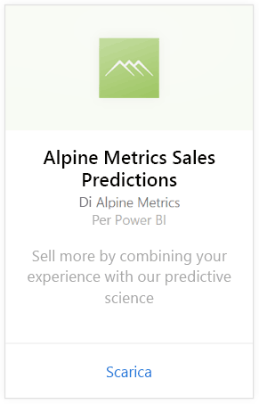
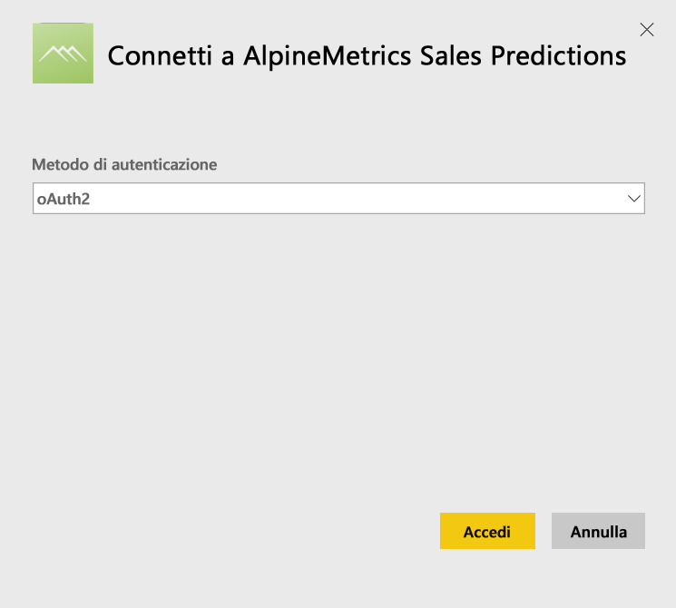
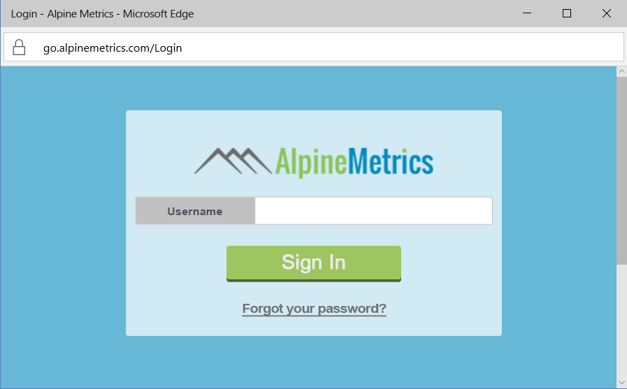
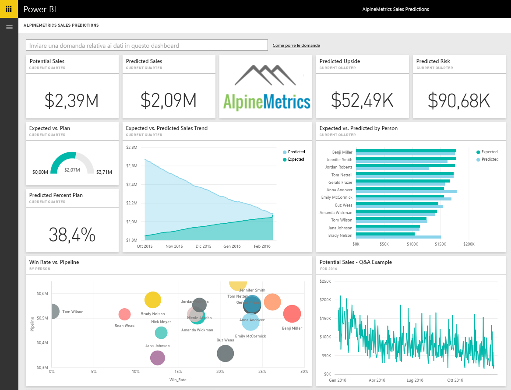

# Connettersi ad Alpine Metrics Sales Predictions con Power BI
Alpine Metrics offre servizi all'avanguardia per l'ottimizzazione dei processi di vendita basata sull'analisi predittiva nel cloud e su richiesta per società commerciali di piccole e grandi dimensioni. Il pacchetto di contenuto Alpine Metrics Sales Predictions per Power BI include metriche, ad esempio vendite potenziali e stimate e rischi, che consentono una maggiore conoscenza del futuro dell'azienda. 

Connettersi al [Pacchetto di contenuto Alpine Metrics Sales Predictions](https://app.powerbi.com/getdata/services/alpine-metrics) per Power BI.

## Come connettersi
1. Selezionare Recupera dati nella parte inferiore del riquadro di spostamento sinistro.  
   
    
2. Nella casella **Servizi** selezionare **Recupera**.  
   
    
3. Selezionare **AlpineMetrics Sales Predictions**, quindi selezionare **Recupera**.  
   
    
4. Selezionare **OAuth 2**, quindi **Accedi**. Quando richiesto, fornire le credenziali di AlpineMetrics.
   
    
   
    
5. Dopo la connessione vengono caricati automaticamente un dashboard, un report e un set di dati. Al termine, i riquadri vengono aggiornati con i dati dell'account.
   
    

**Altre operazioni**

* Provare a [porre una domanda nella casella Domande e risposte](power-bi-q-and-a.md) nella parte superiore del dashboard
* [Cambiare i riquadri](service-dashboard-edit-tile.md) nel dashboard.
* [Selezionare un riquadro](service-dashboard-tiles.md) per aprire il report sottostante.
* Anche se la pianificazione prevede che il set di dati venga aggiornato quotidianamente, è possibile modificare la frequenza di aggiornamento o provare ad aggiornarlo su richiesta usando **Aggiorna ora**

## Cosa è incluso
Il pacchetto di contenuto include i dati delle tabelle seguenti:  

    - Account    
    - Business    
    - Country    
    - Industry    
    - Opportunità  
    - Person  
    - Prediction    
    - Prediction History    
    - Product  
    - Region    

## Requisiti di sistema
È necessario un account Alpine Metrics con le autorizzazioni per le tabelle precedenti per creare un'istanza di questo pacchetto di contenuto.

## Passaggi successivi
[Introduzione a Power BI](service-get-started.md)

[Power BI - Concetti di base](service-basic-concepts.md)

