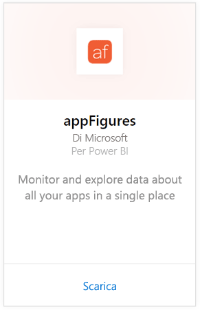
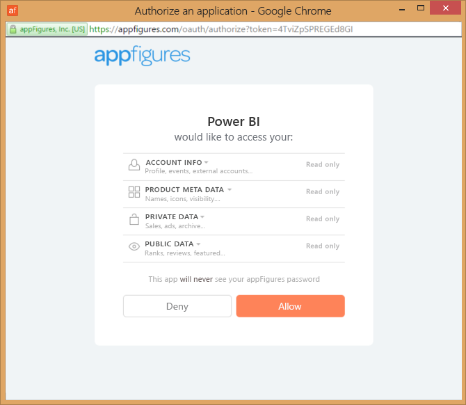
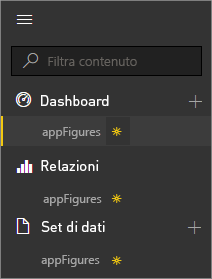
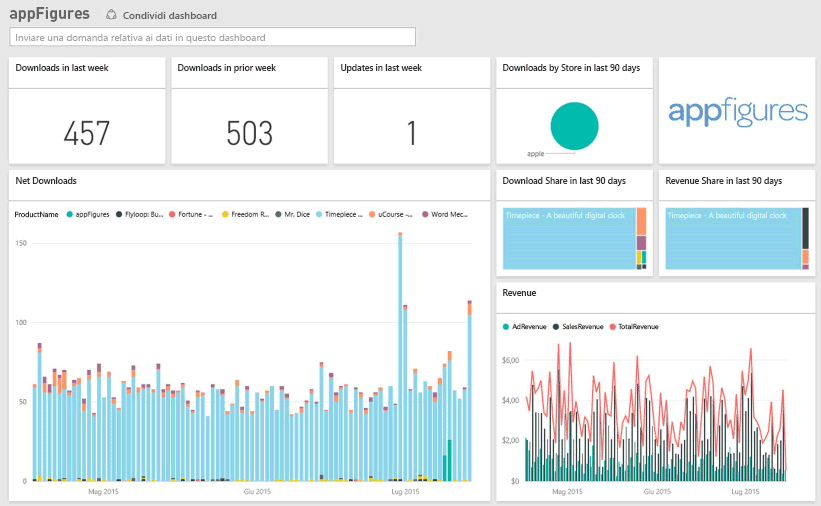
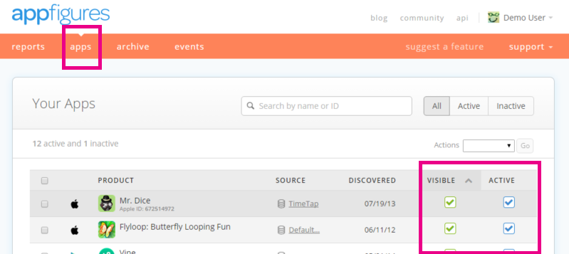

# Connettersi ad appFigures con Power BI
L'uso combinato di Power BI e del pacchetto di contenuto appFigures consente di tenere facilmente traccia di importanti statistiche sulle app. Power BI recupera infatti i dati, inclusi quelli relativi alle statistiche su vendite, download e annunci, creando quindi un dashboard predefinito e report correlati basati su tali dati.

Connettersi al [pacchetto di contenuto appFigures](https://app.powerbi.com/getdata/services/appfigures) oppure ottenere altre informazioni sull'[integrazione di appFigures](https://powerbi.microsoft.com/integrations/appfigures) con Power BI.

## Come connettersi
1. Selezionare **Recupera dati** nella parte inferiore del riquadro di spostamento sinistro.
   
   
2. Nella casella **Servizi** selezionare **Recupera**.
   
   
3. Selezionare **appFigures** \> **Recupera**.
   
   
4. In **Metodo di autenticazione** selezionare **oAuth2** \> **Accedi**. Quando richiesto, immettere le credenziali di appFigures e seguire il relativo processo di autenticazione.
   
   Alla prima connessione Power BI chiede di consentire l'accesso in sola lettura all'account. Selezionare **Consenti** per avviare il processo di importazione. L'operazione può richiedere qualche minuto a seconda del volume dei dati dell'account.
   
   
5. Dopo l'importazione dei dati in Power BI, nel riquadro di spostamento sinistro vengono visualizzati il nuovo dashboard, il nuovo report e il nuovo set di dati. I nuovi elementi sono contrassegnati con un asterisco giallo \*:
   
    
6. Selezionare il dashboard appFigures. Si tratta del dashboard predefinito creato da Power BI per visualizzare i dati, che è possibile modificare per visualizzare i dati nel modo desiderato.
   
    

**Altre operazioni**

* Provare a [porre una domanda nella casella Domande e risposte](service-q-and-a.md) nella parte superiore del dashboard
* [Cambiare i riquadri](service-dashboard-edit-tile.md) nel dashboard.
* [Selezionare un riquadro](service-dashboard-tiles.md) per aprire il report sottostante.
* Anche se la pianificazione prevede che il set di dati venga aggiornato quotidianamente, è possibile modificare la frequenza di aggiornamento o provare ad aggiornarlo su richiesta usando **Aggiorna ora**

## Cosa è incluso
I dati seguenti sono disponibili da appFigures in Power BI.

| **Nome tabella** | **Descrizione** |
| --- | --- |
| Countries |Questa tabella fornisce informazioni sui nomi di paese. |
| Dates |Questa tabella include le date a partire da oggi fino alla prima data di pubblicazione di app il cui stato è Active e Visible nell'account di appFigures. |
| Events |Questa tabella contiene informazioni su download, vendite e annunci per ciascuna app, ordinate per paese e su base giornaliera. Notare che tutte le informazioni sugli acquisti app e in-app sono indicate in questa tabella, ma è possibile usare la colonna <strong>Tipo</strong> per distinguerle. |
| Inapps |Questa tabella contiene dati sui diversi tipi di acquisti in-app associati ad app il cui stato è Active e Visible nell'account di appFigures. |
| Prodotti |Questa tabella contiene dati sulle diverse app il cui stato è Active e Visible nell'account di appFigures. |

## Risoluzione dei problemi
Se i dati di alcune app non vengono visualizzati in Power BI, verificare che lo stato di tali app sia visibile e attivo nella scheda delle **app** del sito appFigures.

## Passaggi successivi
* [Introduzione a Power BI](service-get-started.md)
* [Recuperare dati in Power BI](service-get-data.md)

