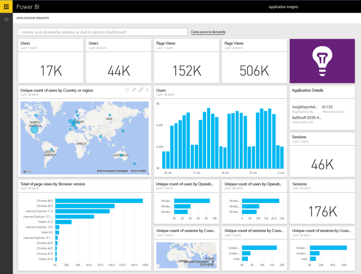

# Connettersi ad Application Insights con Power BI
Usare Power BI per creare potenti dashboard personalizzati in base ai dati di telemetria di [Application Insights](https://azure.microsoft.com/documentation/articles/app-insights-overview/). Concepire i dati di telemetria dell'app in nuovi modi. Combinare metriche da più app o servizi componenti in un unico dashboard. Questa prima versione del pacchetto di contenuto Power BI per Application Insights include widget per metriche relative all'uso comune, ad esempio utenti attivi, visualizzazione della pagina, sessioni, versione del browser e del sistema operativo e la distribuzione geografica degli utenti in una mappa.

Connettersi al [Pacchetto di contenuto Application Insights per Power BI](https://app.powerbi.com/getdata/services/application-insights).

>[!NOTE]
>Per la connessione è necessario accedere al pannello della panoramica di Application Insights per l'applicazione nel portale di anteprima di Azure. Di seguito sono fornite informazioni più dettagliate sui requisiti.

## Come connettersi
1. Selezionare **Recupera dati** nella parte inferiore del riquadro di spostamento sinistro.
   
    
2. Nella casella **Servizi** selezionare **Recupera**.
   
    
3. Selezionare **Application Insights** > **Recupera**.
   
    
4. Fornire i dettagli dell'applicazione a cui ci si vuole connettere, tra cui il **nome della risorsa di Application Insights**, il **gruppo di risorse**e l' **ID sottoscrizione**. Per altre informazioni, vedere [Ricerca dei parametri di Application Insights](#FindingAppInsightsParams) qui di seguito.
   
        
5. Selezionare **Accedi** e seguire le istruzioni per la connessione.
   
    
6. Il processo di importazione inizia automaticamente. Al termine viene visualizzata una notifica e nel riquadro di spostamento verranno visualizzati un nuovo dashboard, un nuovo report e un nuovo set di dati, contrassegnati con un asterisco.  Selezionare il dashboard per visualizzare i dati importati.
   
    

**Altre operazioni**

* Provare a [porre una domanda nella casella Domande e risposte](service-q-and-a.md) nella parte superiore del dashboard
* [Cambiare i riquadri](service-dashboard-edit-tile.md) nel dashboard.
* [Selezionare un riquadro](service-dashboard-tiles.md) per aprire il report sottostante.
* Anche se la pianificazione prevede che il set di dati venga aggiornato quotidianamente, è possibile modificare la frequenza di aggiornamento o provare ad aggiornarlo su richiesta usando **Aggiorna ora**

## Cosa è incluso
Il pacchetto di contenuto Application Insights include le tabelle e le metriche seguenti:  

    - ApplicationDetails  
    - UniqueUsersLast7Days   
    - UniqueUsersLast30Days   
    - UniqueUsersDailyLast30Days  
    - UniqueUsersByCountryLast7Days  
    - UniqueUsersByCountryLast30Days   
    - PageViewsDailyLast30Days   
    - SessionsLast7Days   
    - SessionsLast30Days  
    - PageViewsByBrowserVersionDailyLast30Days   
    - UniqueUsersByOperatingSystemLast7Days   
    - UniqueUsersByOperatingSystemLast30Days    
    - SessionsDailyLast30Days   
    - SessionsByCountryLast7Days   
    - SessionsByCountryLast30Days   
    - PageViewsByCountryDailyLast30Days   

## Individuazione dei parametri
Il nome della risorsa, il gruppo di risorse e l'ID sottoscrizione sono reperibili nel portale di Azure. Selezionando il nome verrà aperta una visualizzazione dettagliata; sarà possibile usare l'elenco a discesa Essentials per trovare tutti i valori necessari.

Copiare e incollare i dati nei campi in Power BI:

## Passaggi successivi
[Introduzione a Power BI](service-get-started.md)

[Recuperare dati in Power BI](service-get-data.md)

