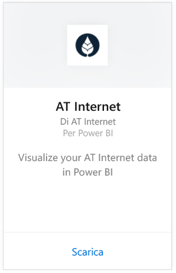
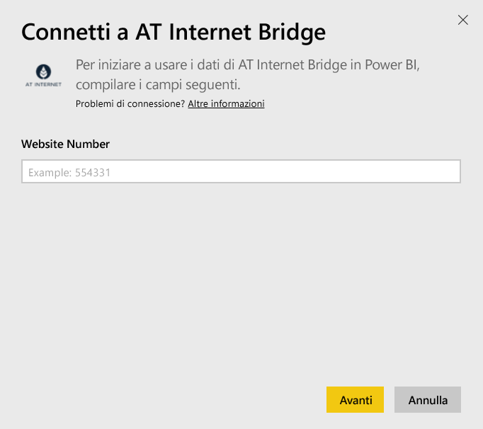
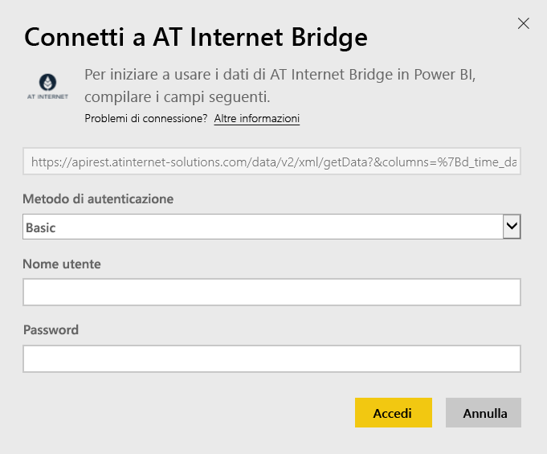

# Connettersi ad AT Internet Bridge con Power BI
AT Internet consente di estrarre un valore immediato dai dati tramite la piattaforma di analisi digitale unificata, la suite di analisi. Il pacchetto di contenuto AT Internet Bridge per Power BI include dati su visite, origini, localizzazione e dispositivi per il sito.

Connettersi al [pacchetto di contenuto AT Internet Bridge](https://app.powerbi.com/getdata/services/at-internet-bridge) per Power BI.

## Come connettersi
1. Selezionare **Recupera dati** nella parte inferiore del riquadro di spostamento sinistro.
   
    
2. Nella casella **Servizi** selezionare **Recupera**.
   
    
3. Selezionare **AT Internet Bridge** \> **Recupera**.
   
   
4. Specificare il numero di sito Web AT Internet a cui ci si vuole connettere.
   
   
5. Selezionare **Basic** come meccanismo di autenticazione, specificare nome utente e password AT Internet e fare clic su **Accedi**.
   
   
6. Fare clic su **Connetti** per avviare il processo di importazione. Al termine nel riquadro di spostamento verranno visualizzati un nuovo dashboard, un nuovo report e un nuovo set di dati. Selezionare il dashboard per visualizzare i dati importati.
   
    

**Altre operazioni**

* Provare a [porre una domanda nella casella Domande e risposte](power-bi-q-and-a.md) nella parte superiore del dashboard
* [Cambiare i riquadri](service-dashboard-edit-tile.md) nel dashboard.
* [Selezionare un riquadro](service-dashboard-tiles.md) per aprire il report sottostante.
* Anche se la pianificazione prevede che il set di dati venga aggiornato quotidianamente, è possibile modificare la frequenza di aggiornamento o provare ad aggiornarlo su richiesta usando **Aggiorna ora**

## Cosa è incluso
Questo pacchetto di contenuto contiene i dati degli ultimi 45 giorni nelle tabelle seguenti:  

    - Conversion  
    - Devices  
    - Localization  
    - Sources  
    - Global Visits  

## Passaggi successivi
[Introduzione a Power BI](service-get-started.md)

[Power BI - Concetti di base](service-basic-concepts.md)

