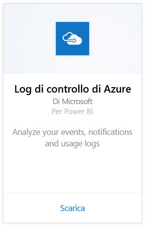
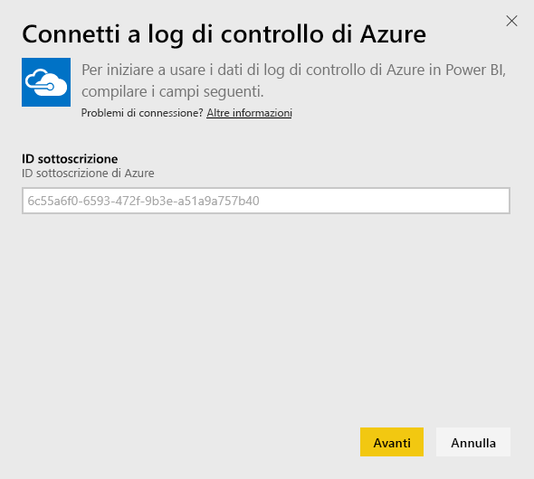
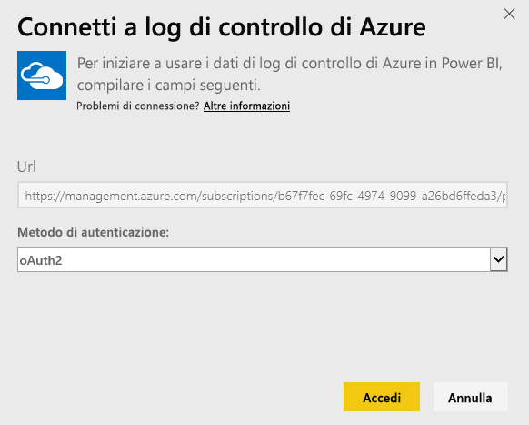
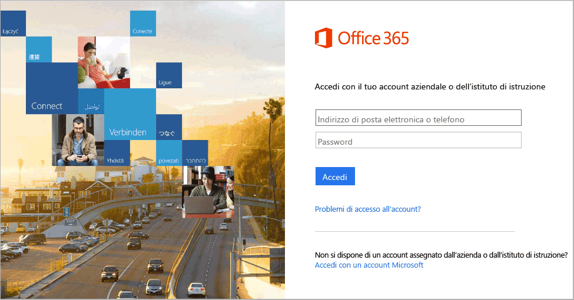
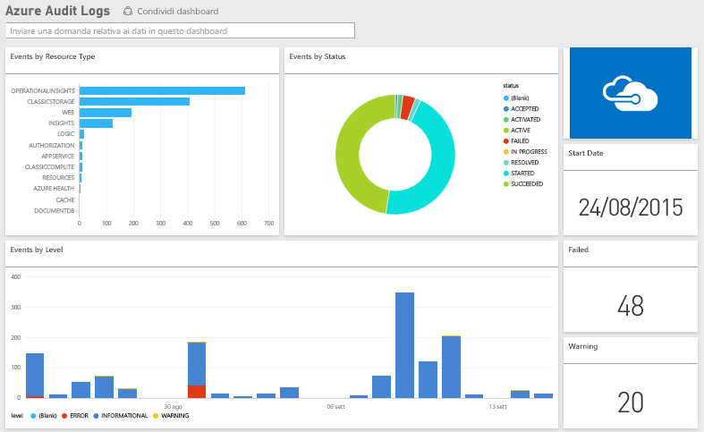

# Connettersi ai log di controllo di Azure con Power BI
Con il pacchetto di contenuto Log di controllo di Azure è possibile analizzare e visualizzare le informazioni archiviate nei log di controllo. Power BI recupera i dati, crea un dashboard predefinito e report basati su tali dati.

[Connettersi al pacchetto di contenuto Log di controllo di Azure](https://app.powerbi.com/getdata/services/azure-audit-logs) oppure ottenere altre informazioni sull'[integrazione di Log di controllo di Azure](https://powerbi.microsoft.com/integrations/azure-audit-logs) con Power BI.

## Come connettersi
1. Selezionare **Recupera dati** nella parte inferiore del riquadro di spostamento sinistro.  
   
    
2. Nella casella **Servizi** selezionare **Recupera**.  
   
     
3. Selezionare **Log di controllo di Azure**  > **Recupera**.  
   
   
4. Quando richiesto, immettere l' **ID sottoscrizione di Azure**. Di seguito sono riportate informazioni dettagliate su come trovare il proprio [ID sottoscrizione](#FindingParams).   
   
    
5. In **Metodo di autenticazione** selezionare **oAuth2** \> **Accedi**.
   
    
6. Immettere le credenziali dell'account per terminare il processo di accesso.
   
    
7. Power BI recupererà i dati dei Log di controllo di Azure e creerà automaticamente un dashboard e un report pronti da usare. 
   
    

**Altre operazioni**

* Provare a [porre una domanda nella casella Domande e risposte](service-q-and-a.md) nella parte superiore del dashboard
* [Cambiare i riquadri](service-dashboard-edit-tile.md) nel dashboard.
* [Selezionare un riquadro](service-dashboard-tiles.md) per aprire il report sottostante.
* Anche se la pianificazione prevede che il set di dati venga aggiornato quotidianamente, è possibile modificare la frequenza di aggiornamento o provare ad aggiornarlo su richiesta usando **Aggiorna ora**

## Requisiti di sistema
Il pacchetto di contenuto Log di controllo di Azure richiede l'accesso ai log di controllo nel portale di Azure. Altre informazioni sono disponibili [qui](https://azure.microsoft.com/en-us/documentation/articles/insights-debugging-with-events/).

## Individuazione dei parametri
È possibile trovare l'ID sottoscrizione in due semplici modi.

1. Da https://portal.azure.com -&gt; Esplora -&gt; Sottoscrizioni -&gt; ID sottoscrizione
2. Da https://manage.windowsazure.com -&gt; Impostazioni  -&gt; ID sottoscrizione

L'ID sottoscrizione sarà un lungo set di numeri e caratteri, simile a quello nell'esempio del punto \#4 sopra riportato. 

## Risoluzione dei problemi
Se viene visualizzato un errore di credenziali o un errore durante il tentativo di aggiornamento a causa di credenziali non valide, provare a eliminare tutte le istanze del pacchetto di contenuto Log di controllo di Azure e a ricollegarsi.

## Passaggi successivi
[Introduzione a Power BI](service-get-started.md)  
[Power BI - Concetti di base](service-basic-concepts.md)  

