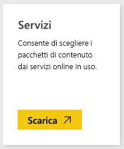
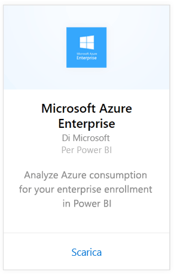
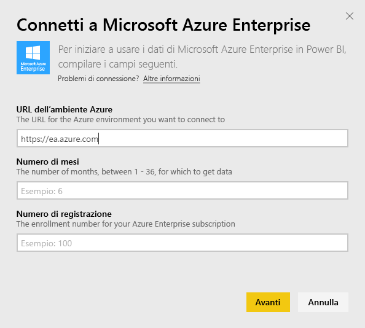
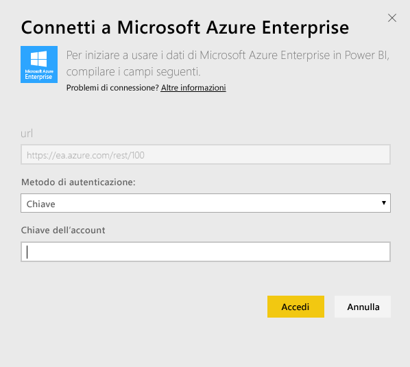
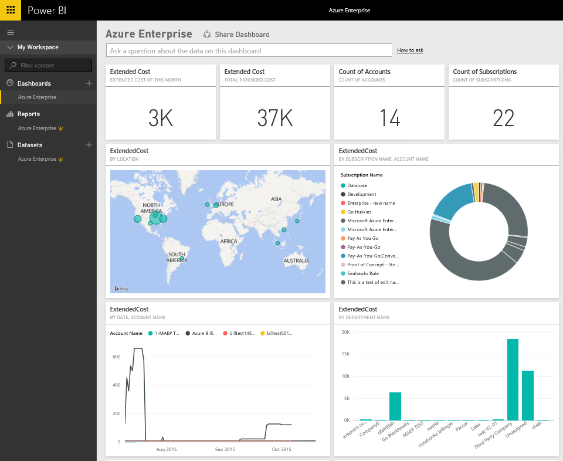
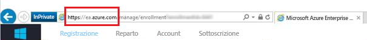
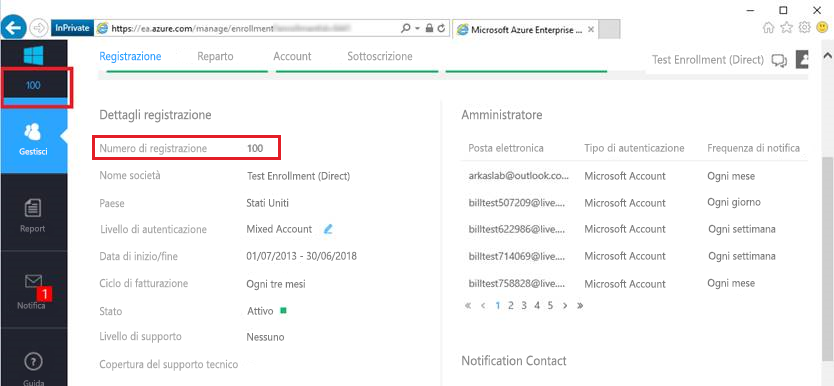
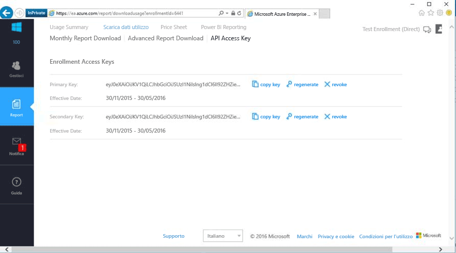

# Connettersi a Microsoft Azure Enterprise con Power BI
Esplorare e monitorare i dati di Microsoft Azure Enterprise in Power BI con il pacchetto di contenuto Power BI. I dati verranno aggiornati automaticamente una volta al giorno.

Connettersi al [pacchetto di contenuto Microsoft Azure Enterprise](https://app.powerbi.com/getdata/services/azure-enterprise) per Power BI.

## Come connettersi
1. Selezionare **Recupera dati** nella parte inferiore del riquadro di spostamento sinistro.
   
    
2. Nella casella **Servizi** selezionare **Recupera**.
   
   
3. Selezionare **Microsoft Azure Enterprise** \> **Recupera**.
   
   
4. Fornire l'URL dell'ambiente Azure, il numero dei mesi di dati che si vogliono importare e il numero di iscrizione di Azure Enterprise. L'URL dell'ambiente Azure sarà `https://ea.azure.com` o `https://ea.windowsazure.cn`. Per informazioni dettagliate su [come trovare questi parametri](#FindingParams), vedere più avanti.
   
    
5. Specificare la chiave di accesso per la connessione. La chiave per l'iscrizione è reperibile nel portale Azure EA.
   
    
6. Il processo di importazione inizierà automaticamente. Al termine nel riquadro di spostamento verranno visualizzati un nuovo dashboard, un nuovo report e un nuovo set di dati. Selezionare il dashboard per visualizzare i dati importati.
   
   

**Altre operazioni**

* Provare a [porre una domanda nella casella Domande e risposte](consumer/end-user-q-and-a.md) nella parte superiore del dashboard
* [Cambiare i riquadri](service-dashboard-edit-tile.md) nel dashboard.
* [Selezionare un riquadro](consumer/end-user-tiles.md) per aprire il report sottostante.
* Anche se la pianificazione prevede che il set di dati venga aggiornato quotidianamente, è possibile modificarne la frequenza di aggiornamento o provare ad aggiornarlo su richiesta usando **Aggiorna ora**

## Cosa è incluso
Il pacchetto di contenuto Azure Enterprise include dati di report mensili per l'intervallo di mesi specificato durante il flusso di connessione. L'intervallo è una finestra mobile, quindi le date incluse vengono aggiornate quando viene aggiornato il set di dati.

## Requisiti di sistema
Il pacchetto di contenuto richiede l'accesso alle funzionalità aziendali nel portale di Azure.

## Individuazione dei parametri
I report di Power Bi sono disponibili per EA Direct, partner e clienti indiretti che riescono a visualizzare le informazioni di fatturazione. Leggere di seguito per informazioni dettagliate su come trovare i valori previsti dal flusso di connessione.

**URL dell'ambiente Azure**

* Questo valore corrisponde in genere a https://ea.azure.com, tuttavia è possibile controllare l'URL dopo l'accesso per confermarlo.
  
    

**Numero di mesi**

* Deve essere un numero compreso tra 1 e 36 che rappresenta il numero di mesi di dati (dalla data odierna) che si vuole importare.

**Numero di registrazione**

* Si tratta del numero di registrazione di Azure Enterprise indicato nella schermata iniziale di [Azure Enterprise Portal](https://ea.azure.com/) in "Dettagli della registrazione".
  
    

**Chiave di accesso**

* La chiave è reperibile nel portale di Azure Enterprise, in "Scarica utilizzo" > "Chiave di accesso API"
  
    

**Guida aggiuntiva**

* Per informazioni aggiuntive sulla configurazione del pacchetto Azure Enterprise per Power BI, accedere ad Azure Enterprise Portal per visualizzare il file della Guida dell'API disponibile in "Guida". Altre informazioni sono disponibili in Report -> Scarica utilizzo -> Chiave di accesso API.

## Passaggi successivi
[Introduzione a Power BI](service-get-started.md)

[Recuperare dati in Power BI](service-get-data.md)

