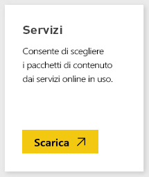
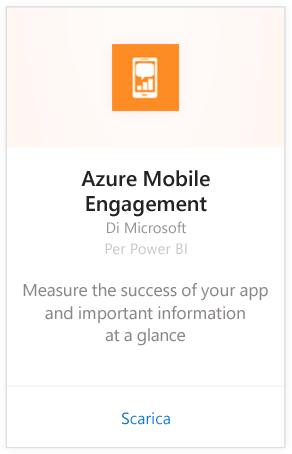
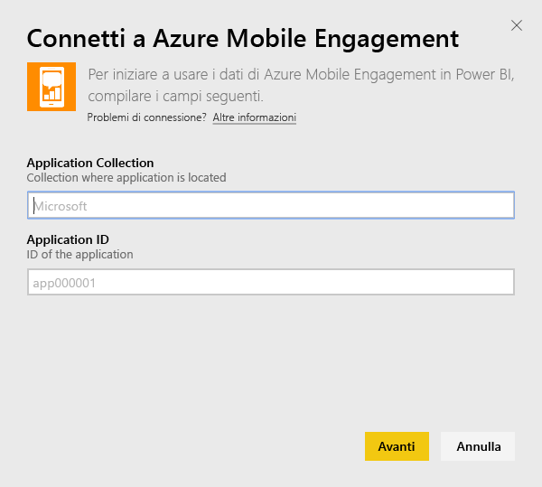
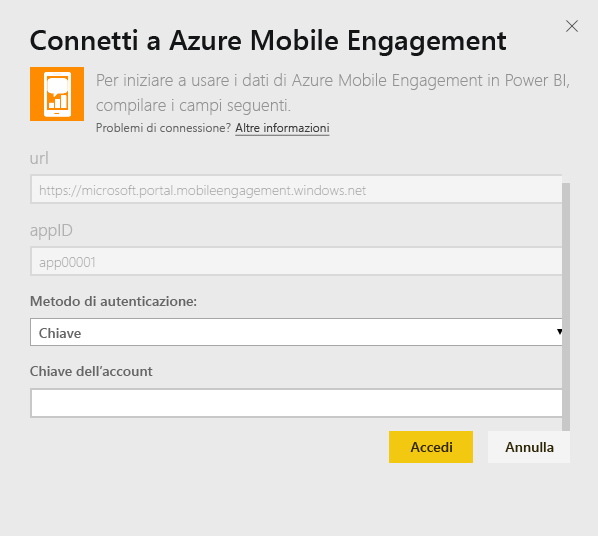
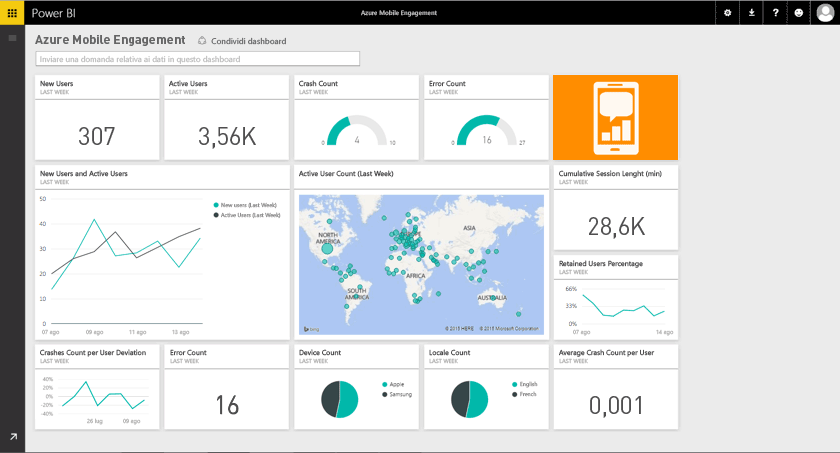

# Connettersi ad Azure Mobile Engagement con Power BI
Il pacchetto di contenuto Azure Mobile Engagement di Power BI consente di ottenere rapidamente informazioni sui dati dell'app.

[!INCLUDE [include-short-name](./includes/service-deprecate-content-packs.md)]

Connettersi al [pacchetto di contenuto Azure Mobile Engagement](https://app.powerbi.com/groups/me/getdata/services/azme) per Power BI.

## Come connettersi
1. Selezionare **Recupera dati** nella parte inferiore del riquadro di spostamento sinistro.
   
    
2. Nella casella **Servizi** selezionare **Recupera**.
   
    
3. Selezionare **Azure Mobile Engagement** \> **Recupera**.
   
     
4. Specificare Raccolta di app e Nome app. Queste informazioni sono disponibili nell'account Azure Mobile Engagement.
   
     
5. In Metodo di autenticazione immettere la chiave e fare clic su Accedi.
   
    
6. Dopo l'importazione dei dati in Power BI, nel riquadro di spostamento sinistro vengono visualizzati il nuovo dashboard, il nuovo report e il nuovo set di dati. I nuovi elementi vengono contrassegnati con un asterisco giallo, \*, che scompare dopo la selezione:
   
    

## Altre operazioni

* Provare a [porre una domanda nella casella Domande e risposte](consumer/end-user-q-and-a.md) nella parte superiore del dashboard
* [Cambiare i riquadri](service-dashboard-edit-tile.md) nel dashboard.
* [Selezionare un riquadro](consumer/end-user-tiles.md) per aprire il report sottostante.
* Anche se la pianificazione prevede che il set di dati venga aggiornato quotidianamente, è possibile modificarne la frequenza di aggiornamento o provare ad aggiornarlo su richiesta usando **Aggiorna ora**

## Passaggi successivi
[Introduzione a Power BI](service-get-started.md)

[Recuperare dati in Power BI](service-get-data.md)

