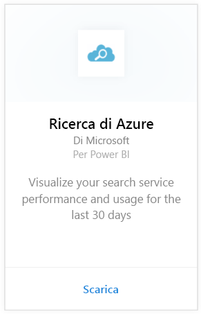
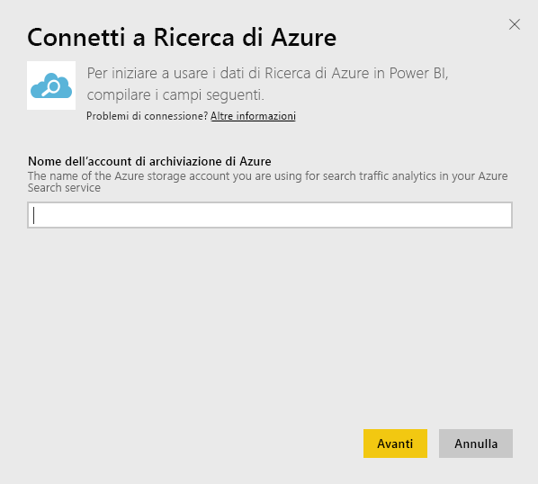
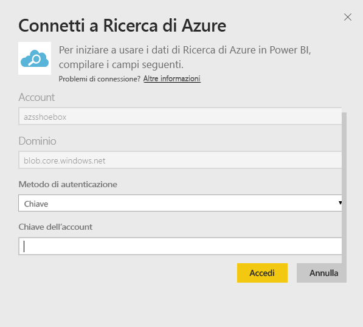
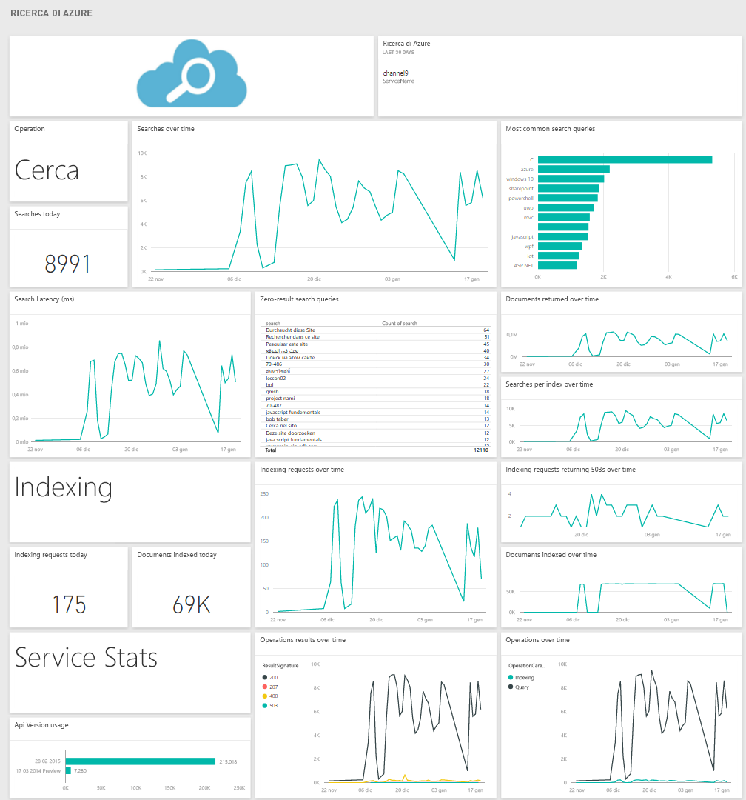

# Connettersi a Ricerca di Azure con Power BI
Analisi del traffico di Ricerca di Azure consente di monitorare e comprendere il traffico diretto al servizio di ricerca di Azure. Il pacchetto di contenuto Ricerca di Azure per Power BI fornisce informazioni dettagliate sui dati di ricerca, incluse la ricerca, l'indicizzazione, le statistiche del servizio e la latenza degli ultimi 30 giorni. Altre informazioni sono reperibili nel [post di blog di Azure](https://azure.microsoft.com/blog/analyzing-your-azure-search-traffic/).

[!INCLUDE [include-short-name](./includes/service-deprecate-content-packs.md)]

Connettersi al [pacchetto di contenuto Ricerca di Azure](https://app.powerbi.com/getdata/services/azure-search) per Power BI.

## Come connettersi
1. Selezionare **Recupera dati** nella parte inferiore del riquadro di spostamento sinistro.
   
    
2. Nella casella **Servizi** selezionare **Recupera**.
   
    
3. Selezionare **Ricerca di Azure** \> **Recupera**.
   
   
4. Specificare il nome dell'account di archiviazione tabelle in cui è archiviata l'analisi di Ricerca di Azure.
   
   
5. Selezionare **Chiave** come meccanismo di autenticazione e fornire la chiave dell'account di archiviazione. Fare clic su **Accedi** per iniziare il processo di caricamento.
   
   
6. Al termine del caricamento, nel riquadro di spostamento verranno visualizzati un nuovo dashboard, un nuovo report e un nuovo modello. Selezionare il dashboard per visualizzare i dati importati.
   
    

**Altre operazioni**

* Provare a [porre una domanda nella casella Domande e risposte](consumer/end-user-q-and-a.md) nella parte superiore del dashboard
* [Cambiare i riquadri](service-dashboard-edit-tile.md) nel dashboard.
* [Selezionare un riquadro](consumer/end-user-tiles.md) per aprire il report sottostante.
* Anche se la pianificazione prevede che il set di dati venga aggiornato quotidianamente, è possibile modificarne la frequenza di aggiornamento o provare ad aggiornarlo su richiesta usando **Aggiorna ora**

## Requisiti di sistema
Il pacchetto di contenuto Ricerca di Azure richiede che nell'account sia abilitato Analisi del traffico di Ricerca di Azure.

## Risoluzione dei problemi
Verificare che il nome dell'account di archiviazione e la chiave di accesso completa siano indicati correttamente. Il nome dell'account di archiviazione deve corrispondere all'account configurato con Analisi del traffico di Ricerca di Azure.

## Passaggi successivi
[Che cos'è Power BI?](power-bi-overview.md)

[Concetti di base sulle finestre di progettazione del servizio Power BI](service-basic-concepts.md)

