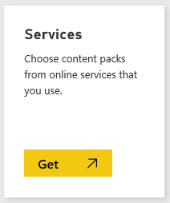
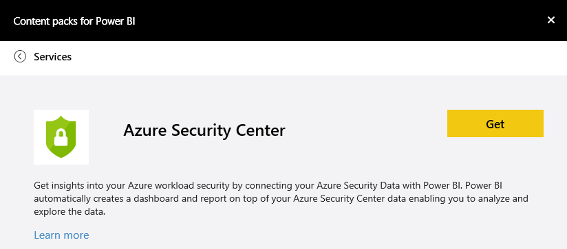
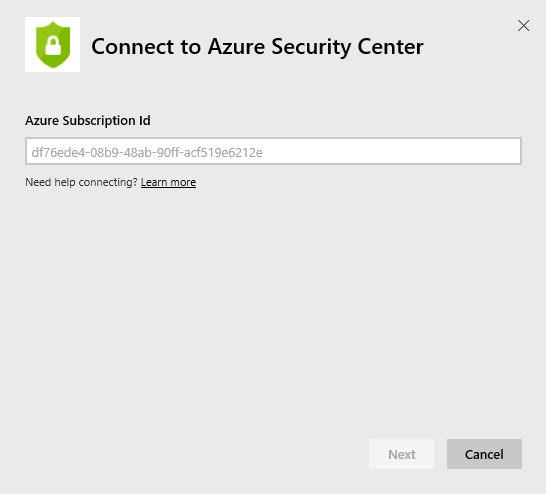
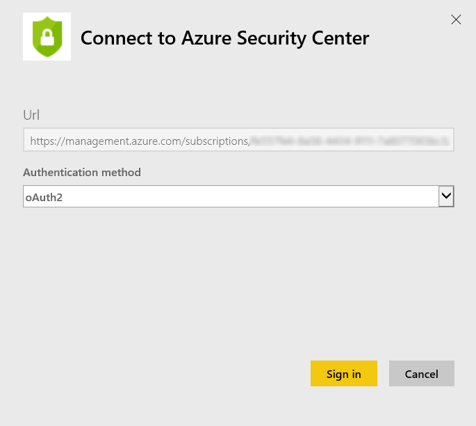
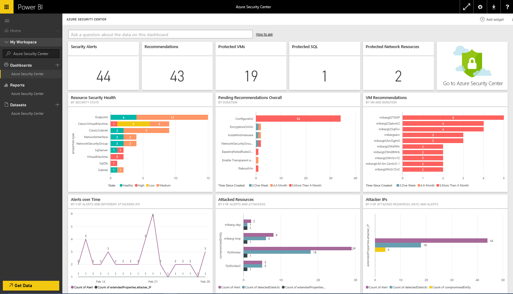

# Connettersi al Centro sicurezza di Azure con Power BI
Usare Power BI per collegarsi ai dati sulla sicurezza di Azure e trovare informazioni approfondite sulla sicurezza del carico di lavoro di Azure. Power BI crea automaticamente un dashboard e un report aggiornati con i dati del Centro sicurezza di Azure che consentono di analizzare ed esplorare i dati.

Connettersi al [pacchetto di contenuto Centro sicurezza di Azure](https://app.powerbi.com/getdata/services/azure-security-center) per Power BI.

## Come connettersi
1. Selezionare **Recupera dati** nella parte inferiore del riquadro di spostamento sinistro.
   
   
2. Nella casella **Servizi** selezionare **Recupera**.
   
   
3. Selezionare **Centro sicurezza di Azure** \> **Recupera**.
   
   
4. Specificare l’ID sottoscrizione. Per informazioni dettagliate su come [trovare questi parametri](#FindingParams), vedere più avanti.
   
   
5. In **Metodo di autenticazione** selezionare **oAuth2** \> **Accedi**. Quando richiesto digitare le credenziali di Azure.
   
    
6. Dopo l'approvazione, il processo di importazione inizierà automaticamente. Al termine nel riquadro di spostamento verranno visualizzati un nuovo dashboard, un nuovo report e un nuovo set di dati. Selezionare il dashboard per visualizzare i dati importati.
   
     

**Altre operazioni**

* Provare a [porre una domanda nella casella Domande e risposte](service-q-and-a.md) nella parte superiore del dashboard
* [Cambiare i riquadri](service-dashboard-edit-tile.md) nel dashboard.
* [Selezionare un riquadro](service-dashboard-tiles.md) per aprire il report sottostante.
* Anche se la pianificazione prevede che il set di dati venga aggiornato quotidianamente, è possibile modificare la frequenza di aggiornamento o provare ad aggiornarlo su richiesta usando **Aggiorna ora**

## Cosa è incluso
Il pacchetto di contenuto contiene informazioni riguardanti lo stato della sicurezza delle risorse, l’analisi di avvisi e prevenzione.

## Requisiti di sistema
Per usare il pacchetto di contenuto è necessario l’accesso ad un ID sottoscrizione e l’abilitazione del Centro sicurezza di Azure. Vedere altri dettagli nel [Centro sicurezza di Azure](https://portal.azure.com/#blade/Microsoft_Azure_Security/SecurityDashboardStartBladeV2) nel Portale di Azure.

Il pacchetto di contenuto richiede che l'utente si connetta con un account aziendale (non un account personale).

## Individuazione dei parametri
È possibile trovare l'ID sottoscrizione in due semplici modi.

1. Da https://portal.azure.com -&gt; Esplora -&gt; Sottoscrizioni -&gt; ID sottoscrizione
2. Da https://manage.windowsazure.com -&gt; Impostazioni  -&gt; ID sottoscrizione

L'ID sottoscrizione sarà un lungo set di numeri e caratteri, simile a quello nell'esempio del punto \#4 sopra riportato. 

## Risoluzione dei problemi
A seconda della dimensione dell'account, il caricamento dei dati potrebbe richiedere tempo. In caso di errore durante l’accesso, controllare i parametri e verificare che il Centro sicurezza di Azure sia abilitato.

Se il pacchetto di contenuto viene caricato, ma non visualizza tutti i dati, verificare che la connessione sia stata stabilita con un account aziendale. Anche se gli account personali sono supportati dal Centro sicurezza di Azure, l'API (e pertanto il pacchetto di contenuto) non restituisce i valori previsti se l'utente si connette con un account non aziendale. Specificare l'accesso a un account aziendale e provare nuovamente a connettersi.

## Passaggi successivi
[Introduzione a Power BI](service-get-started.md)

[Recuperare dati in Power BI](service-get-data.md)

