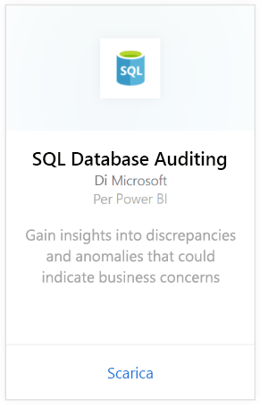
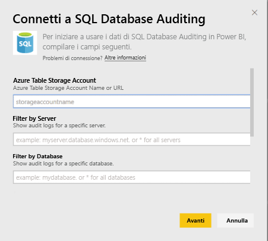
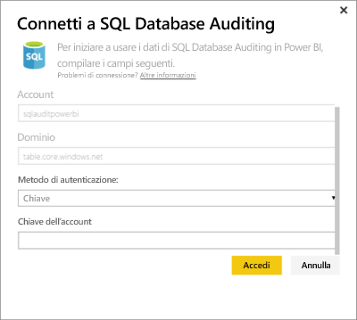
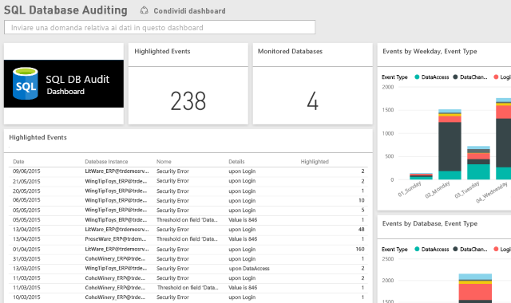

# Pacchetto di contenuto Servizio di controllo del database SQL per Power BI
Il pacchetto di contenuto Power BI per il [servizio di controllo del database SQL](http://azure.microsoft.com/documentation/articles/sql-database-auditing-get-started/) di Azure consente di comprendere l'attività del database e di ottenere informazioni su discrepanze e anomalie che potrebbero indicare problemi aziendali o possibili violazioni della sicurezza. 

Connettersi al [pacchetto di contenuto Servizio di controllo del database SQL](https://app.powerbi.com/getdata/services/sql-db-auditing) per Power BI.

>[!NOTE]
>Il pacchetto di contenuto importa i dati da tutte le tabelle che contengono "AuditLogs" nel nome e li aggiunge a una singola tabella del modello di dati denominata "AuditLogs". Verranno inclusi gli ultimi 250.000 eventi e i dati verranno aggiornati quotidianamente.

## Come connettersi
1. Selezionare **Recupera dati** nella parte inferiore del riquadro di spostamento sinistro.
   
    
2. Nella casella Servizi selezionare Recupera.
   
    
3. Selezionare **Servizio di controllo del database SQL** \>**Recupera**.
   
   
4. Nella finestra di connessione al servizio di controllo del database SQL:
   
   - Immettere l'URL o il nome dell'account di Archiviazione tabelle di Azure in cui sono archiviati i log.
   
   - Immettere il nome del server SQL a cui si è interessati. Immettere "\*" per caricare i log di controllo per tutti i server.
   
   - Immettere il nome del database SQL a cui si è interessati. Immettere "\*" per caricare i log di controllo per tutti i database.
   
   - Immettere il nome della tabella di Azure che contiene i log a cui si è interessati. Immettere "\*" per caricare i log di controllo da tutte le tabelle che contengono "AuditLogs" nel nome.
   
   >[!IMPORTANT]
   >Per motivi di prestazioni si consiglia di specificare sempre un nome di tabella esplicito, anche se tutti i log di controllo vengono archiviati in una singola tabella.
   
   - Immettere la data di inizio dei log di controllo a cui si è interessati. Immettere "\*" per caricare i log di controllo senza un limite di tempo inferiore o "1d" per caricare i log di controllo dell'ultimo giorno.
   
   - Immettere la data di fine dei log di controllo a cui si è interessati. Immettere "\*" per caricare i log di controllo senza un limite di tempo superiore.
   
   
5. In Metodo di autenticazione selezionare **Chiave**, immettere il valore di **Chiave account** \> **Accedi**.
   
   
6. Dopo l'importazione dei dati in Power BI, nel riquadro di spostamento sinistro vengono visualizzati il nuovo dashboard, il nuovo report e il nuovo set di dati. I nuovi elementi sono contrassegnati con un asterisco giallo \*.
   
   

**Altre operazioni**

* Provare a [porre una domanda nella casella Domande e risposte](consumer/end-user-q-and-a.md) nella parte superiore del dashboard
* [Cambiare i riquadri](service-dashboard-edit-tile.md) nel dashboard.
* [Selezionare un riquadro](consumer/end-user-tiles.md) per aprire il report sottostante.
* Anche se la pianificazione prevede che il set di dati venga aggiornato quotidianamente, è possibile modificarne la frequenza di aggiornamento o provare ad aggiornarlo su richiesta usando **Aggiorna ora**

## Passaggi successivi
[Recuperare dati per Power BI](service-get-data.md)
[Che cos'è Power BI?](power-bi-overview.md)
