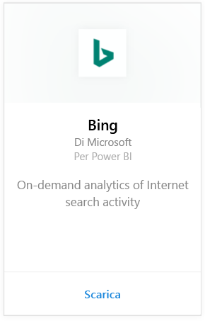
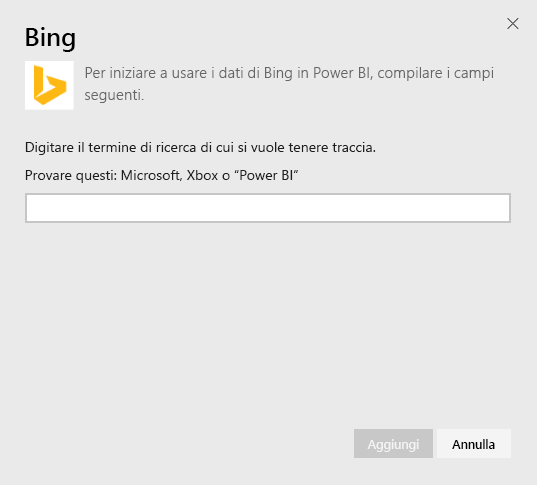
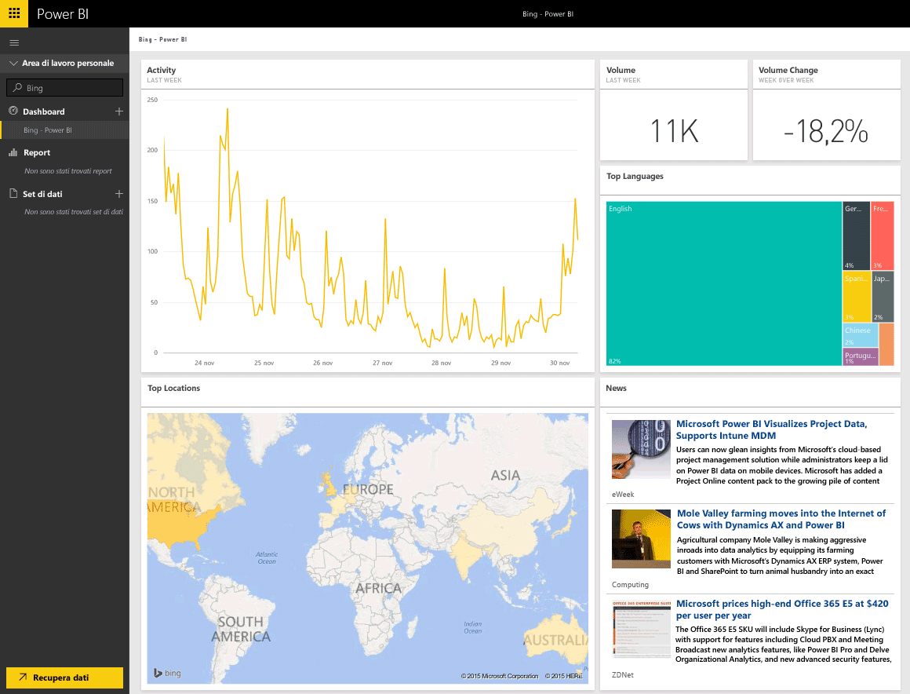

# Connettersi a Bing con Power BI
Il pacchetto di contenuto Bing consentirà di visualizzare l'analisi delle attività di ricerca Internet per un termine di propria scelta.

Connettersi al [pacchetto di contenuto Bing](https://app.powerbi.com/groups/me/getdata/services/bing) per Power BI.

>[!NOTE]
>I riquadri di Bing si aggiorneranno automaticamente ogni ~ 5 minuti circa e il solo riquadro che è possibile selezionare è il riquadro Notizie, che riporta all'articolo sulle notizie corrispondente. 

>[!NOTE]
>I riquadri dal pacchetto di contenuto di Bing non vengono visualizzati nelle applicazioni per dispositivi mobili. Stiamo lavorando per risolvere questo problema.

1. Selezionare **Recupera dati** nella parte inferiore del riquadro di spostamento sinistro.
   
    
2. Nella casella **Servizi** selezionare **Recupera**.
   
    
3. Selezionare **Bing** > **Recupera**.
   
    
4. Nella finestra di dialogo dei parametri, immettere il termine di ricerca di cui si desidera tenere traccia e scegliere Aggiungi.
   
        
5. A sinistra si noterà una nuova voce nell'elenco dei dashboard, denominata con Bing e il termine di ricerca specificato. Si noti che non esiste alcun set di dati o report associato a questo dashboard. Il caricamento dei riquadri può richiedere del tempo ma una volta completato verrà visualizzato un layout simile al seguente.
   
    

Una volta completato il caricamento, è possibile iniziare a esplorare i dati, inclusi l’associazione di riquadri da questo dashboard ad altri dashboard nell'account.

