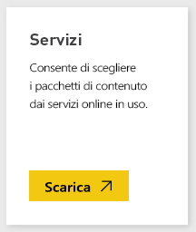
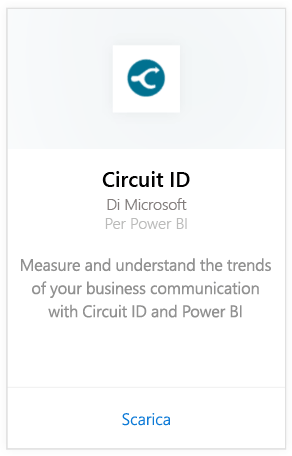
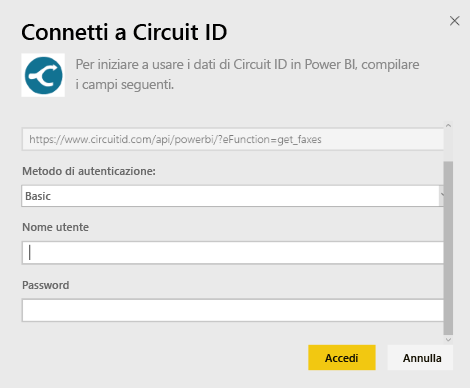
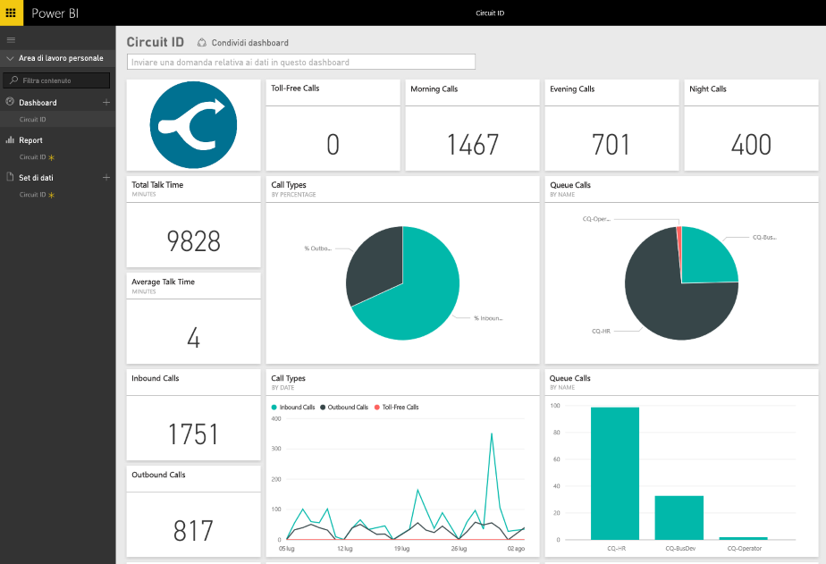

# Connettersi a Circuit ID con Power BI
L'analisi dei dati di comunicazione dall'ID circuito con Power BI è molto semplice. Power BI recupera infatti i dati, creando quindi un dashboard predefinito e report correlati basati su tali dati. Dopo aver creato la connessione, è possibile esplorare i dati e personalizzare il dashboard in base alle esigenze. I dati vengono aggiornati automaticamente ogni giorno.

Connettersi al [pacchetto di contenuto Circuit ID](https://app.powerbi.com/getdata/services/circuitid) per Power BI.

## Come connettersi
1. Selezionare **Recupera dati** nella parte inferiore del riquadro di spostamento sinistro.
   
    
2. Nella casella **Servizi** selezionare **Recupera**.
   
    
3. Selezionare **Circuit ID** \> **Recupera**.
   
    
4. In Metodo di autenticazione selezionare Di base e fornire il nome utente e la password. Quindi, fare clic su Accedi.
   
    
5. Dopo l'importazione dei dati in Power BI, nel riquadro di spostamento sinistro vengono visualizzati il nuovo dashboard, il nuovo report e il nuovo set di dati. I nuovi elementi sono contrassegnati con un asterisco giallo.
   
    

**Altre operazioni**

* Provare a [porre una domanda nella casella Domande e risposte](consumer/end-user-q-and-a.md) nella parte superiore del dashboard
* [Cambiare i riquadri](service-dashboard-edit-tile.md) nel dashboard.
* [Selezionare un riquadro](consumer/end-user-tiles.md) per aprire il report sottostante.
* Anche se la pianificazione prevede che il set di dati venga aggiornato quotidianamente, è possibile modificarne la frequenza di aggiornamento o provare ad aggiornarlo su richiesta usando **Aggiorna ora**

## Passaggi successivi
[Che cos'è Power BI?](power-bi-overview.md)

[Recuperare dati per Power BI](service-get-data.md)

