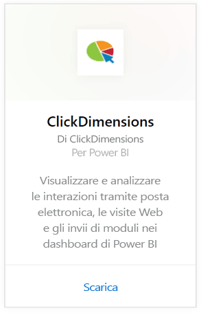
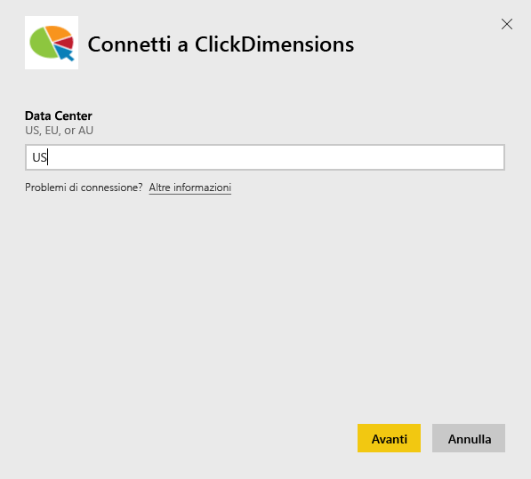
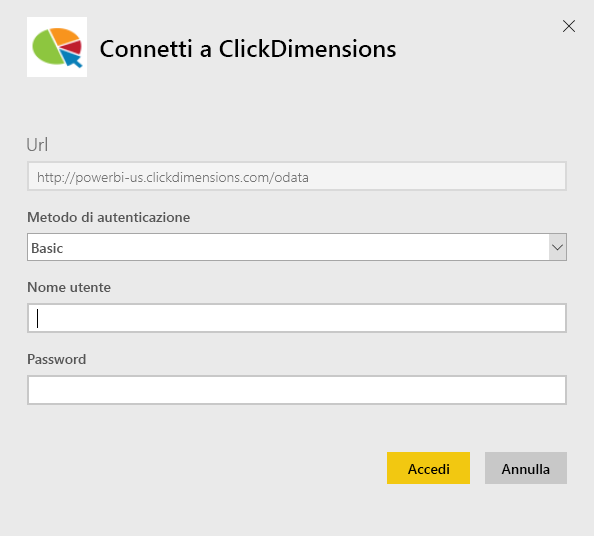
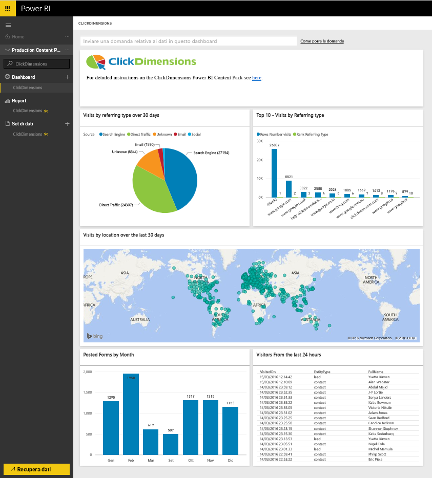
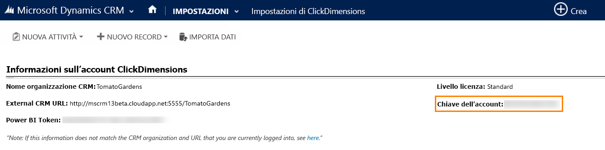
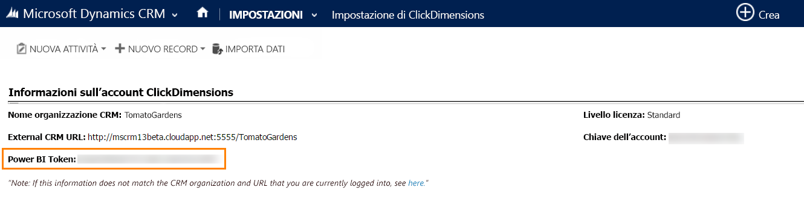

# Connettersi a ClickDimensions con Power BI
Il pacchetto di contenuto ClickDimensions per Power BI consente agli utenti di usare i dati di marketing di ClickDimensions in Power BI, offrendo ai team di gestione informazioni approfondite sui risultati delle attività di vendita e marketing. Visualizzare e analizzare le interazioni tramite posta elettronica, le visite Web e gli invii di moduli nei dashboard e report di Power BI.

Connettersi al [pacchetto di contenuto ClickDimensions](https://app.powerbi.com/getdata/services/click-dimensions) per Power BI.

## Come connettersi
1. Selezionare **Recupera dati** nella parte inferiore del riquadro di spostamento sinistro.
   
   
2. Nella casella **Servizi** selezionare **Recupera**.
   
   
3. Selezionare **ClickDimensions** \>  **Recupera**.
   
   
4. Specificare la posizione del data center (US, EU o AU) e selezionare **Avanti**.
   
   
5. In **Metodo di autenticazione** selezionare **Di base** \> **Accedi**. Quando richiesto, immettere le credenziali di ClickDimensions. Per informazioni dettagliate su come [trovare questi parametri](#FindingParams), vedere più avanti.
   
    
6. Dopo l'approvazione, il processo di importazione inizierà automaticamente. Al termine nel riquadro di spostamento verranno visualizzati un nuovo dashboard, un nuovo report e un nuovo set di dati. Selezionare il dashboard per visualizzare i dati importati.
   
     

**Altre operazioni**

* Provare a [porre una domanda nella casella Domande e risposte](consumer/end-user-q-and-a.md) nella parte superiore del dashboard
* [Cambiare i riquadri](service-dashboard-edit-tile.md) nel dashboard.
* [Selezionare un riquadro](consumer/end-user-tiles.md) per aprire il report sottostante.
* Anche se la pianificazione prevede che il set di dati venga aggiornato quotidianamente, è possibile modificarne la frequenza di aggiornamento o provare ad aggiornarlo su richiesta usando **Aggiorna ora**

## Requisiti di sistema
Per connettersi al pacchetto di contenuto di Power BI, è necessario specificare il data center corrispondente al proprio account e accedere con l'account ClickDimensions. In caso di dubbi sul data center da specificare, rivolgersi all'amministratore.

## Individuazione dei parametri
La chiave dell'account si trova nelle impostazioni di ClickDimensions all'interno delle impostazioni di CRM. Copiare la chiave dell'account dalle impostazioni di ClickDimensions e incollarlo nel campo del nome utente.  

  

Copiare il token di Power BI dalle impostazioni di ClickDimensions e incollarlo nel campo della password. Il token di Power BI si trova nelle impostazioni di ClickDimensions all'interno delle impostazioni di CRM.  

  

## Passaggi successivi
[Introduzione a Power BI](service-get-started.md)

[Recuperare dati in Power BI](service-get-data.md)

