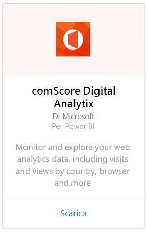
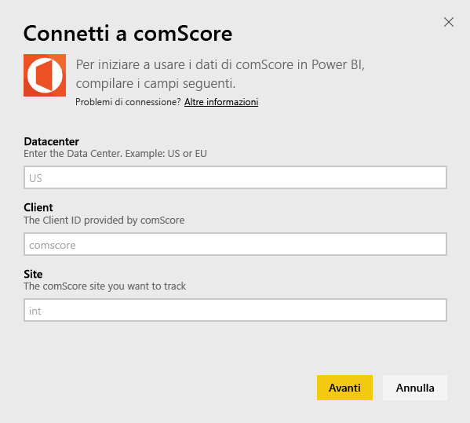
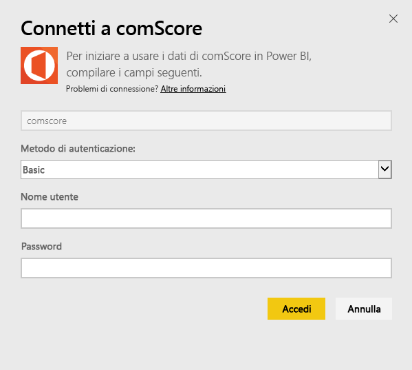
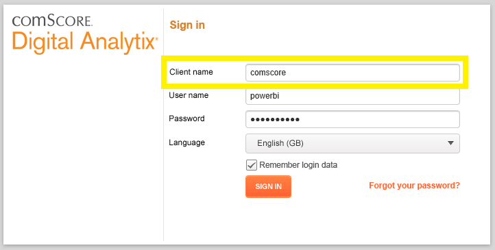
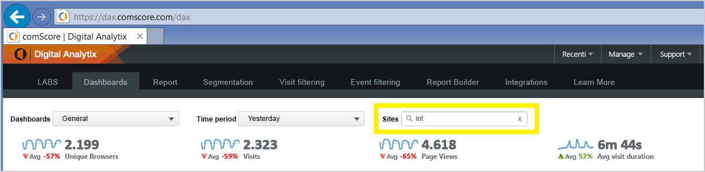

# Connettersi a comScore Digital Analytix con Power BI
Visualizzare ed esplorare i dati di comScore Digital Analytix in Power BI con il pacchetto di contenuto Power BI. I dati verranno aggiornati automaticamente una volta al giorno.

Connettersi al [pacchetto di contenuto comScore per Power BI](https://app.powerbi.com/getdata/services/comscore).

>[!NOTE]
>Per la connessione al pacchetto di contenuto è necessario un account utente di comScore DAx e l'accesso al'API comScore. Altre [informazioni](#Requirements) sono disponibili di seguito.

## Come connettersi
1. Selezionare Recupera dati nella parte inferiore del riquadro di spostamento sinistro.
   
   
2. Nella casella **Servizi** selezionare **Recupera**.
   
   
3. Selezionare **comScore Digital Analytix** \> **Recupera**.
   
   
4. Fornire il data center, l'ID client comScore e il sito al quale connettersi. Per altri dettagli su come trovare questi valori, vedere la sezione seguente [Individuazione dei parametri comScore](#FindingParams).
   
   
5. Fornire il nome utente e la password comScore per la connessione. Per informazioni dettagliate sull'individuazione di questo valore, vedere più avanti.
   
   
6. Il processo di importazione inizierà automaticamente. Al termine nel riquadro di spostamento verranno visualizzati un nuovo dashboard, un nuovo report e un nuovo set di dati. Selezionare il dashboard per visualizzare i dati importati.

**Altre operazioni**

* Provare a [porre una domanda nella casella Domande e risposte](service-q-and-a.md) nella parte superiore del dashboard
* [Cambiare i riquadri](service-dashboard-edit-tile.md) nel dashboard.
* [Selezionare un riquadro](service-dashboard-tiles.md) per aprire il report sottostante.
* Anche se la pianificazione prevede che il set di dati venga aggiornato quotidianamente, è possibile modificare la frequenza di aggiornamento o provare ad aggiornarlo su richiesta usando **Aggiorna ora**

## Requisiti di sistema
Per la connessione è necessario un account utente di comScore DAx e l'accesso al'API comScore DAx. Contattare l'amministratore di comScore DAx per confermare l'account.

## Individuazione dei parametri
I dettagli su come individuare ciascuno dei parametri comScore sono disponibili più avanti.

**Data center**

Il data center al quale connettersi viene determinato dall'URL aperto in comScore.

Se si usa https://dax.comscore.com, immettere "US", se si usa https://dax.comscore.eu, immettere "EU".

 

**Client**

Il client è uguale a quello fornito durante l'accesso a comScore DAx.

 

**Sito**

Il sito comScore determina il sito da cui visualizzare i dati. Per un elenco di siti, vedere l'account comScore.

## Passaggi successivi
[Introduzione a Power BI](service-get-started.md)

[Recuperare dati in Power BI](service-get-data.md)

