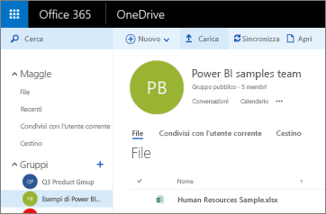
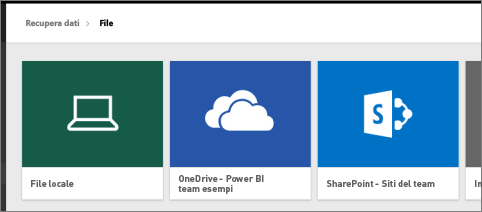
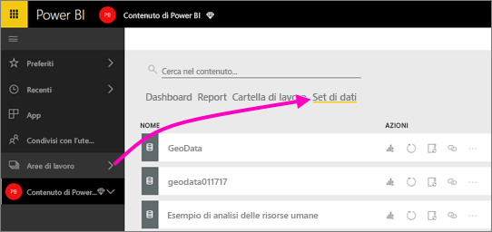
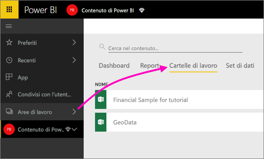

# Connettersi ai file archiviati in OneDrive per l'area di lavoro di Power BI
Dopo aver [creato un'area di lavoro in Power BI](service-create-distribute-apps.md), è possibile archiviare i file di Excel, CSV e di Power BI Desktop in OneDrive for Business per l'area di lavoro di Power BI. È possibile continuare ad aggiornare i file archiviati in OneDrive. Gli aggiornamenti eseguiti verranno applicati automaticamente ai report e ai dashboard di Power BI basati sui file. 

> [!NOTE]
> La nuova esperienza dell'area di lavoro cambia la relazione tra le aree di lavoro di Power BI e i gruppi di Office 365. Non verrà creato automaticamente un gruppo di Office 365 ogni volta che si crea una delle nuove aree di lavoro. Informazioni sulla [creazione di nuove aree di lavoro](service-create-the-new-workspaces.md)

L'aggiunta di file all'area di lavoro è un processo in due passaggi: 

1. Prima di tutto è necessario [caricare i file in nello spazio OneDrive for Business](service-connect-to-files-in-app-workspace-onedrive-for-business.md#1-upload-files-to-the-onedrive-for-business-for-your-workspace) per l'area di lavoro
2. e quindi [connettersi a tali file da Power BI](service-connect-to-files-in-app-workspace-onedrive-for-business.md#2-import-excel-files-as-datasets-or-as-excel-online-workbooks).

> [!NOTE]
> Le aree di lavoro sono disponibili solo con [Power BI Pro](service-features-license-type.md).
> 

## 1\. Caricare file in OneDrive for Business per l'area di lavoro
1. Nel servizio Power BI fare clic sulla freccia accanto ad Aree di lavoro > selezionare i puntini di sospensione ( **…** ) accanto al nome dell'area di lavoro per le app. 
   
   
2. Selezionare **File** per aprire OneDrive for Business per l'area di lavoro in Office 365.
   
   > [!NOTE]
   > Se nel menu dell'area di lavoro per le app non è presente alcuna voce **File**, selezionare **Membri**  per aprire OneDrive for Business per l'area di lavoro. Selezionare quindi **File**. Office 365 configura un percorso di archiviazione OneDrive per i file dell'area di lavoro del gruppo dell'app. Questo processo potrebbe richiedere alcuni minuti. 
   > 
   > 
3. In questo percorso è possibile caricare i file in OneDrive for Business per l'area di lavoro. Selezionare **Carica**e passare ai file.
   
   

## 2\. Importare i file di Excel come set di dati o come cartelle di lavoro di Excel Online
Ora che i file si trovano in OneDrive for Business per l'area di lavoro, è possibile: 

* [Importare i dati dalla cartella di lavoro di Excel come set di dati](service-get-data-from-files.md). Quindi usare i dati per creare report e dashboard visualizzabili in un Web browser e su dispositivi mobili.
* In alternativa, [connettersi a un'intera cartella di lavoro di Excel in Power BI](service-excel-workbook-files.md) e visualizzarla esattamente come appare in Excel Online.

### Importare i file presenti nell'area di lavoro o connettersi a essi
1. In Power BI passare all'area di lavoro. Il nome di questa si trova nell'angolo in alto a sinistra. 
2. Selezionare **Recupera dati** nella parte inferiore del riquadro di spostamento. 
   
   
3. Nella casella **File** selezionare **Recupera**.
   
   
4. Selezionare **OneDrive** - *nome area di lavoro*.
   
    
5. Selezionare il file desiderato > **Connetti**.
   
    A questo punto è necessario scegliere se [importare i dati dalla cartella di lavoro di Excel](service-get-data-from-files.md) o se [connettersi a intere cartelle di lavoro di Excel](service-excel-workbook-files.md).
6. Selezionare **Importa** o **Connetti**.
   
    
7. Se si seleziona **Importa**, la cartella di lavoro sarà visualizzata nella scheda **Set di dati**. 
   
    
   
    Se si seleziona **Connetti**, la cartella di lavoro sarà visualizzata nella scheda **Cartelle di lavoro**.
   
    

## Passaggi successivi
* [Creare app e aree di lavoro in Power BI](service-create-distribute-apps.md)
* [Importare i dati da cartelle di lavoro di Excel](service-get-data-from-files.md)
* [Connettersi a cartelle di lavoro di Excel complete](service-excel-workbook-files.md)
* Altre domande? [Provare la community di Power BI](https://community.powerbi.com/)
* Per inviare commenti e suggerimenti, visitare il forum [Power BI Ideas](https://ideas.powerbi.com/forums/265200-power-bi)

