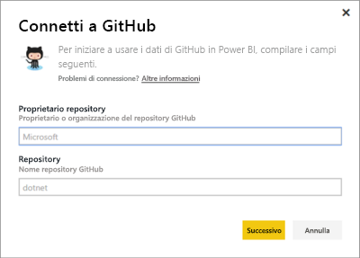
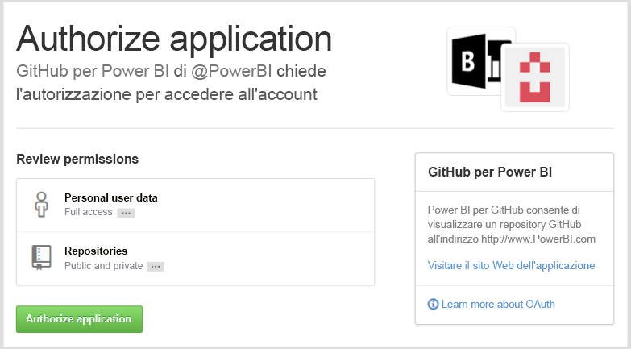
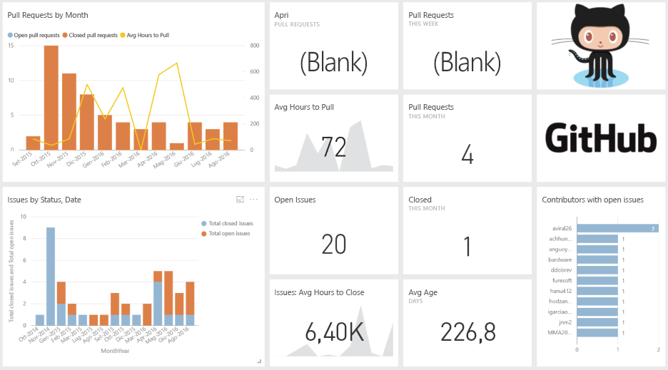
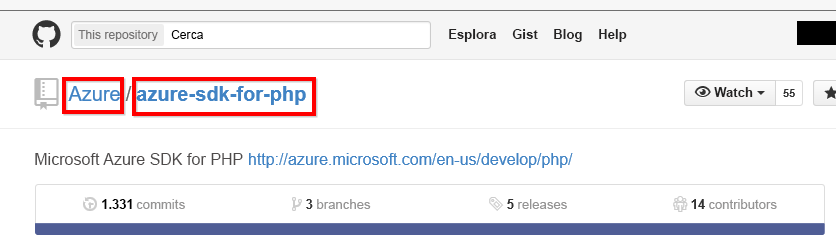

# Connettersi a GitHub con Power BI
Il pacchetto di contenuto GitHub per Power BI permette di ottenere informazioni approfondite su un repository GitHub con dati relativi a contributi, problemi, richieste pull e utenti attivi.

Connettersi al [pacchetto di contenuto GitHub](https://app.powerbi.com/getdata/services/github) oppure leggere altre informazioni sull'[integrazione di GitHub](https://powerbi.microsoft.com/integrations/github) con Power BI.

>[!NOTE]
>Il pacchetto di contenuto richiede che l'account GitHub abbia accesso al repository. Di seguito sono fornite informazioni più dettagliate sui requisiti.

## Come connettersi
1. Selezionare **Recupera dati** nella parte inferiore del riquadro di spostamento sinistro.
   
    
2. Nella casella **Servizi** selezionare **Recupera**.
   
    
3. Selezionare **GitHub** \> **Recupera**.
   
   
4. Immettere il nome del repository e il proprietario del repository. Per informazioni dettagliate su [come trovare questi parametri](#FindingParams), vedere più avanti.
   
   
5. Immettere le credenziali per GitHub. È possibile saltare questo passaggio se è già stato effettuato l'accesso nel browser. 
6. In **Metodo di autenticazione** selezionare **oAuth2** \> **Accedi**. 
7. Seguire le istruzioni nelle schermate di autenticazione di Github. Concedere al pacchetto di contenuto GitHub per Power BI le autorizzazioni per i dati di GitHub.
   
   
   
   Power BI verrà connesso a GitHub e potrà connettersi ai dati.  I dati vengono aggiornati una volta al giorno.
8. Dopo la connessione al repository, Power BI importa i dati. Nel riquadro di spostamento a sinistra vengono visualizzati i nuovi report, set di dati e [dashboard di GitHub](https://powerbi.microsoft.com/integrations/github). I nuovi elementi sono contrassegnati con un asterisco giallo \*.
   
   

**Altre operazioni**

* Provare a [porre una domanda nella casella Domande e risposte](power-bi-q-and-a.md) nella parte superiore del dashboard
* [Cambiare i riquadri](service-dashboard-edit-tile.md) nel dashboard.
* [Selezionare un riquadro](service-dashboard-tiles.md) per aprire il report sottostante.
* Anche se la pianificazione prevede che il set di dati venga aggiornato quotidianamente, è possibile modificare la frequenza di aggiornamento o provare ad aggiornarlo su richiesta usando **Aggiorna ora**

## Cosa è incluso
I dati seguenti sono disponibili da GitHub in Power BI:     

| Nome tabella | Descrizione |
| --- | --- |
| Contributions |La tabella Contributions fornisce il totale delle operazioni di aggiunta, eliminazione e commit effettuate dal collaboratore, aggregato per ogni settimana. Sono inclusi i 100 collaboratori principali. |
| Issues |Elenca tutti i problemi per il repository selezionato e include calcoli quali il tempo totale e medio per la chiusura di un problema, il numero totale di problemi aperti e il numero totale di problemi chiusi. Questa tabella sarà vuota se il repository non include alcun problema. |
| Pull requests |Questa tabella contiene tutte le richieste pull per il repository e gli autori di tali richieste. Contiene anche calcoli relativi a numero di richieste aperte, chiuse e totali, tempo necessario per il pull delle richieste e durata media delle richieste pull. Questa tabella sarà vuota se il repository non include alcun problema. |
| Users |Questa tabella fornisce un elenco di utenti o collaboratori di GitHub che hanno contribuito, hanno sottoposto problemi o risolto richieste pull per il repository selezionato. |
| Milestones |Include tutte le attività cardine per il repository selezionato. |
| DateTable |Questa tabella contiene date a partire da oggi e per gli anni passati, in modo da permettere di analizzare i dati di GitHub in base alla data. |
| ContributionPunchCard |Questa tabella può essere usata come una scheda perforata di collaborazione per il repository selezionato. Mostra i commit in base al giorno della settimana e all'ora del giorno. Questa tabella non è connessa ad altre tabelle nel modello. |
| RepoDetails |Questa tabella fornisce dettagli per il repository selezionato. |

## Requisiti di sistema
* Account GitHub autorizzato ad accedere al repository.  
* Autorizzazione concessa a Power BI per l'app GitHub durante il primo accesso. Vedere i dettagli riportati di seguito relativi alla revoca dell'accesso.  
* Chiamate API disponibili sufficienti per eseguire il pull e aggiornare i dati.  

### Rimuovere le autorizzazioni per Power BI
Per rimuovere le autorizzazioni per la connessione di Power BI al repository di GitHub, è possibile revocare l'accesso in GitHub. Per altri dettagli, vedere questo argomento della [Guida di GitHub](https://help.github.com/articles/keeping-your-ssh-keys-and-application-access-tokens-safe/#reviewing-your-authorized-applications-oauth).

## Individuazione dei parametri
È possibile determinare il proprietario e il repository esaminando il repository in GitHub:

La prima parte, "Azure", è il proprietario e la seconda parte, "azure-sdk-for-php", è il repository stesso.  Questi due elementi sono visibili nell'URL del repository:

    <https://github.com/Azure/azure-sdk-for-php> .

## Risoluzione dei problemi
Se necessario, è possibile verificare le credenziali per GitHub.  

1. In un'altra finestra del browser passare al sito Web GitHub e accedere a GitHub. Per verificare se l'accesso è stato effettuato, vedere l'angolo superiore destro del sito GitHub.    
2. In GitHub passare all'URL del repository a cui si vuole accedere in Power BI. Ad esempio: https://github.com/dotnet/corefx.  
3. In Power BI provare a connettersi a GitHub. Nella finestra di dialogo di configurazione di GitHub usare i nomi del repository e del proprietario del repository per lo stesso repository.  

## Passaggi successivi
* [Introduzione a Power BI](service-get-started.md)
* [Recuperare i dati](service-get-data.md)

