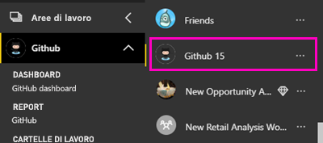
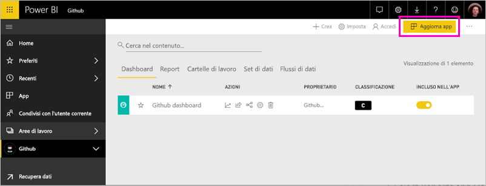

# Connettersi a GitHub con Power BI
Questo articolo illustra il pull dei dati dall'account GitHub con un'app di modello di Power BI. L'app per il modello genera un'area di lavoro con un dashboard, un set di report e un set di dati consente di esplorare i dati di GitHub. L'app GitHub per Power BI Mostra informazioni dettagliate sul tuo repository GitHub, noto anche come repository, con dati relativi a contributi, problemi, richieste pull e utenti attivi.

Dopo aver installato l'app per il modello, è possibile modificare il dashboard e report. Quindi è possibile distribuirla come app per i colleghi all'interno dell'organizzazione.

Connettersi al [app di modello di GitHub](https://app.powerbi.com/getdata/services/github) o altre informazioni, vedere la [integrazione con GitHub](https://powerbi.microsoft.com/integrations/github) con Power BI.

È anche possibile provare il [esercitazione GitHub](service-tutorial-connect-to-github.md). Installa i dati di GitHub reali sul repository pubblico per la documentazione di Power BI.

>[!NOTE]
>L'app per il modello richiede l'account GitHub abbia accesso al repository. Di seguito sono fornite informazioni più dettagliate sui requisiti.

## Come connettersi
[!INCLUDE [powerbi-service-apps-get-more-apps](./includes/powerbi-service-apps-get-more-apps.md)]
   
3. Selezionare **GitHub** \> **Scarica adesso**.
4. Nelle **installare questa App di Power BI?** selezionate **installare**.
4. Nel **Apps** riquadro, selezionare la **GitHub** riquadro.

    

6. Nelle **iniziare con la nuova app**, selezionare **connettere dati**.

    

5. Immettere il nome del repository e il proprietario del repository. Per informazioni dettagliate su [come trovare questi parametri](#FindingParams), vedere più avanti.
   
    

5. Immettere le credenziali di GitHub (questo passaggio può essere ignorato se hai già effettuato l'accesso nel browser). 
6. In **Metodo di autenticazione** selezionare **oAuth2** \> **Accedi**. 
7. Seguire le schermate di autenticazione di GitHub. Concessione di GitHub per Power BI modello app l'autorizzazione per i dati di GitHub.
   
   
   
    Power BI si connette a GitHub e i dati.  I dati vengono aggiornati una volta al giorno. Dopo che Power BI Importa i dati, è visualizzato il contenuto della nuova area di lavoro di GitHub.

## Modificare e distribuire l'app

È stata installata l'app di modello di GitHub. Ciò significa che è inoltre stata creata l'area di lavoro di app di GitHub. Nell'area di lavoro, è possibile modificare il report e dashboard e quindi distribuirlo come una *app* ai colleghi all'interno dell'organizzazione. 

1. Selezionare la freccia accanto al nome dell'area di lavoro nella barra di spostamento a sinistra. Noterete che l'area di lavoro contiene un dashboard e un report.

    

8. Selezionare nuovo [dashboard GitHub](https://powerbi.microsoft.com/integrations/github).    
    

3. Per visualizzare tutto il contenuto dell'area di lavoro nuovo GitHub, nella barra di spostamento a sinistra, selezionare **aree di lavoro** > **GitHub**.
 
   

    Questa vista è l'elenco di contenuto per l'area di lavoro. Nell'angolo superiore destro, vedrai **Aggiorna app**. Quando si è pronti per distribuire l'app con i colleghi, ovvero si apprenderà come iniziare. 

    

2. Selezionare **Reports** e **i set di dati** per visualizzare gli altri elementi nell'area di lavoro.

    Conoscenza [distribuzione di app](service-create-distribute-apps.md) ai colleghi.

## Che cosa è incluso nell'app
I dati seguenti sono disponibili da GitHub in Power BI:     

| Nome tabella | Descrizione |
| --- | --- |
| Contributi |La tabella contributions fornisce il totale aggiunte, eliminazioni e commit effettuate dal collaboratore, aggregato per ogni settimana. Sono inclusi i 100 collaboratori principali. |
| Issues |Elenca tutti i problemi per il repository selezionato e include calcoli quali il tempo totale e medio per la chiusura di un problema, il numero totale di problemi aperti e il numero totale di problemi chiusi. Questa tabella sarà vuota se il repository non include alcun problema. |
| Pull requests |Questa tabella contiene tutte le richieste pull per il repository e gli autori di tali richieste. Contiene anche calcoli relativi al numero di richieste pull aperte, chiuse e totali, tempo impiegato per le richieste pull e la durata media delle richieste pull. Questa tabella sarà vuota se il repository non include alcun problema. |
| Utenti |Questa tabella fornisce un elenco di utenti a GitHub o i collaboratori che hanno apportato contributi, segnalato problemi o risolto richieste Pull per il repository selezionato. |
| Milestones |Include tutte le attività cardine per il repository selezionato. |
| DateTable |Questa tabella contiene date da oggi e per gli anni in passato che consentono di analizzare i dati di GitHub per Data. |
| ContributionPunchCard |Questa tabella può essere usata come una scheda perforata di collaborazione per il repository selezionato. Mostra i commit in base al giorno della settimana e all'ora del giorno. Questa tabella non è connessa ad altre tabelle nel modello. |
| RepoDetails |Questa tabella fornisce dettagli per il repository selezionato. |

## Requisiti di sistema
* Account GitHub autorizzato ad accedere al repository.  
* Autorizzazione concessa a Power BI per l'app GitHub durante il primo accesso. Vedere i dettagli riportati di seguito relativi alla revoca dell'accesso.  
* Chiamate API disponibili sufficienti per eseguire il pull e aggiornare i dati.  

### Rimuovere le autorizzazioni per Power BI
Per rimuovere le autorizzazioni Power BI la connessione al repository di GitHub, è possibile revocare l'accesso in GitHub. Vedere questo [Guida di GitHub](https://help.github.com/articles/keeping-your-ssh-keys-and-application-access-tokens-safe/#reviewing-your-authorized-applications-oauth) argomento per informazioni dettagliate.

## Individuazione dei parametri
È possibile determinare il proprietario e il repository esaminando il repository in GitHub:

La prima parte, "Azure", è il proprietario e la seconda parte, "azure-sdk-for-php", è il repository stesso.  Questi due elementi sono visibili nell'URL del repository:

    <https://github.com/Azure/azure-sdk-for-php> .

## Risoluzione dei problemi
Se necessario, è possibile verificare le credenziali per GitHub.  

1. In un'altra finestra del browser, visitare il sito web GitHub e accedere a GitHub. Per verificare se l'accesso è stato effettuato, vedere l'angolo superiore destro del sito GitHub.    
2. In GitHub passare all'URL del repository a cui si vuole accedere in Power BI. Ad esempio: https://github.com/dotnet/corefx.  
3. In Power BI provare a connettersi a GitHub. Nella finestra di dialogo di configurazione di GitHub usare i nomi del repository e del proprietario del repository per lo stesso repository.  

## Passaggi successivi

* [Esercitazione: Connettersi a un repository di GitHub con Power BI](service-tutorial-connect-to-github.md)
* [Creare le nuove aree di lavoro in Power BI](service-create-the-new-workspaces.md)
* [Installare e usare app in Power BI](consumer/end-user-apps.md)
* [Connettersi all'app di Power BI per servizi esterni](service-connect-to-services.md)
* Domande? [Provare a rivolgersi alla community di Power BI](http://community.powerbi.com/)

