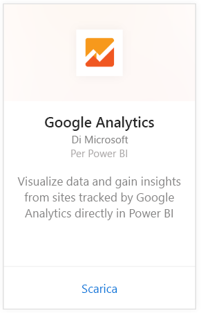
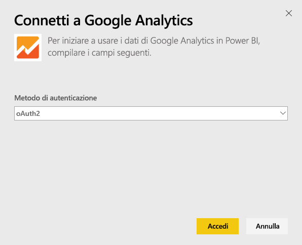
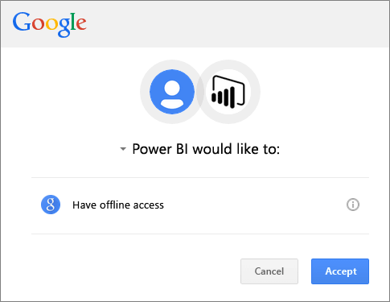
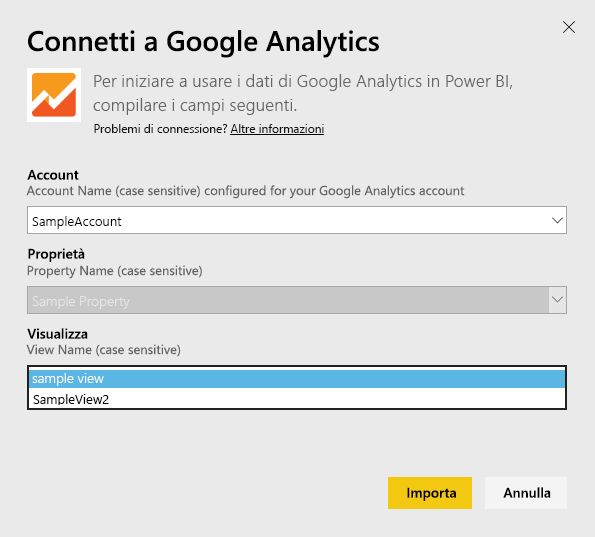
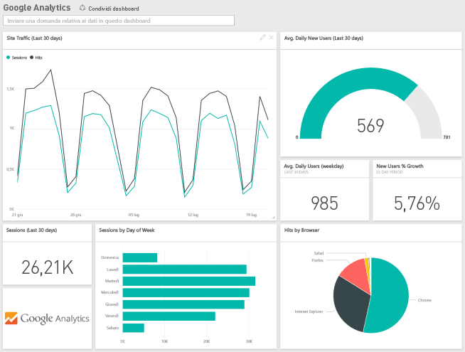
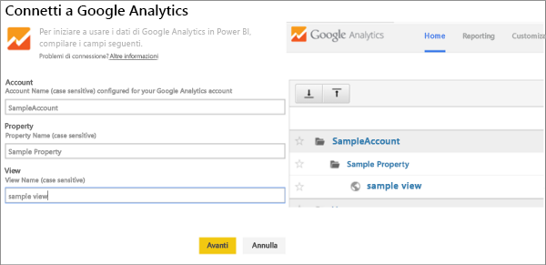

# Connettersi a Google Analytics con Power BI
Per connettersi a Google Analytics con Power BI, è necessario prima di tutto connettersi all'account di Google Analytics. Verranno visualizzati un dashboard di Power BI e un set di report di Power BI che forniscono informazioni dettagliate sul traffico e sul numero di utenti del sito. È possibile interagire con i dashboard e i report, ma non è possibile salvare le modifiche. I dati verranno aggiornati automaticamente una volta al giorno.

Connettersi a [Google Analytics](https://app.powerbi.com/getdata/services/google-analytics) per Power BI. Vedere altre informazioni sull'[integrazione di Google Analytics](https://powerbi.microsoft.com/integrations/google-analytics) con Power BI.

È possibile creare dashboard e report personalizzati iniziando dal [connettore di Google Analytics](service-google-analytics-connector.md) in Power BI Desktop. È sufficiente connettersi con l'account Google Analytics e creare report personalizzati che possono essere pubblicati nel servizio Power BI.

## Come connettersi
[!INCLUDE [powerbi-service-apps-get-more-apps](./includes/powerbi-service-apps-get-more-apps.md)]

3. Selezionare **Google Analytics** \> **Recupera**.
   
   
4. Quando richiesto, immettere le credenziali di Google Analytics. Selezionare **oAuth 2** come meccanismo di autenticazione e fare clic su **Accedi**. Seguire il flusso di autenticazione di Google, che può includere l'autenticazione a due fattori se è stata configurata.
   
   
5. Fare clic su **Accetta** per consentire a Power BI di accedere ai dati di Google Analytics.
   
   
6. Power BI si connette a una visualizzazione specifica di Google Analytics. Selezionare il nome dell'account, il nome della proprietà e il nome della visualizzazione a cui connettersi. Queste informazioni sono disponibili nell'account di Google Analytics, in alto a sinistra o nella scheda **Home** . Visualizzare i dettagli di seguito. 
   
   
5. Fare clic su **Connetti** per avviare il processo di importazione. 

## Visualizzare report e dashboard di Google Analytics
[!INCLUDE [powerbi-service-apps-open-app](./includes/powerbi-service-apps-open-app.md)]

   

[!INCLUDE [powerbi-service-apps-open-app](./includes/powerbi-service-apps-what-now.md)]

## Requisiti di sistema
Per connettersi da Power BI è necessario un account [Google Analytics](https://www.google.com/analytics/). Con account di Google a cui non è connesso un account Google Analytics verrà visualizzato un errore di autenticazione.

## Risoluzione dei problemi
**Credenziali** Se si hanno più account Google, usare una finestra del browser anonima durante la connessione per assicurarsi che venga usato l'account corretto.

Se si riceve un errore che indica che le credenziali non sono valide, anche se è stato possibile eseguire l'accesso a Google, verificare di avere un account [Google Analytics](https://www.google.com/analytics/).

**Parametri** I nomi univoci sono attualmente richiesti per i parametri. Se viene visualizzato un errore che indica che il valore selezionato è duplicato, selezionare un altro valore o modificare i nomi in Google Analytics per renderli univoci. Il problema è in fase di lavorazione.

>[!NOTE]
>Ai parametri viene applicata la distinzione tra maiuscole e minuscole. Immetterli esattamente come vengono visualizzati nell'account di Google Analytics.

Se i problemi persistono, aprire un ticket di supporto per contattare il team di Power BI:

* Nell'app Power BI selezionare il punto interrogativo \> **Contatta il supporto tecnico**.
* Nel sito del supporto tecnico di Power BI (da cui si sta leggendo questo articolo) selezionare **Contattare il supporto tecnico** sul lato destro della pagina.

## Passaggi successivi
* [Cosa sono le app in Power BI?](service-create-distribute-apps.md)
* [Recuperare dati in Power BI](service-get-data.md)
* Altre domande? [Provare a rivolgersi alla community di Power BI](http://community.powerbi.com/)

