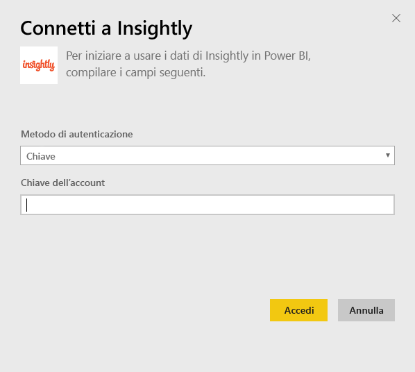

# Connettersi a Insightly con Power BI
Visualizzare e condividere i dati CRM Insightly in Power BI con il pacchetto di contenuto Insightly. Connettersi a Power BI con la chiave API Insightly per visualizzare e creare report e dashboard dai dati CRM. Con Power BI, è possibile analizzare i dati in modi nuovi, creare grafici avanzati e visualizzare contatti, lead e organizzazioni su una mappa.

Connettersi al [pacchetto di contenuto Insightly](https://app.powerbi.com/getdata/services/insightly) per Power BI.

## Come connettersi
1. Selezionare **Recupera dati** nella parte inferiore del riquadro di spostamento sinistro.
   
   
2. Nella casella **Servizi** selezionare **Recupera**.
   
   
3. Selezionare **Insightly** \> **Recupera**.
   
   
4. Selezionare **Chiave** come tipo di autenticazione e specificare la chiave API Insightly, quindi selezionare **Accedi**. Per informazioni dettagliate su come [trovare questo valore](#FindingParams), vedere più avanti.
   
   
5. Dopo l'approvazione, il processo di importazione inizierà automaticamente. Al termine nel riquadro di spostamento verranno visualizzati un nuovo dashboard, un nuovo report e un nuovo set di dati. Selezionare il dashboard per visualizzare i dati importati.
   
     

**Altre operazioni**

* Provare a [porre una domanda nella casella Domande e risposte](power-bi-q-and-a.md) nella parte superiore del dashboard
* [Cambiare i riquadri](service-dashboard-edit-tile.md) nel dashboard.
* [Selezionare un riquadro](service-dashboard-tiles.md) per aprire il report sottostante.
* Anche se la pianificazione prevede che il set di dati venga aggiornato quotidianamente, è possibile modificare la frequenza di aggiornamento o provare ad aggiornarlo su richiesta usando **Aggiorna ora**

## Cosa è incluso
Il pacchetto di contenuto include le tabelle seguenti e i campi dei relativi record:

| Tabelle |  |  |  |
| --- | --- | --- | --- |
| Contatti |Opportunità |Fasi della pipeline |Data completamento attività |
| Campi personalizzati |Data chiusura opportunità |Data completamento progetto |Attività |
| Events |Data previsione opportunità |Progetti |Team/Membri |
| Lead |Organizzazioni |Tag |Users |

Molte tabelle e report includono anche campi calcolati univoci, ad esempio:  

* Tabelle con date di chiusura previste delle opportunità "raggruppate", date di chiusura effettive delle opportunità, date di completamento progetto e attività per analisi mensile, trimestrale o annuale.  
* Un campo di valore ponderato per le opportunità (valore opportunità * probabilità di acquisizione).  
* Campi di durata media e totale delle attività, in base alle date di inizio e completamento.  
* Report con campi calcolati per la percentuale di acquisizione delle opportunità (numero di opportunità acquisite/totali) e valore della percentuale di acquisizione (valore delle opportunità acquisite/totali).  

## Requisiti di sistema
È necessario un account Insightly con accesso all'API Insightly. Le autorizzazioni di visibilità si baseranno sulla chiave API usata per stabilire la connessione a Power BI. I record Insightly visibili all'utente saranno visibili anche nel report e dashboard di Power BI che si condividono con altri.

## Individuazione dei parametri
**Chiave API**

Per copiare la chiave API da Insightly, selezionare User Settings nel menu del profilo Insightly e scorrere verso il basso. Questa stringa di caratteri verrà usata per connettere i dati a Power BI.

## Risoluzione dei problemi
I dati vengono importati tramite l'API Insightly, che include un limite giornaliero in base al piano di abbonamento Insightly in uso. I limiti sono elencati nella sezione relativa alla limitazione delle richieste nella documentazione dell'API Insightly: https://api.insight.ly/v2.2/Help#!/Overview/Introduction#ratelimit

I report forniti usano campi predefiniti da Insightly e possono non includere le personalizzazioni. Modificare il report per visualizzare tutti i campi disponibili.

## Passaggi successivi
[Introduzione a Power BI](service-get-started.md)

[Recuperare dati in Power BI](service-get-data.md)

