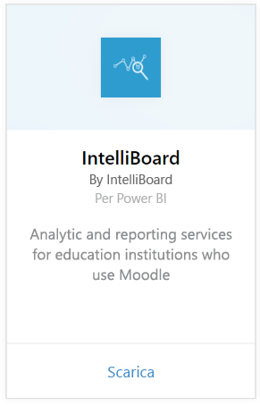
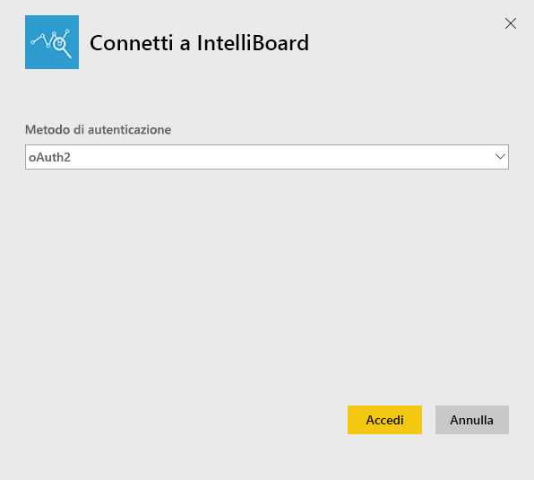
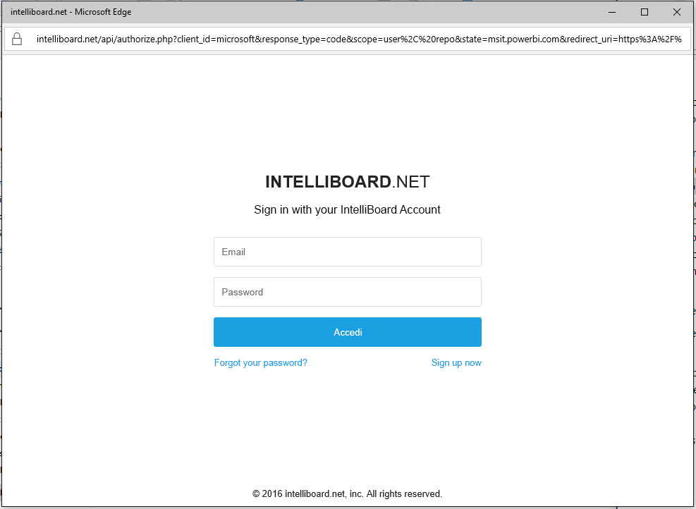
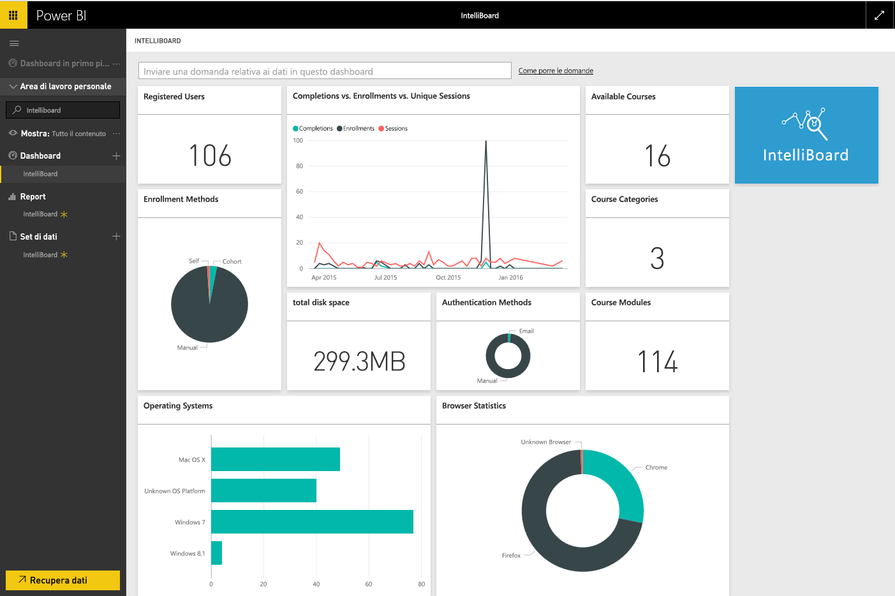

# Connettersi a IntelliBoard con Power BI
IntelliBoard offre un accesso semplificato ai dati del sistema LMS di Moodle in Reporting Services. Il pacchetto di contenuto IntelliBoard per Power BI offre altre funzionalità di analisi, incluse le metriche per i corsi, gli utenti registrati, le prestazioni complessive e l'attività del sistema LMS.

Connettersi al [pacchetto di contenuto IntelliBoard](https://app.powerbi.com/getdata/services/intelliboard) per Power BI.

## Come connettersi
1. Selezionare **Recupera dati** nella parte inferiore del riquadro di spostamento sinistro.  
   
    
2. Nella casella **Servizi** selezionare **Recupera**.  
   
    
3. Selezionare **IntelliBoard**, quindi **Recupera**.  
   
    
4. Selezionare **OAuth 2**, quindi **Accedi**. Quando richiesto, fornire le credenziali di IntelliBoard.
   
    
   
    
5. Dopo la connessione vengono caricati automaticamente un dashboard, un report e un set di dati. Al termine, i riquadri vengono aggiornati con i dati dell'account IntelliBoard.
   
    

**Altre operazioni**

* Provare a [porre una domanda nella casella Domande e risposte](consumer/end-user-q-and-a.md) nella parte superiore del dashboard
* [Cambiare i riquadri](service-dashboard-edit-tile.md) nel dashboard.
* [Selezionare un riquadro](consumer/end-user-tiles.md) per aprire il report sottostante.
* Anche se la pianificazione prevede che il set di dati venga aggiornato quotidianamente, è possibile modificarne la frequenza di aggiornamento o provare ad aggiornarlo su richiesta usando **Aggiorna ora**

## Cosa è incluso
Il pacchetto di contenuto include i dati delle tabelle seguenti:  

    - Activity  
    - Agents  
    - Auth  
    - Countries  
    - CoursesProgress  
    - Enrollments
    - Lang  
    - Platform  
    - Totals  
    - UsersProgress    

## Requisiti di sistema
È necessario un account IntelliBoard con le autorizzazioni per le tabelle precedenti per creare un'istanza di questo pacchetto di contenuto.

## Passaggi successivi
[Che cos'è Power BI?](power-bi-overview.md)

[Concetti di base sulle finestre di progettazione del servizio Power BI](service-basic-concepts.md)

