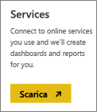

# Connettersi a Lithium con Power BI
Lithium sviluppa relazioni affidabili tra i migliori marchi del mondo e i rispettivi clienti, consentendo alle persone di ottenere risposte e condividere le proprie esperienze. Connettendo il pacchetto di contenuto Lithium a Power BI, è possibile misurare le metriche chiave relative alla community online per migliorare le vendite, ridurre i costi di assistenza e incrementare la fidelizzazione. 

Connettersi al [pacchetto di contenuto Lithium](https://app.powerbi.com/getdata/services/lithium) per Power BI.

>[!NOTE]
>Il pacchetto di contenuto per Power BI usa l'API Lithium. Un numero eccessivo di chiamate all'API potrebbe comportare addebiti aggiuntivi da parte di Lithium. Consultare l'amministratore di Lithium.

## Come connettersi
1. Selezionare **Recupera dati** nella parte inferiore del riquadro di spostamento sinistro.
   
    
2. Nella casella **Servizi** selezionare **Recupera**.
   
    
3. Selezionare **Lithium** \> **Recupera**.
   
   
4. Specificare l'URL della community Lithium. Usare il formato *https://community.yoursite.com*.
   
   
5. Quando richiesto, immettere le credenziali di Lithium. Selezionare **oAuth 2** come meccanismo di autenticazione, fare clic su **Accesso** e seguire il flusso di autenticazione di Lithium.
   
   
   
   
6. Al termine del flusso di accesso, verrà avviato il processo di importazione. Al termine nel riquadro di spostamento verranno visualizzati un nuovo dashboard, un nuovo report e un nuovo set di dati. Selezionare il dashboard per visualizzare i dati importati.
   
    

**Altre operazioni**

* Provare a [porre una domanda nella casella Domande e risposte](power-bi-q-and-a.md) nella parte superiore del dashboard
* [Cambiare i riquadri](service-dashboard-edit-tile.md) nel dashboard.
* [Selezionare un riquadro](service-dashboard-tiles.md) per aprire il report sottostante.
* Anche se la pianificazione prevede che il set di dati venga aggiornato quotidianamente, è possibile modificare la frequenza di aggiornamento o provare ad aggiornarlo su richiesta usando **Aggiorna ora**

## Requisiti di sistema
Il pacchetto di contenuto Lithium richiede una community Lithium versione 15.9 o successive. Contattare l'amministratore di Lithium per controllare.

## Passaggi successivi
[Che cos'è Power BI?](power-bi-overview.md)

[Power BI - Concetti di base](service-basic-concepts.md)

