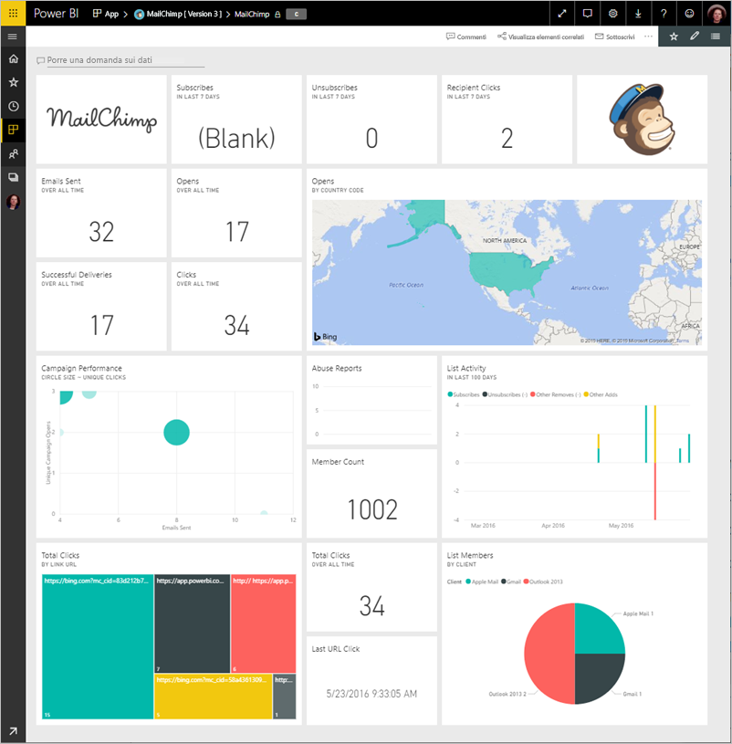
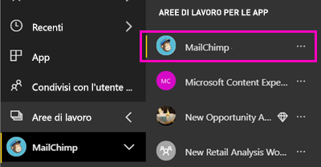
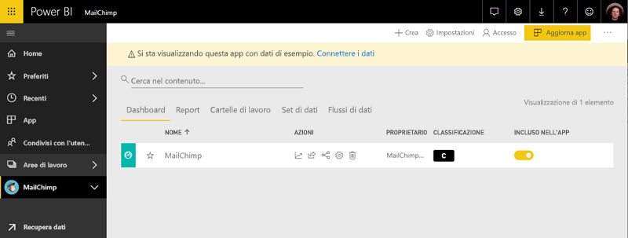

# Connettersi a MailChimp con Power BI
Questo articolo illustra il pull dei dati dall'account MailChimp con un'app di modello di Power BI. L'app per il modello genera un'area di lavoro con un dashboard, un set di report e un set di dati consentono di esplorare i dati di MailChimp. Integrare le funzionalità di analisi per creare [dashboard MailChimp](https://powerbi.microsoft.com/integrations/mailchimp) e identificare rapidamente le tendenze in campagne, report e singoli sottoscrittori. I dati verranno aggiornati quotidianamente, assicurando che i dati che si sta monitorando sono aggiornati.

Dopo aver installato l'app per il modello, è possibile modificare il dashboard e report. Quindi è possibile distribuirla come app per i colleghi all'interno dell'organizzazione.

Connettere il [MailChimp modello app](https://app.powerbi.com/getdata/services/mailchimp) per Power BI.

## Come connettersi

[!INCLUDE [powerbi-service-apps-get-more-apps](./includes/powerbi-service-apps-get-more-apps.md)]

3. Selezionare **MailChimp** \> **Scarica adesso**.
4. Nelle **installare questa App di Power BI?** selezionate **installare**.
4. Nel **Apps** riquadro, selezionare la **MailChimp** riquadro.

    

6. Nelle **iniziare con la nuova app**, selezionare **connettere dati**.

    

1. In Metodo di autenticazione selezionare **oAuth2** \> **Accedi**.
   
    Quando richiesto, immettere le credenziali di MailChimp e seguire il processo di autenticazione.
   
    Alla prima connessione Power BI chiede di consentire l'accesso in sola lettura all'account. Selezionare **Consenti** per avviare il processo di importazione. Possono volerci alcuni minuti, a seconda del volume di dati nell'account.
   
    

5. Dopo che Power BI Importa i dati, viene aperto il dashboard di MailChimp.
   
    

## Modificare e distribuire l'app

È stata installata l'app di modello di MailChimp. Ciò significa che è inoltre stata creata l'area di lavoro di app di MailChimp. Nell'area di lavoro, è possibile modificare il report e dashboard e quindi distribuirlo come una *app* ai colleghi all'interno dell'organizzazione. 

1. Per visualizzare tutto il contenuto dell'area di lavoro nuovo MailChimp, nella barra di spostamento a sinistra, selezionare **aree di lavoro** > **MailChimp**. 

    

    Questa vista è l'elenco di contenuto per l'area di lavoro. Nell'angolo superiore destro, vedrai **Aggiorna app**. Quando si è pronti per distribuire l'app con i colleghi, ovvero si apprenderà come iniziare.

    

2. Selezionare **Reports** e **i set di dati** per visualizzare gli altri elementi nell'area di lavoro. 

    Conoscenza [distribuzione di app](service-create-distribute-apps.md) ai colleghi.

## Passaggi successivi

* [Creare le nuove aree di lavoro in Power BI](service-create-the-new-workspaces.md)
* [Installare e usare app in Power BI](consumer/end-user-apps.md)
* [App Power BI per dispositivi esterni](service-connect-to-services.md)
* Domande? [Provare a rivolgersi alla community di Power BI](http://community.powerbi.com/)

