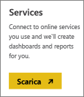
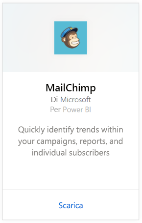
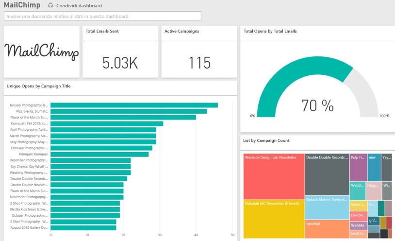

# Connettersi a MailChimp con Power BI
Il pacchetto di contenuto Power BI estrae i dati dall'account MailChimp e genera un dashboard, un set di report e un set di dati utili per l'esplorazione dei dati. Integrare le funzionalità di analisi per creare [dashboard MailChimp](https://powerbi.microsoft.com/integrations/mailchimp) e identificare rapidamente le tendenze in campagne, report e singoli sottoscrittori. I dati sono impostati in modo da essere aggiornati quotidianamente.

Connettersi al [pacchetto di contenuto MailChimp](https://app.powerbi.com/getdata/services/mailchimp) per Power BI.

## Come connettersi
1. Selezionare **Recupera dati** nella parte inferiore del riquadro di spostamento sinistro.
   
    
2. Nella casella **Servizi** selezionare **Recupera**.
   
   
3. Selezionare **MailChimp** \> **Recupera**.
   
   
4. In Metodo di autenticazione selezionare **oAuth2** \> **Accedi**.
   
    Quando richiesto, immettere le credenziali di MailChimp e seguire il processo di autenticazione.
   
    Alla prima connessione verrà richiesto di consentire a Power BI l'accesso in sola lettura all'account. Selezionare **Consenti** per avviare il processo di importazione che può richiedere qualche minuto a seconda del volume dei dati dell'account.
   
    
5. Dopo l'importazione dei dati in Power BI, nel riquadro di spostamento sinistro vengono visualizzati il nuovo dashboard, il nuovo report e il nuovo set di dati. Si tratta del dashboard predefinito creato da Power BI per visualizzare i dati, che è possibile modificare per visualizzare i dati nel modo desiderato.
   
   

**Altre operazioni**

* Provare a [porre una domanda nella casella Domande e risposte](consumer/end-user-q-and-a.md) nella parte superiore del dashboard
* [Cambiare i riquadri](service-dashboard-edit-tile.md) nel dashboard.
* [Selezionare un riquadro](consumer/end-user-tiles.md) per aprire il report sottostante.
* Anche se la pianificazione prevede che il set di dati venga aggiornato quotidianamente, è possibile modificarne la frequenza di aggiornamento o provare ad aggiornarlo su richiesta usando **Aggiorna ora**

## Passaggi successivi
[Che cos'è Power BI?](power-bi-overview.md)

[Power BI - Concetti di base](consumer/end-user-basic-concepts.md)

