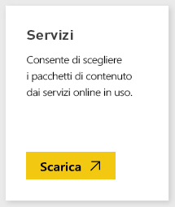
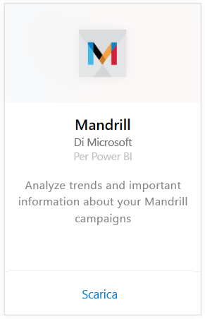
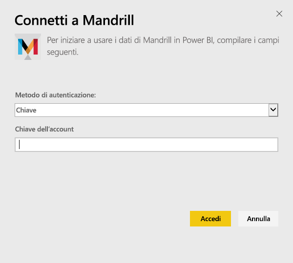
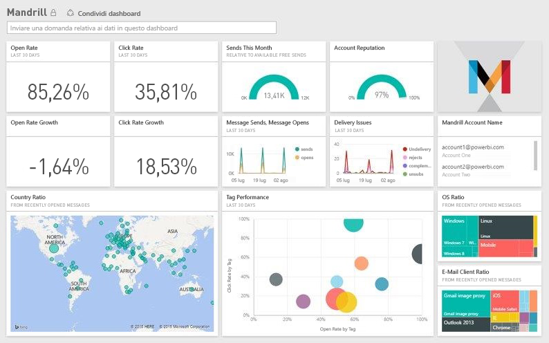

# Connettersi a Mandrill con Power BI
Il pacchetto di contenuto Power BI estrae i dati dall'account Mandrill e genera un dashboard, un set di report e un set di dati utili per l'esplorazione dei dati. Usare l'analisi di Mandrill per ottenere rapidamente informazioni sulla newsletter o sulla campagna di marketing. I dati sono impostati in modo da essere aggiornati quotidianamente.

Connettersi al [pacchetto di contenuto Mandrill per Power BI](http://app.powerbi.com/getdata/services/mandrill).

## Come connettersi
1. Selezionare **Recupera dati** nella parte inferiore del riquadro di spostamento sinistro.
   
    
2. Nella casella **Servizi** selezionare **Recupera**.
   
    
3. Selezionare **Mandrill** > **Recupera**.
   
    
4. In **Metodo di autenticazione**selezionare **Chiave** e immettere la chiave API. È possibile trovare la chiave nella scheda **Impostazioni** del dashboard Mandrill. Selezionare **Accedi** per avviare il processo di importazione che può richiedere qualche minuto a seconda del volume dei dati dell'account.
   
    
5. Dopo l'importazione dei dati in Power BI, nel riquadro di spostamento sinistro vengono visualizzati il nuovo dashboard, il nuovo report e il nuovo set di dati. Si tratta del dashboard predefinito creato da Power BI per visualizzare i dati,
   
    

**Altre operazioni**

* Provare a [porre una domanda nella casella Domande e risposte](service-q-and-a.md) nella parte superiore del dashboard
* [Cambiare i riquadri](service-dashboard-edit-tile.md) nel dashboard.
* [Selezionare un riquadro](service-dashboard-tiles.md) per aprire il report sottostante.
* Anche se la pianificazione prevede che il set di dati venga aggiornato quotidianamente, è possibile modificare la frequenza di aggiornamento o provare ad aggiornarlo su richiesta usando **Aggiorna ora**

## Passaggi successivi
[Introduzione a Power BI](service-get-started.md)

[Power BI - Concetti di base](service-basic-concepts.md)

