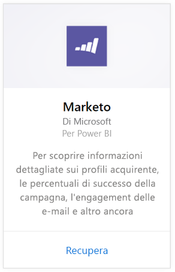
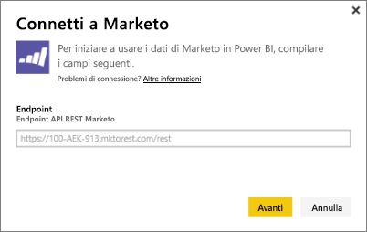
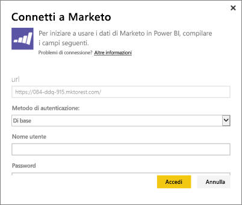
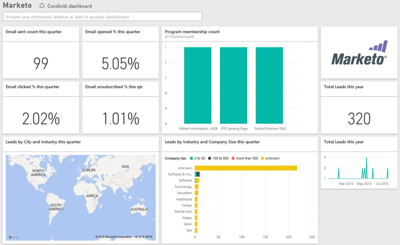

# Connettersi a Marketo con Power BI
Il pacchetto di contenuto Marketo per Power BI consente di ottenere informazioni dettagliate sull'account Marketo, con dati relativi ai lead e alle rispettive attività. La creazione di questa connessione consente di recuperare i dati e fornisce automaticamente un dashboard e i report correlati basati su tali dati.

Connettersi al [pacchetto di contenuto Marketo](https://app.powerbi.com/getdata/services/marketo) per Power BI.

## Come connettersi
1. Selezionare **Recupera dati** nella parte inferiore del riquadro di spostamento sinistro.
   
   
2. Nella casella **Servizi** selezionare **Recupera**.
   
    
3. Selezionare **Marketo** \> **Recupera**.
   
   
4. Immettere l'endpoint REST di Marketo fornito all'utente da Marketo o dall'amministratore Marketo e fare clic su Avanti.
   
   
   
   Altre informazioni sull'endpoint REST di Marketo: [http://developers.marketo.com/documentation/rest/endpoint-url/ ](http://developers.marketo.com/documentation/rest/endpoint-url/).
5. Usando il metodo di autenticazione **Di base** , immettere l'ID cliente come **Nome utente** e il Segreto client come **Password**. L'ID client e il segreto client sono disponibili in Marketo oppure possono essere richiesti all'amministratore di Marketo ([http://developers.marketo.com/documentation/rest/custom-service/](http://developers.marketo.com/documentation/rest/custom-service/)). 
   
   
   
   In questo modo, il pacchetto di contenuto *Marketo per Power BI* può accedere ai dati di [analisi di Marketo](https://powerbi.microsoft.com/integrations/marketo) e consente l'analisi dei dati in Power BI. I dati vengono aggiornati una volta al giorno.
6. Una volta connessi al proprio account Marketo, viene caricato un dashboard con tutti i dati:
   
   

**Altre operazioni**

* Provare a [porre una domanda nella casella Domande e risposte](power-bi-q-and-a.md) nella parte superiore del dashboard
* [Cambiare i riquadri](service-dashboard-edit-tile.md) nel dashboard.
* [Selezionare un riquadro](service-dashboard-tiles.md) per aprire il report sottostante.
* Anche se la pianificazione prevede che il set di dati venga aggiornato quotidianamente, è possibile modificare la frequenza di aggiornamento o provare ad aggiornarlo su richiesta usando **Aggiorna ora**

## Cosa è incluso
In Marketo in Power BI sono disponibili i dati seguenti relativi all'attività verificatasi tra la giornata odierna e un anno fa:

| Nome tabella | Descrizione |
| --- | --- |
| EmailActivities |Dati relativi a posta elettronica inviata ai lead/contatti con i dettagli su dispositivi, categorie, numero e percentuale di messaggi non recapitati, numero e percentuale di messaggi selezionati, numero e percentuale di messaggi aperti e nome del programma. Il report Email Activities mostrato in Power BI riguarda esclusivamente il recapito della posta elettronica e non applica alcuna logica aggiuntiva ai dati. Per questo motivo, i risultati del client Marketo e di Power BI potrebbero risultare diversi. |
| ProgramActivites |Dati sui programmi che hanno subito modifiche di stato. Include dettagli quali: Motivo, Operazione riuscita, numero e percentuale acquisizione programma e numero e percentuale Programma riuscito. |
| WebPageActivities |Dati ricavati dalle visite degli utenti a una pagina Web, tra cui agente di ricerca, agente utente, pagina Web e ora del giorno. |
| Datetable |Date di oggi e dell'anno scorso.  Consente di analizzare i dati Marketo per data. |
| Lead |Informazioni sui lead, ad esempio società, importo fatturato, numero di dipendenti, paese, settore, punteggio dei lead e stato dei lead. I lead vengono recuperati in base alla loro presenza nei dati di attività di posta elettronica, del programma e delle pagine Web. |

Tutte le date sono in formato UTC. A seconda del fuso orario in cui si trova l'account, le date possono variare (analogamente a come osservato nel client di Marketo)

## Requisiti di sistema
* L'account Marketo usato per la connessione ha l'autorizzazione per accedere ai lead e alle attività.
* Chiamate API disponibili sufficienti per connettersi ai dati.  Marketo ha un'API per ogni account.  Quando viene raggiunto il limite, non sarà possibile caricare i dati in Power BI. 

**Dettagli sul limite di API**

L'importazione di dati da Marketo usa le API di Marketo. Ogni cliente di Marketo ha a disposizione un limite totale di 10.000 chiamate alle API giornaliere, che vengono condivise tra tutte le applicazioni che usano le API di Marketo. È possibile usare le API per altre integrazioni, nonché per l'integrazione di Power BI. Per altre informazioni sulle API, vedere: <http://developers.marketo.com/documentation/rest/>.

La quantità di chiamate API che Power BI invia a Marketo dipende dalla quantità di dati nell'account di Marketo. Power BI importa tutti i lead e le attività per l'ultimo anno. Di seguito è riportato un esempio di dati da Marketo e la quantità di chiamate API che vengono effettuate da Power BI durante l'importazione:  

| Tipo di dati | Numero di righe | Chiamate API |
| --- | --- | --- |
| Informazioni sui lead |15.000 |50 |
| Attività di posta elettronica |150.000 |1.000 |
| Attività del programma |15.000 |100 |
| Attività Web |150.000 |1.000 |
| Modifiche al programma |7.500 |50 |
| **Totale chiamate API** | |**2,200** |

## Passaggi successivi
[Introduzione a Power BI](service-get-started.md)

[Recuperare dati per Power BI](service-get-data.md)

[Blog di Power BI: Monitorare e analizzare i dati Marketo con Power BI](http://blogs.msdn.com/b/powerbi/archive/2015/03/19/monitor-and-analyze-your-marketo-data-with-power-bi.aspx)

