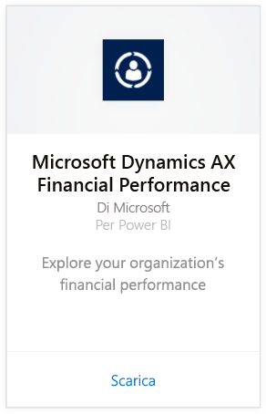
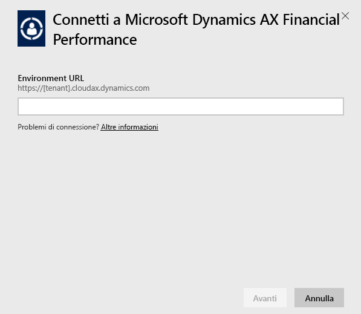
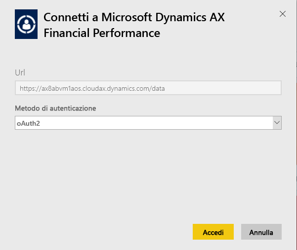
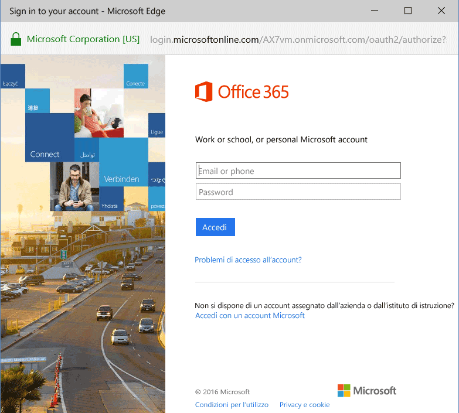
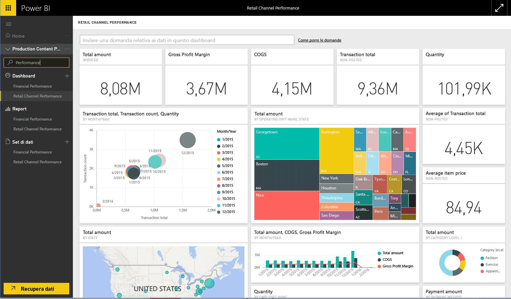

# Connettersi al pacchetto di contenuto di Microsoft Dynamics AX con Power BI
Microsoft Dynamics AX include tre pacchetti di contenuto Power BI destinati a utenti aziendali diversi. Il pacchetto di contenuto Financial Performance, progettato specificamente per i CFO, offre informazioni dettagliate sulle prestazioni finanziarie dell'organizzazione. Il pacchetto di contenuto Retail Channel Performance, destinato ai responsabili di canale, interpreta le prestazioni di vendita per prevedere tendenze e cogliere intuizioni direttamente dai dati di Retail and Commerce . Il pacchetto di contenuto Cost Management è progettato per i COO e i CFO e offre informazioni dettagliate sulle prestazioni operative.

Connettersi al pacchetto di contenuto Microsoft Dynamics AX [Retail Channel Performance](https://app.powerbi.com/getdata/services/dynamics-ax-retail-channel-performance), [Financial Performance](https://app.powerbi.com/getdata/services/dynamics-ax-financial-performance) o [Cost Management](https://app.powerbi.com/getdata/services/dynamics-ax-cost-management) per Power BI.

## Come connettersi
1. Selezionare **Recupera dati** nella parte inferiore del riquadro di spostamento sinistro.
   
   
2. Nella casella **Servizi** selezionare **Recupera**.
   
   
3. Selezionare uno dei pacchetti di contenuto di Dynamics AX e scegliere **Recupera**.
   
   
4. Specificare l'URL dell'ambiente Dynamics AX 7 in uso. Per informazioni dettagliate su come [trovare questi parametri](#FindingParams), vedere più avanti.
   
   
5. In **Metodo di autenticazione** selezionare **oAuth2** \> **Accedi**. Quando richiesto, immettere le credenziali di Dynamics AX.
   
    
   
    
6. Dopo l'approvazione, il processo di importazione inizierà automaticamente. Al termine nel riquadro di spostamento verranno visualizzati un nuovo dashboard, un nuovo report e un nuovo set di dati. Selezionare il dashboard per visualizzare i dati importati.
   
     

**Altre operazioni**

* Provare a [porre una domanda nella casella Domande e risposte](power-bi-q-and-a.md) nella parte superiore del dashboard
* [Cambiare i riquadri](service-dashboard-edit-tile.md) nel dashboard.
* [Selezionare un riquadro](service-dashboard-tiles.md) per aprire il report sottostante.
* Anche se la pianificazione prevede che il set di dati venga aggiornato quotidianamente, è possibile modificare la frequenza di aggiornamento o provare ad aggiornarlo su richiesta usando **Aggiorna ora**

## Cosa è incluso
Il pacchetto di contenuto usa il feed OData Dynamics AX 7 per importare i dati correlati rispettivamente a Retail Channel, a Financial Performance e a Cost Management.

## Requisiti di sistema
Questo pacchetto di contenuto richiede l'URL di un ambiente Dynamics AX 7. L'utente deve avere accesso al feed OData.

## Individuazione dei parametri

L'URL dell'ambiente Dynamics AX 7 è già presente nel browser quando l'utente effettua l'accesso. Copiare semplicemente l'URL dell'ambiente Dynamics AX radice nella finestra di dialogo di Power BI.

## Risoluzione dei problemi
A seconda della dimensione dell'istanza, il caricamento dei dati potrebbe richiedere tempo. Se all'interno di Power BI vengono visualizzati report vuoti, verificare di avere accesso alle tabelle OData necessarie per tali report.

## Passaggi successivi
[Introduzione a Power BI](service-get-started.md)

[Recuperare dati in Power BI](service-get-data.md)

