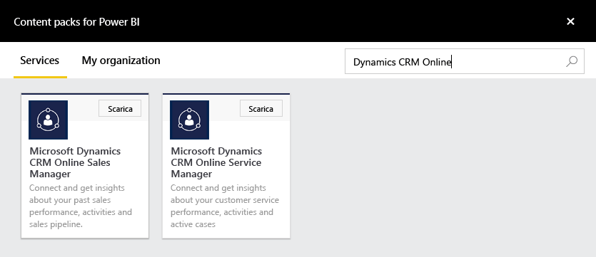
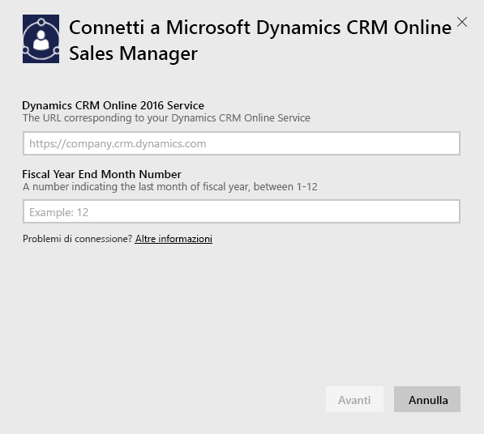
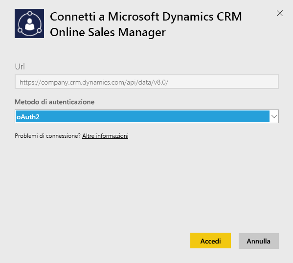
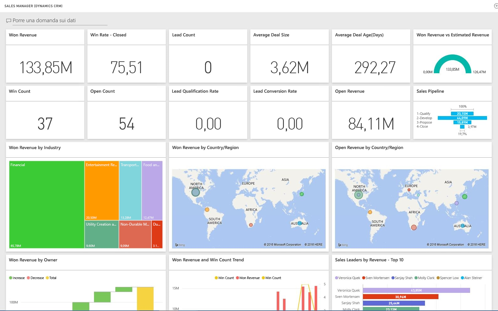

# Connettersi a Microsoft Dynamics CRM con Power BI
Microsoft Dynamics CRM Online per Power BI consente di accedere ai dati e analizzarli facilmente. Power BI usa il feed OData per creare un modello descrittivo con tutte le entità e le misurazioni necessarie, tra cui account, attività, opportunità, prodotti, lead, utenti e così via. Dopo aver installato l'app è possibile visualizzare dashboard e report nel servizio Power BI ([https://powerbi.com](https://powerbi.com)) e nelle app per dispositivi mobili di Power BI. 

Connettersi a Dynamics CRM Online [Sales Manager](https://msit.powerbi.com/groups/me/getdata/services/dynamics-crm-sales-manager) o [Service Manager](https://msit.powerbi.com/groups/me/getdata/services/dynamics-crm-customer-service). Vedere altre informazioni sull'[integrazione di Dynamics CRM Online](https://powerbi.microsoft.com/integrations/microsoft-dynamicscrm) con Power BI.

Questa connessione richiede **Microsoft Dynamics CRM Online 2016 o versione successiva**. Altre informazioni sui [requisiti](#Requirements) sono disponibili più avanti.

## Come connettersi
[!INCLUDE [powerbi-service-apps-get-more-apps](./includes/powerbi-service-apps-get-more-apps.md)]
3. Selezionare **Microsoft Dynamics CRM Sales Manager** o **Microsoft Dynamics CRM Service Manager** e fare clic su **Scarica**.
   
   
4. Specificare l'URL del servizio associato all'account.  L'URL sarà nel formato `https://company.crm.dynamics.com` Vedere altri dettagli [di seguito](#FindingParams).
   
   
5. Quando richiesto, specificare le credenziali. È possibile saltare questo passaggio se è già stato eseguito l'accesso nel browser. In Metodo di autenticazione immettere **oAuth2** e fare clic su **Accedi**:
   
   
6. Dopo la connessione verrà visualizzato un dashboard personalizzato per un utente di Sales Manager o Service Manager, popolato con i dati personali:
   
   

## Visualizzare il dashboard e i report di Microsoft Dynamics CRM
[!INCLUDE [powerbi-service-apps-open-app](./includes/powerbi-service-apps-open-app.md)]

[!INCLUDE [powerbi-service-apps-open-app](./includes/powerbi-service-apps-what-now.md)]

## Cosa è incluso
Le sezioni seguenti illustrano in modo dettagliato gli elementi disponibili per gli utenti tipo [Sales Manager](#Sales) e [Service Manager](#Service).

I dati aggiuntivi sono limitati in base al ruolo di sicurezza assegnato all'utente di Dynamics CRM Online.

Il dashboard e i report hanno lo scopo di fornire report operativi su dati a breve termine incentrati su un team o un gruppo. Ogni query è limitata al recupero di un massimo di 100.000 record da Dynamics CRM Online. Se questo limite viene superato a causa del volume elevato dei dati nell'organizzazione, il provisioning avrà esito negativo, perché l'aggiornamento dei dati di Dynamics CRM Online verrà interrotto. Se l'account ha dimensioni troppo elevate, prendere in considerazione la connessione con Power BI Desktop per creare una soluzione personalizzata.

### Responsabile vendite
Il dashboard e i report contengono metriche chiave quali:  

* Won Revenue   
* Percentuale di trattative concluse   
* Ricavi aperti   
* Ricavi persi   
* Ricavi previsti  
* Dimensione media dell'opportunità e altro ancora  

Contengono anche grafici chiave come i seguenti:  

* Tendenza ricavi ottenuti e persi, confronto tra ricavi ottenuti e tendenza dei ricavi stimati  
* Ricavi ottenuti in base a varie dimensioni, ad esempio settore, area, territorio   
* Migliori venditori per ricavi, attività   
* Account principali, opportunità vinte/perse    
* Tendenza per le nuove opportunità, pipeline di vendita e altro ancora   

Queste metriche e questi grafici sono utili per comprendere le prestazioni dell'organizzazione di vendita e analizzare la pipeline di vendita nell'intero team di vendita.

La tabella seguente elenca le entità CRM disponibili per questo servizio e offre anche informazioni dettagliate sui filtri applicati a ogni record di entità.

| Entità CRM | Filtri applicati |
| --- | --- |
| Account |Tutti gli account con opportunità correlate modificati negli ultimi 365 giorni. |
| Attività |Tutte le attività modificate negli ultimi 90 giorni   [modifiedon] > today - 90 days |
| Business unit |Tutte le business unit non disabilitate   [isdisabled] = false |
| Lead |Tutti i lead modificati negli ultimi 180 giorni   [modifiedon] > today - 180 days |
| Opportunità |Tutte le opportunità modificate negli ultimi 365 giorni   [modifiedon] > today - 365 days |
| Prodotto opportunità |Tutti i prodotti opportunità modificati negli ultimi 365 giorni   [modifiedon] > today - 365 days |
| Product |Tutti i prodotti attivi   [statecode] <> 1 |
| Territorio |Tutti i territori |
| Utente |Tutti gli utenti attivi, non gli amministratori delegati    [isdisabled] = false and [accessmode] <> 4 |

### Service Manager
Il dashboard e i report contengono metriche chiave quali:  

* Percentuale CSAT   
* Percentuale SLA Met   
* Percentuale di casi con escalation   
* Tempo medio di gestione   
* Totale casi risolti  
* Totale casi attivi  
* Numero di volte in cui un articolo della Knowledge Base viene usato nei casi e altro ancora    

Contengono anche grafici chiave come i seguenti:   

* Tendenze dei volumi dei casi per casi in ingresso, casi risolti, casi con escalation   
* Volume di casi in base a diverse dimensioni, ad esempio origine, posizione, priorità, tipo  
* Leader in base a percentuale CSAT, percentuale SLA met, attività, casi risolti  
* Articoli della Knowledge Base più usati e più visualizzati e altro ancora  
    Queste metriche e questi grafici sono utili per comprendere le prestazioni dell'organizzazione di supporto tecnico e analizzare il carico di lavoro dei casi attivi nel team de servizio e nelle code del servizio.

La tabella seguente elenca le entità CRM disponibili per questo servizio e fornisce anche informazioni dettagliate sui filtri applicati a ogni record di entità.

| Entità CRM | Filtri applicati |
| --- | --- |
| Account |Tutti gli account con casi correlati modificati negli ultimi 90 giorni |
| Attività |Tutte le attività modificate negli ultimi 90 giorni   [modifiedon] > today - 90 days |
| Caso |Tutti i casi modificati negli ultimi 90 giorni   [modifiedon] > today - 90 days |
| Impegno di risoluzione dei casi |Tutti gli impegni di risoluzione dei casi modificati negli ultimi 90 giorni   [modifiedon] > today - 90 days |
| Contatta |Tutti i contatti con casi correlati modificati negli ultimi 90 giorni. |
| Articolo della Knowledge Base |Tutte le versioni più recenti degli articoli della Knowledge Base    [islatestversion] = true |
| Evento imprevisto dell'articolo della Knowledge Base |Tutti gli eventi imprevisti degli articoli della Knowledge Base modificati negli ultimi 90 giorni   [modifiedon] > today - 90 days |
| Coda |Tutte le code attive    [statecode] = 0 |
| Elemento della coda |Tutti gli elementi della coda correlati ai casi creati negli ultimi 365 giorni    [createdon] > today - 365 days and   [objecttypecode] = 112 |
| Utente |Tutti gli utenti attivi    [isdisabled] = false |

## Requisiti di sistema
* Istanza valida di Dynamics CRM Online 2016 o versione successiva. Power BI non funziona con una versione locale di CRM. Se non si ha la versione 2016 o successiva:
* Un amministratore deve abilitare l'endpoint OData nelle impostazioni del sito.
* Un account con meno di 100.000 record nelle tabelle. Si noti che se l'account ha accesso a più di 100.000 record, l'importazione avrà esito negativo.

## Individuazione dei parametri
L'indirizzo dell'istanza è reperibile nella barra dell'URL del browser. Ha in genere questo formato `https://[instance_name].crm.dynamics.com`.

Power BI supporta solo gli endpoint di Dynamics CRM 2016. La connessione non funziona con le versioni precedenti di CRM Online. Usare Power BI Desktop per connettersi direttamente all'account.

## Risoluzione dei problemi
In caso di problemi di connessione, verificare quanto segue:  

* L'URL dell'istanza fornito è corretto (verificare con l'amministratore)  
* L'istanza è CRM Online 2016  
* L'endpoint OData è abilitato  

Provare anche a connettersi direttamente in Power BI Desktop con l'URL di OData `https://[instance_name].crm.dynamics.com/api/data/v8.0/`.

Se si conferma di avere Dynamics CRM Online 2016, tuttavia si verificano ancora problemi di connessione, contattare l'amministratore di CRM per verificare che siano presenti tutti gli aggiornamenti disponibili.

Se CRM Online 2016 o versione successiva non è disponibile, usare Power BI Desktop per connettersi direttamente all'account.

Se viene visualizzato un errore "Data refresh failed as query exceeded the maximum limit of 100000 records." (Aggiornamento dati non riuscito. La query supera il limite massimo di 100.000 record.) è consigliabile connettersi direttamente da Power BI Desktop o sfruttando il modello di soluzione CRM.

## Passaggi successivi
* [Cosa sono le app in Power BI?](service-create-distribute-apps.md)
* [Recuperare dati in Power BI](service-get-data.md)
* Altre domande? [Provare a rivolgersi alla community di Power BI](http://community.powerbi.com/)

