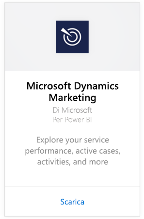
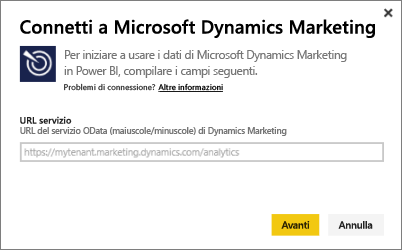
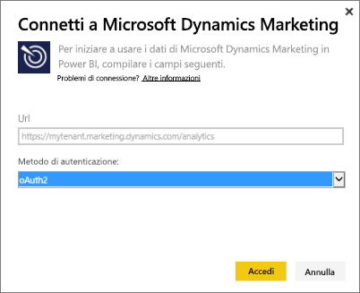
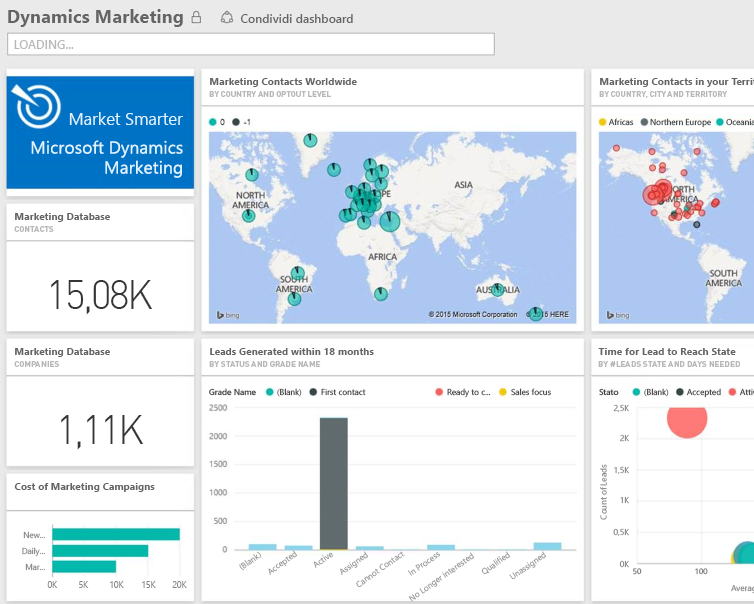

# Connettersi a Microsoft Dynamics Marketing con Power BI
Il pacchetto di contenuto Microsoft Dynamics Marketing per Power BI consente di accedere e analizzare facilmente i dati da Dynamics Marketing. Il pacchetto di contenuto usa un modello descrittivo basato sul feed OData, con tutte le entità e le misurazioni necessarie, tra cui programmi, campagne, società e contatti di marketing, lead, interazioni e punteggio dei lead, siti Web e messaggi di posta elettronica di marketing, osservazioni relative ai comportamenti, budget, transazioni finanziarie e indicatori KPI delle prestazioni e così via. 

Connettersi al [pacchetto di contenuto Dynamics Marketing](https://app.powerbi.com/getdata/services/microsoft-dynamics-marketing) per Power BI.

>[!NOTE]
>È necessario specificare un URL di OData valido per un'istanza di  Dynamics Marketing. Il pacchetto di contenuto non funziona infatti con una versione locale di CRM. Vedere i requisiti aggiuntivi indicati di seguito.

## Come connettersi
1. Selezionare Recupera dati nella parte inferiore del riquadro di spostamento sinistro.
   
    
2. Nella casella **Servizi** selezionare **Recupera**.
   
    
3. Selezionare **Microsoft Dynamics Marketing** \> **Recupera**.
   
   
4. Specificare l'URL di OData associato all'account,  Sarà nel formato "`https://[instance\_name].marketing.dynamics.com/analytics.`"
   
   
5. Quando richiesto, specificare le credenziali. È possibile saltare questo passaggio se è già stato effettuato l'accesso nel browser. In Metodo di autenticazione immettere **oAuth2** e fare clic su **Accedi**:
   
   
6. Dopo la connessione verrà visualizzato un dashboard Dynamics Marketing, popolato con i dati personali. Gli asterischi gialli indicano i nuovi elementi nel riquadro di spostamento sinistro.
   
   

**Altre operazioni**

* Provare a [porre una domanda nella casella Domande e risposte](consumer/end-user-q-and-a.md) nella parte superiore del dashboard
* [Cambiare i riquadri](service-dashboard-edit-tile.md) nel dashboard.
* [Selezionare un riquadro](consumer/end-user-tiles.md) per aprire il report sottostante.
* Anche se la pianificazione prevede che il set di dati venga aggiornato quotidianamente, è possibile modificarne la frequenza di aggiornamento o provare ad aggiornarlo su richiesta usando **Aggiorna ora**

## Requisiti di sistema
* È necessario specificare un URL di OData valido per un'istanza di  Dynamics Marketing. Il pacchetto di contenuto non funziona infatti con una versione locale di CRM.  
* Un amministratore deve abilitare l'endpoint OData nelle impostazioni del sito. Per trovare l'indirizzo dell'endpoint OData, passare a **Home \> Impostazioni \> Impostazioni sito** nella sezione **Servizio dati organizzazione**.  Il formato dell'URL OData è https://[nome\_istanza].marketing.dynamics.com/analytics  
* L'identità/account utente per l'accesso a Microsoft Dynamics Marketing deve essere uguale a quello con cui è stata effettuata l'iscrizione per l'uso di Power BI. Quando si effettua l'accesso a Microsoft Dynamics Marketing, viene automaticamente usata la stessa identità usata per Power BI. Se si vuole accedere a Microsoft Dynamics Marketing con un account diverso, effettuare la registrazione come utente Power BI specificando lo stesso account. Questo problema verrà probabilmente risolto in una versione futura.   

## Risoluzione dei problemi
Se viene visualizzato un messaggio di accesso non riuscito quando si prova a connettersi all'account di Dynamics CRM, verificare che l'account di accesso usato per Power BI sia quello con cui si accede al feed OData di CRM Online. Provare anche ad accedere al feed nel browser per testarlo.

Chiedere all'amministratore di verificare che l'URL di OData sia corretto e che l'endpoint OData sia abilitato.

Verificare la versione di Dynamics Marketing usata (sono state rese disponibili altre correzioni per le versioni 18.0 e 18.1) e, in caso di problemi se si usa una versione meno recente, è possibile provare a eseguire l'aggiornamento.

Se i problemi persistono, aprire un ticket di supporto per contattare il team di Power BI:

* Nell'app Power BI selezionare il punto interrogativo \> **Contatta il supporto tecnico**.
* Nel sito del supporto tecnico di Power BI (da cui si sta leggendo questo articolo) selezionare **Contattare il supporto tecnico** sul lato destro della pagina.

## Passaggi successivi
[Recuperare dati per Power BI](service-get-data.md)

[Che cos'è Power BI?](power-bi-overview.md)

