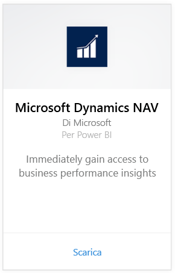
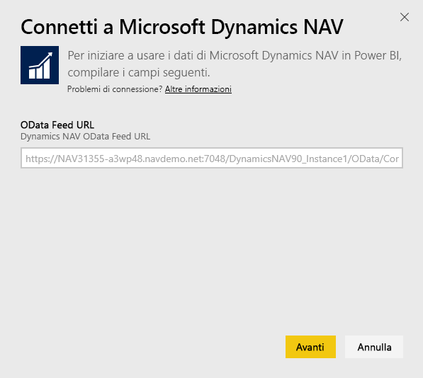
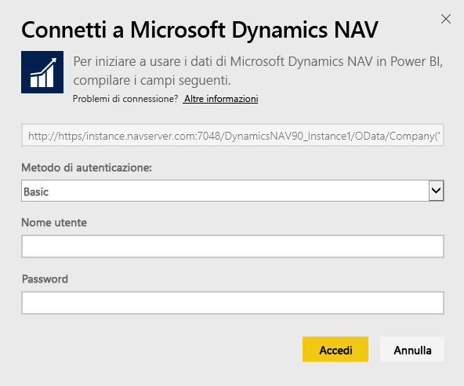
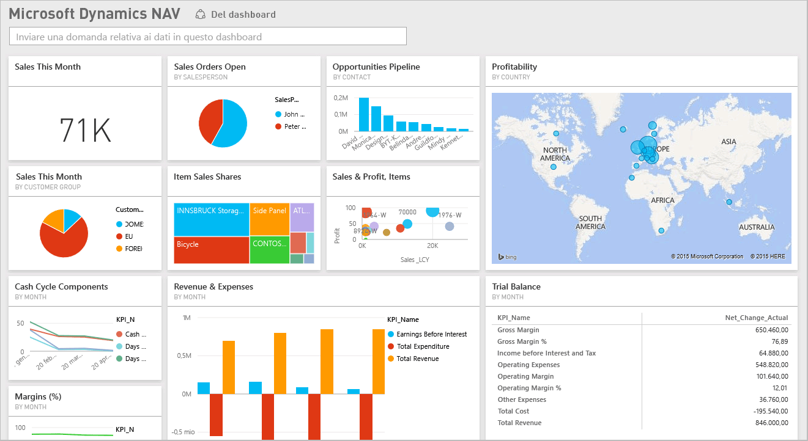

# Connettersi a Microsoft Dynamics NAV con Power BI
Ottenere informazioni dettagliate sui dati di Microsoft Dynamics NAV è facile con Power BI. Power BI recupera i dati, sia di vendita che finanziari, quindi crea un'app con un dashboard e report in base a tali dati. Power BI richiede le autorizzazioni per le tabelle da cui vengono recuperati i dati, in questo caso i dati finanziari e sulle vendite. Di seguito sono fornite informazioni più dettagliate sui requisiti. Dopo aver installato l'app è possibile visualizzare dashboard e report nel servizio Power BI ([https://powerbi.com](https://powerbi.com)) e nelle app per dispositivi mobili di Power BI. 

[Connettersi a Microsoft Dynamics NAV per Power BI](https://app.powerbi.com/getdata/services/microsoft-dynamics-nav) oppure leggere altre informazioni sull'[integrazione di Dynamics NAV](https://powerbi.microsoft.com/integrations/microsoft-dynamics-nav) con Power BI.

## Come connettersi
[!INCLUDE [powerbi-service-apps-get-more-apps](./includes/powerbi-service-apps-get-more-apps.md)]

1. Selezionare **Microsoft Dynamics NAV**, quindi selezionare **Recupera**.  
   
2. Quando richiesto, immettere l'URL OData di Microsoft Dynamics NAV. L'URL deve corrispondere al modello seguente:
   
    `https//instance.navserver.com:7048/DynamicsNAV90_Instance1/OData/Company('CRONUS%20International%20Ltd.')`
   
   * "instance.navserver.com" con il nome del proprio server NAV
   * "DynamicsNAV90\_Instance1" con il nome dell'istanza del server NAV
   * "Company('CRONUS%20International%20Ltd.')" con il nome della società NAV.
     
     Un modo semplice per ottenere questo URL consiste nel passare a Servizi Web in Dynamics NAV, trovare il servizio Web powerbifinance e copiare l'URL OData, omettendo però "/powerbifinance" nella stringa dell'URL.  
     
3. Selezionare **Di base** e immettere le credenziali di Microsoft Dynamics NAV.
   
    sono necessarie le credenziali di amministratore, o almeno le autorizzazioni per accedere ai dati finanziari e di vendita, per il proprio account Microsoft Dynamics NAV.  Al momento è supportata solo l'autenticazione di base (nome utente e password).
   
    
4. Power BI recupererà i dati di Microsoft Dynamics NAV e creerà automaticamente un dashboard e un report pronti da usare.   
   

## Visualizzare il dashboard e i report
[!INCLUDE [powerbi-service-apps-open-app](./includes/powerbi-service-apps-open-app.md)]

[!INCLUDE [powerbi-service-apps-open-app](./includes/powerbi-service-apps-what-now.md)]

## Cosa è incluso
Il dashboard e i report contengono i dati delle tabelle seguenti, con distinzione tra maiuscole e minuscole:  

* ItemSalesAndProfit  
* ItemSalesByCustomer  
* powerbifinance  
* SalesDashboard  
* SalesOpportunities  
* SalesOrdersBySalesPerson  
* TopCustomerOverview  

## Requisiti di sistema
Per importare i dati di Microsoft Dynamics NAV in Power BI, è necessario avere le autorizzazioni per accedere alle tabelle di dati finanziari e di vendita da cui vengono recuperati i dati. Le tabelle devono contenere dei dati perché non è consentito importare tabelle vuote.

## Risoluzione dei problemi
Power BI usa i servizi Web di Microsoft Dynamics NAV per recuperare i dati. Se si ha una grande quantità di dati nell'istanza di Microsoft Dynamics NAV, un suggerimento per ridurre al minimo l'impatto sull'uso del servizio Web consiste nel modificare la frequenza di aggiornamento a seconda delle esigenze. Un altro suggerimento consiste nell'avere un solo amministratore che crea l'app e la condivide anziché avere ogni amministratore che crea la propria app.

**"La convalida dei parametri non è riuscita. Verificare che tutti i parametri siano validi"**  
Se questo errore viene visualizzato dopo aver digitato l'URL di Microsoft Dynamics NAV, verificare che siano soddisfatti i requisiti seguenti:

* L'URL segue esattamente questo modello:
  
    `https//instance.navserver.com:7048/DynamicsNAV90_Instance1/OData/Company('CRONUS%20International%20Ltd.')`
  
  * "instance.navserver.com" con il nome del proprio server NAV
  * "DynamicsNAV90\_Instance1" con il nome dell'istanza del server NAV
  * "Company('CRONUS%20International%20Ltd.')" con il nome della società NAV.
* Verificare che tutte le lettere siano minuscole.  
* Verificare che l'URL sia in 'https'.  
* Verificare che non vi sia la barra finale alla fine dell'URL.

**"L'accesso non è riuscito"**  
Se questo errore si verifica dopo aver usato le credenziali di Microsoft Dynamics NAV per eseguire l'accesso, potrebbe essersi verificato uno dei problemi seguenti:

* L'account in uso non ha le autorizzazioni per recuperare i dati di Microsoft Dynamics NAV dall'account. Verificare che sia un account amministratore e riprovare.
* L'istanza di Dynamics NAV a cui si sta provando a connettersi non ha un certificato SSL valido. In questo caso, verrà visualizzato un messaggio di errore più dettagliato (ad esempio, "Impossibile stabilire relazione SSL attendibile"). Si noti che i certificati autofirmati non sono supportati.

**"Errore"**  
Se viene visualizzata una finestra di dialogo di errore dopo la finestra di dialogo di autenticazione, Power BI ha riscontrato un problema durante il caricamento dei dati.

* Verificare che l'URL segua il modello specificato in precedenza. Un errore comune consiste nello specificare:
  
    `https//instance.navserver.com:7048/DynamicsNAV90\_Instance1/OData`
  
    È tuttavia necessario includere la sezione 'Company('CRONUS%20International%20Ltd.')' con il nome della società NAV:
  
    `https//instance.navserver.com:7048/DynamicsNAV90\_Instance1/OData/Company('CRONUS%20International%20Ltd.')`

## Passaggi successivi
* [Cosa sono le app in Power BI?](consumer/end-user-apps.md)
* [Recuperare dati in Power BI](service-get-data.md)
* Altre domande? [Provare a rivolgersi alla community di Power BI](http://community.powerbi.com/)

