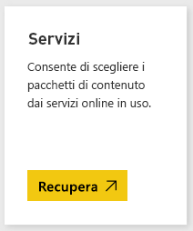
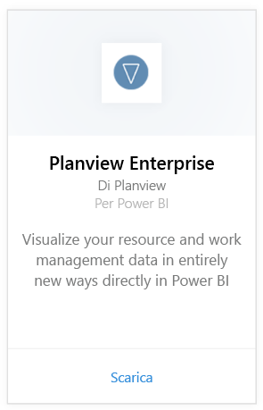
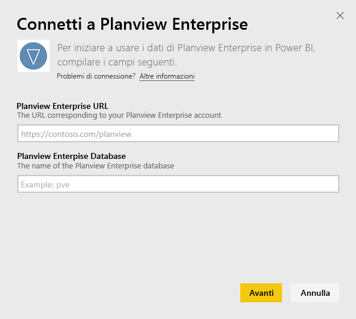
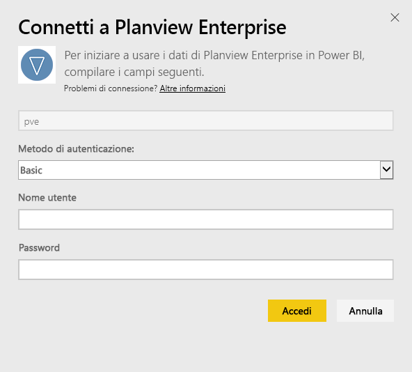
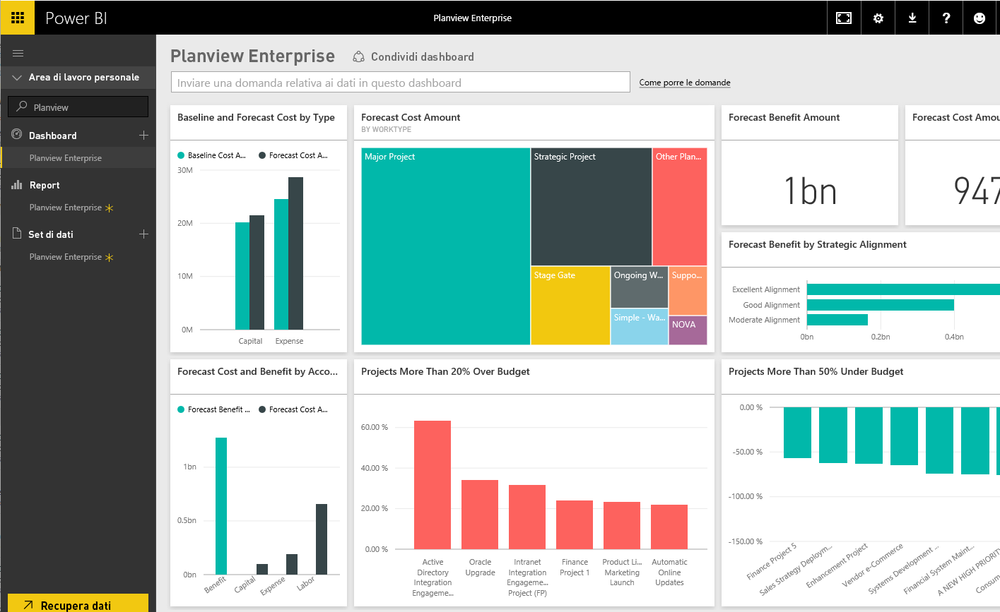

# Connettersi a Planview Enterprise con Power BI
Con il pacchetto di contenuto Planview Enterprise per Power BI è possibile visualizzare i dati di gestione risorse e lavoro in modi completamente nuovi direttamente in Power BI. Usare le credenziali di accesso a Planview Enterprise per vedere in modo interattivo gli investimenti per il portfolio comprendere lo stato del budget e controllare l'allineamento dei progetti alle priorità strategiche aziendali. È anche possibile estendere il dashboard e i report predefiniti per ottenere le informazioni più importanti.

Connettersi al [pacchetto di contenuto Planview Enterprise in Power BI](https://app.powerbi.com/getdata/services/planview-enterprise)

>[!NOTE]
>Per importare i dati di Planview Enterprise in Power BI è necessario essere un utente di Planview Enterprise con la funzionalità Reporting Portal Viewer abilitata nel proprio ruolo. Vedere i requisiti aggiuntivi indicati di seguito.

## Come connettersi
1. Selezionare **Recupera dati** nella parte inferiore del riquadro di spostamento sinistro.
   
    
2. Nella casella **Servizi** selezionare **Recupera**.
   
    
3. Nella pagina di Power BI, selezionare **Planview Enterprise**, quindi selezionare **Recupera**:  
    
4. Nella casella di testo Planview Enterprise URL immettere l'URL per il server di Planview Enterprise che si vuole usare. Nella casella di testo Planview Enterprise Database immettere il nome del database di Planview Enterprise, quindi fare clic su Avanti.  
    
5. Nell'elenco di Metodo di autenticazione, selezionare **Basic** se non è già selezionato. Immettere il **nome utente** e la **password** per il proprio account e selezionare **Accedi**.  
   
6. Nel riquadro a sinistra, selezionare Planview Enterprise dall'elenco dei dashboard.  
     Power BI Importa i dati di Planview Enterprise nel dashboard. Si noti che il caricamento dei dati può richiedere un po' di tempo.  
    

**Altre operazioni**

* Provare a [porre una domanda nella casella Domande e risposte](consumer/end-user-q-and-a.md) nella parte superiore del dashboard
* [Cambiare i riquadri](service-dashboard-edit-tile.md) nel dashboard.
* [Selezionare un riquadro](consumer/end-user-tiles.md) per aprire il report sottostante.
* Anche se la pianificazione prevede che il set di dati venga aggiornato quotidianamente, è possibile modificarne la frequenza di aggiornamento o provare ad aggiornarlo su richiesta usando **Aggiorna ora**

## Requisiti di sistema
Per importare i dati di Planview Enterprise in Power BI è necessario essere un utente di Planview Enterprise con la funzionalità Reporting Portal Viewer abilitata nel proprio ruolo. Vedere i requisiti aggiuntivi indicati di seguito.

Questa procedura presuppone che sia stato già effettuato l'accesso alla home page di Microsoft Power BI con un account Power BI. Se non si dispone di un account Power BI, andare a [powerbi.com](https://powerbi.microsoft.com/get-started/) e in **Power BI - Collaborazione e condivisione nel cloud**, selezionare **Prova gratuitamente**. Quindi fare clic su **Recupera dati**.

## Passaggi successivi:

[Che cos'è Power BI?](power-bi-overview.md)

[Recuperare dati per Power BI](service-get-data.md)