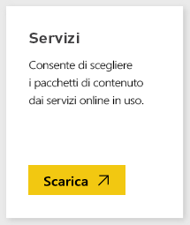

# Connettersi a Prevedere con Power BI
Accedere a informazioni finanziarie esclusive e critiche per promuovere in modo proattivo e in tutta sicurezza la propria azienda.

Connettersi al [pacchetto di contenuto Prevedere per Power BI](https://app.powerbi.com/getdata/services/prevedere).

>[!NOTE]
>Se non si è già utenti di Prevedere, usare la [chiave di esempio](https://prevederepowerbiconnector.azurewebsites.net/static/learnmore.html) per provarlo.

## Come connettersi
1. Selezionare **Recupera dati** nella parte inferiore del riquadro di spostamento sinistro.
   
   
2. Nella casella **Servizi** selezionare **Recupera**.
   
   
3. Selezionare **Prevedere** e quindi **Recupera**.
   
   
4. In **Metodo di autenticazione**selezionare **Chiave** e immettere la chiave API di Prevedere.
   
    
5. Selezionare **Accedi** per avviare il processo di importazione. Al termine nel riquadro di spostamento verranno visualizzati un nuovo dashboard, un nuovo report e un nuovo set di dati. Selezionare il dashboard per visualizzare i dati importati.
   
     

**Altre operazioni**

* Provare a [porre una domanda nella casella Domande e risposte](power-bi-q-and-a.md) nella parte superiore del dashboard
* [Cambiare i riquadri](service-dashboard-edit-tile.md) nel dashboard.
* [Selezionare un riquadro](service-dashboard-tiles.md) per aprire il report sottostante.
* Anche se la pianificazione prevede che il set di dati venga aggiornato quotidianamente, è possibile modificare la frequenza di aggiornamento o provare ad aggiornarlo su richiesta usando **Aggiorna ora**

## Cosa è incluso
Il pacchetto di contenuto ottiene gli approfondimenti sulle previsioni di vendita al dettaglio, sui modelli di previsione, sugli indici economici composti e altro ancora.

## Requisiti di sistema
Questo pacchetto di contenuto richiede l'accesso a una chiave API di Prevedere o alla chiave di esempio (vedere sotto).

## Individuazione dei parametri

I clienti esistenti possano accedere ai dati usando la propria chiave API. Se non si è ancora un cliente, è possibile vedere un esempio dei dati e delle analisi usando la [chiave di esempio](https://prevederepowerbiconnector.azurewebsites.net/static/learnmore.html).

## Risoluzione dei problemi
A seconda della dimensione dell'istanza, il caricamento dei dati potrebbe richiedere tempo.

## Passaggi successivi
[Introduzione a Power BI](service-get-started.md)

[Recuperare dati in Power BI](service-get-data.md)

