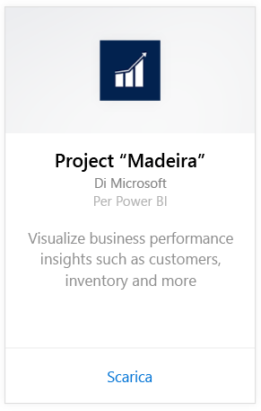
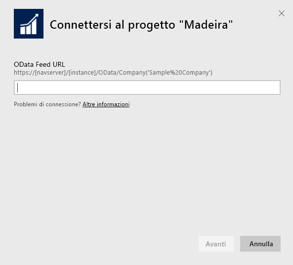
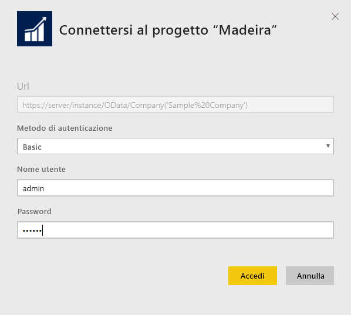
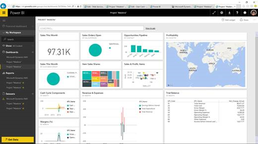
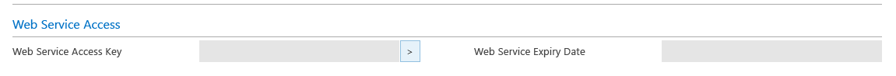
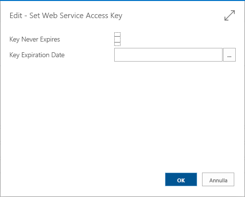
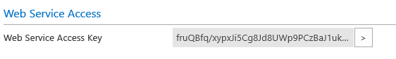

# Connettersi al progetto "Madeira" con Power BI
Ottenere informazioni dettagliate sui dati di Project "Madeira" è facile con Power BI e il pacchetto di contenuto Project "Madeira". Power BI recupera i dati, sia di vendita che finanziari, quindi crea un dashboard e dei report predefiniti in base a tali dati.
Connettersi al pacchetto di contenuto Project "Madeira" per Power BI oppure leggere altre informazioni sull'integrazione di Project "Madeira" con Power BI.

>[!NOTE]
>Questo pacchetto di contenuto richiede le autorizzazioni per le tabelle da cui vengono recuperati i dati, in questo caso i dati finanziari e sulle vendite. Altre informazioni sui requisiti sono disponibili [più avanti](#Requirements).

Connettersi al [pacchetto di contenuto Project "Madeira"](https://app.powerbi.com/getdata/services/project-madeira) per Power BI.

## Come connettersi
1. Selezionare **Recupera dati** nella parte inferiore del riquadro di spostamento sinistro.  
    
2. Nella casella **Servizi** selezionare **Recupera**.  
    
3. Selezionare **Project "Madeira"**, quindi **Recupera**.  
    
4. Quando richiesto, immettere l'URL di Project "Madeira". L'URL deve seguire esattamente il modello seguente: https://mycronusus.projectmadeira.com:7048/NAV/OData/Società('CRONUS%20US'), con il proprio nome società di Project "Madeira". Si noti che non c'è la barra rovesciata alla fine dell'URL e la connessione deve essere https. Per informazioni dettagliate su come trovare questo URL, vedere [più avanti](#FindingParams).  
   
    
5. Quando richiesto, in Metodo di autenticazione selezionare Di base, immettere l'indirizzo di posta elettronica di selezionare come nome utente e quindi immettere la chiave di accesso del servizio Web per il proprio account di selezionare come password. Se è già stato effettuato l'accesso a Project "Madeira" nel browser, le credenziali potrebbero non essere richieste. Vedere i dettagli sulla generazione di questa chiave di accesso [più avanti](#FindingParams).  
   
    >[!NOTE]
    >È necessario essere un utente avanzato nel progetto "Madeira".
   
   
6. Dopo la connessione vengono caricati automaticamente un dashboard, un report e un set di dati. Al termine, i riquadri vengono aggiornati con i dati dell'account.  
   
    

**Altre operazioni**

* Provare a [porre una domanda nella casella Domande e risposte](power-bi-q-and-a.md) nella parte superiore del dashboard
* [Cambiare i riquadri](service-dashboard-edit-tile.md) nel dashboard.
* [Selezionare un riquadro](service-dashboard-tiles.md) per aprire il report sottostante.
* Anche se la pianificazione prevede che il set di dati venga aggiornato quotidianamente, è possibile modificare la frequenza di aggiornamento o provare ad aggiornarlo su richiesta usando **Aggiorna ora**

## Requisiti di sistema
Per importare i dati di Project "Madeira" in Power BI, è necessario avere le autorizzazioni di accesso alle tabelle da cui vengono recuperati i dati finanziari e sulle vendite. Tutte le tabelle (maiuscole/minuscole) necessarie per il pacchetto di contenuto includono:  
 
    ´´´ 
    - ItemSalesAndProfit  
    - ItemSalesByCustomer  
    - powerbifinance  
    - SalesDashboard  
    - SalesOpportunities  
    - SalesOrdersBySalesPerson  
    - TopCustomerOverview  
    ´´´ 

## Individuazione dei parametri
**Ottenere l'URL giusto** Un modo semplice per ottenere questo URL consiste nel passare a Servizi Web in Project "Madeira", trovare il servizio Web powerbifinance e copiare l'URL OData (fare clic con il pulsante destro del mouse e scegliere Copia collegamento), omettendo però "/powerbifinance…" nella stringa dell'URL.

**Chiavi di accesso al servizio Web** Per poter usare i dati di Project "Madeira" sarà necessario creare una chiave di accesso al servizio Web per il proprio account utente. In Project “Madeira”, cercare la pagina Utenti e quindi aprire la scheda relativa al proprio account utente. Qui è possibile generare una nuova chiave di accesso ai servizi Web e copiarla nel campo Password nella pagina di connessione di Power BI.

Quando si inizia a usare le chiavi di accesso al servizio Web che si useranno in futuro, scegliere OK nel messaggio che viene visualizzato.
Quando si crea la chiave è possibile selezionare se scadrà in una data specifica o no.

Quando si sceglie OK, viene creata una chiave che potrà essere copiata nel campo Password nella pagina di connessione di Power BI.

## Risoluzione dei problemi
Il dashboard di Power BI si basa sui servizi Web pubblicati sopra elencati e visualizza i dati della società dimostrativa o della propria società se si importano i dati dalla corrente soluzione finanziaria. Tuttavia, se si verificano problemi, questa sezione fornisce una soluzione alternativa per i problemi più comuni.

**"La convalida dei parametri non è riuscita. Verificare che tutti i parametri siano validi"**

Se questo errore viene visualizzato dopo aver immesso l'URL di Project "Madeira", verificare che siano soddisfatti i requisiti seguenti:  

   - L'URL segue esattamente questo modello: https://*mycronusus*.projectmadeira.com:7048/NAV/OData/Company('*CRONUS%20US*')  
   - Eliminare qualsiasi testo tra parentesi dopo il nome della società  
   - Verificare che non vi sia la barra finale alla fine dell'URL.  
   - Assicurarsi che l'URL usi una connessione sicura come indicato dall'URL che inizia con https.  

**"Accesso non riuscito"** Se questo errore si verifica quando si accede al dashboard usando le credenziali di Project "Madeira", potrebbe essere stato causato da uno dei problemi seguenti:  

   - L'account in uso non ha le autorizzazioni per leggere i dati di Project "Madeira" dall'account. Verificare l'account utente in Project "Madeira", assicurarsi che sia stata usata la chiave di accesso al servizio Web giusta come password e riprovare.  
   - L'istanza di Project "Madeira" a cui si sta provando a connettersi non ha un certificato SSL valido. In questo caso, verrà visualizzato un messaggio di errore più dettagliato (ad esempio, "Impossibile stabilire relazione SSL attendibile"). Si noti che i certificati autofirmati non sono supportati.  

**"Si è verificato un errore"** Se viene visualizzata una finestra di dialogo di errore dopo aver passato la finestra di dialogo di autenticazione, più di frequente è causata da un problema di connessione ai dati per il pacchetto di contenuto. Verificare che l'URL segua il modello specificato in precedenza:  
    https://*mycronusus*.projectmadeira.com:7048/NAV/OData/Società('*CRONUS%20US*')

Un errore comune consiste nello specificare l'URL completo per un servizio Web specifico:  
    https://*mycronusus*.projectmadeira.com:7048/NAV/OData/Società('*CRONUS%20US*')/powerbifinance

Oppure è possibile avere dimenticato di specificare il nome della società:   
    https://*mycronusus*.projectmadeira.com:7048/NAV/OData/

## Passaggi successivi
[Introduzione a Power BI](service-get-started.md)

[Power BI - Concetti di base](service-basic-concepts.md)

