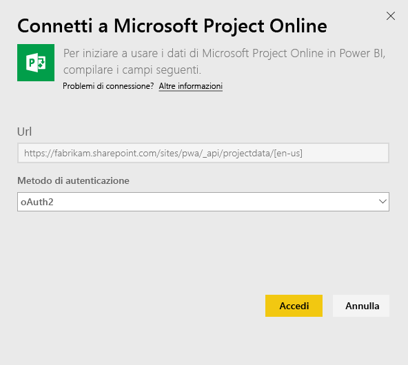
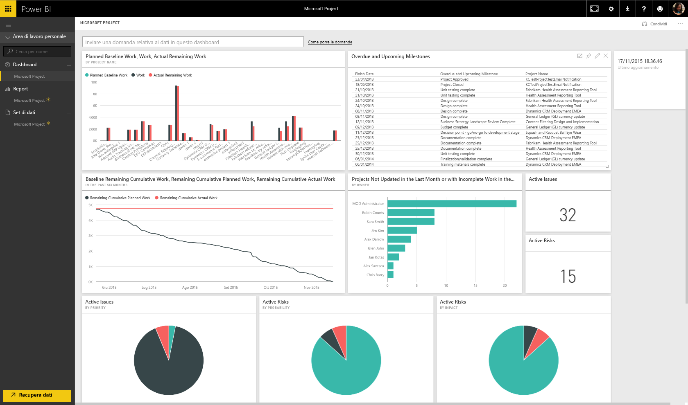

# Connettersi a Project Online con Power BI
Microsoft Project Online è una soluzione online flessibile per la gestione del portfolio di progetti (PPM) e il lavoro quotidiano. Progetto Online consente alle organizzazioni di iniziare, definire le priorità degli investimenti nel portfolio di progetti e offrire i vantaggi aziendali previsti. Il pacchetto di contenuto Project Online per Power BI consente di esplorare i dati del progetto con metriche predefinite, ad esempio lo stato del portfolio e la conformità del progetto.

Connettersi al [pacchetto di contenuto Project Online](https://app.powerbi.com/getdata/services/project-online) per Power BI.

## Come connettersi
1. Selezionare **Recupera dati** nella parte inferiore del riquadro di spostamento sinistro.
   
    
2. Nella casella **Servizi** selezionare **Recupera**.
   
   
3. Selezionare **Microsoft Project Online** \> **Recupera**.
   
   
4. Nella casella di testo **URL Project Web App** immettere l'URL di Project Web App a cui connettersi e selezionare **Avanti**. Si noti che questo può differire dall'esempio se è presente un dominio personalizzato.
   
    
5. In Metodo di autenticazione selezionare **oAuth2** \> **Accedi**. Quando richiesto, immettere le credenziali di Project Online e seguire il processo di autenticazione.
   
    
    
Si noti che è necessario disporre di Visualizzatore portfolio, Program Manager o delle autorizzazioni di amministratore per l'istanza di Project Web App a cui ci si connette.

6. Una notifica indicherà che è in corso il caricamento dei dati. A seconda delle dimensioni dell'account l'operazione potrebbe richiedere alcuni minuti. Dopo l'importazione dei dati in Power BI, nel riquadro di spostamento sinistro vengono visualizzati il nuovo dashboard, il nuovo report e il nuovo set di dati. Si tratta del dashboard predefinito creato da Power BI per visualizzare i dati, che è possibile modificare per visualizzare i dati nel modo desiderato.
   
   

**Altre operazioni**

* Provare a [porre una domanda nella casella Domande e risposte](power-bi-q-and-a.md) nella parte superiore del dashboard
* [Cambiare i riquadri](service-dashboard-edit-tile.md) nel dashboard.
* [Selezionare un riquadro](service-dashboard-tiles.md) per aprire il report sottostante.
* Anche se la pianificazione prevede che il set di dati venga aggiornato quotidianamente, è possibile modificare la frequenza di aggiornamento o provare ad aggiornarlo su richiesta usando **Aggiorna ora**

## Passaggi successivi
[Introduzione a Power BI](service-get-started.md)

[Recuperare dati in Power BI](service-get-data.md)

