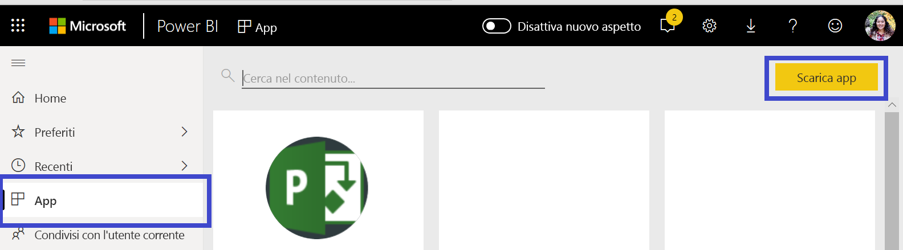
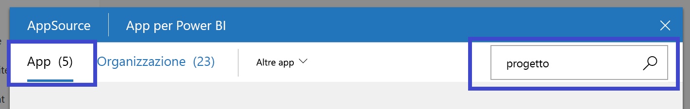
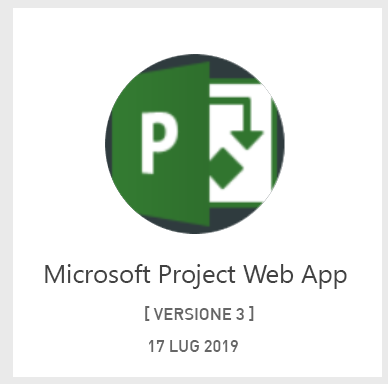
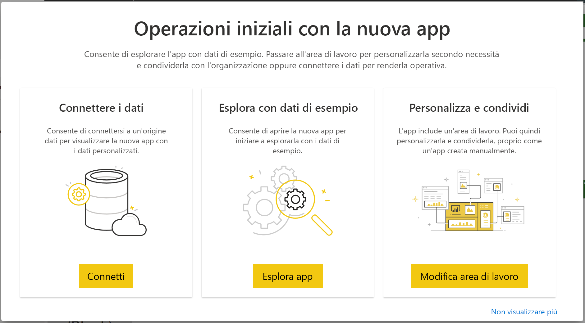
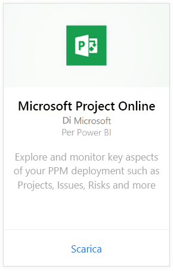
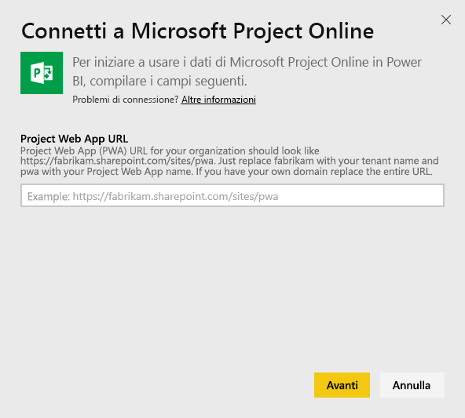
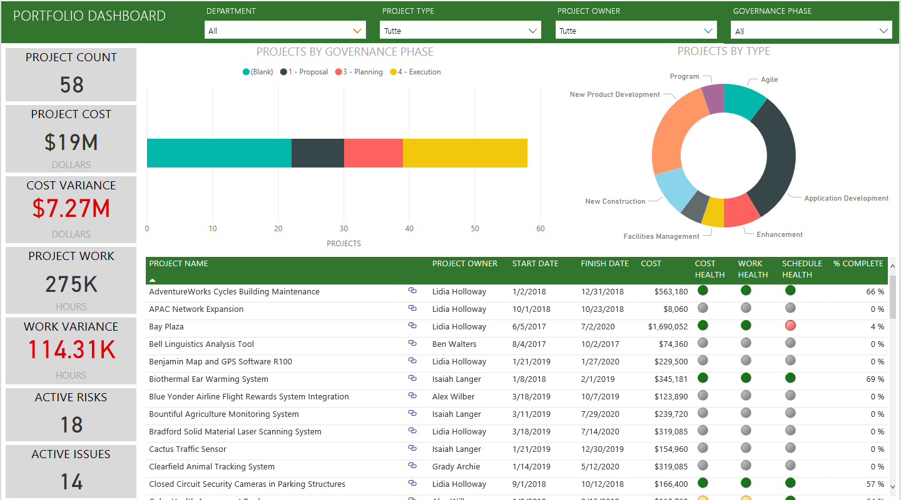
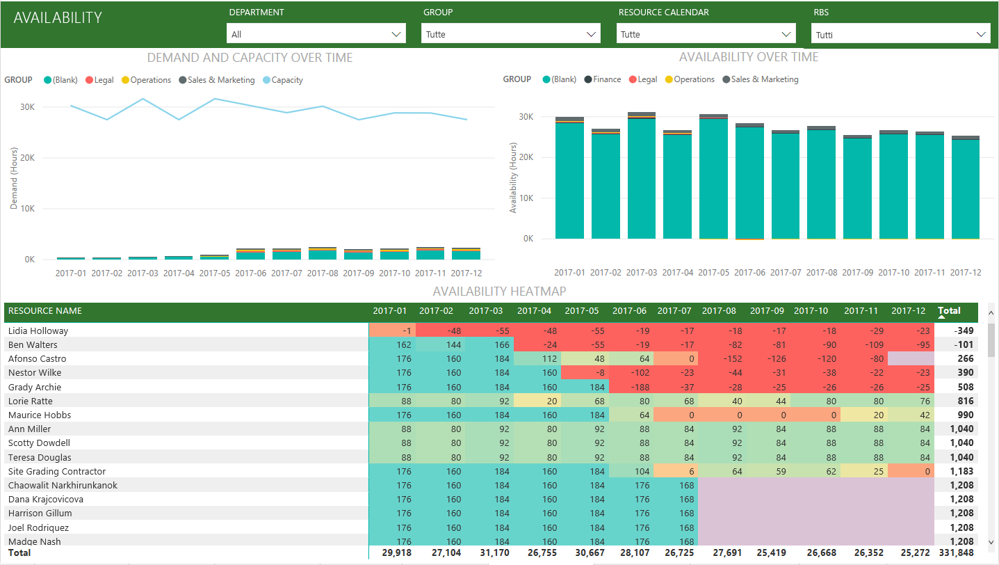
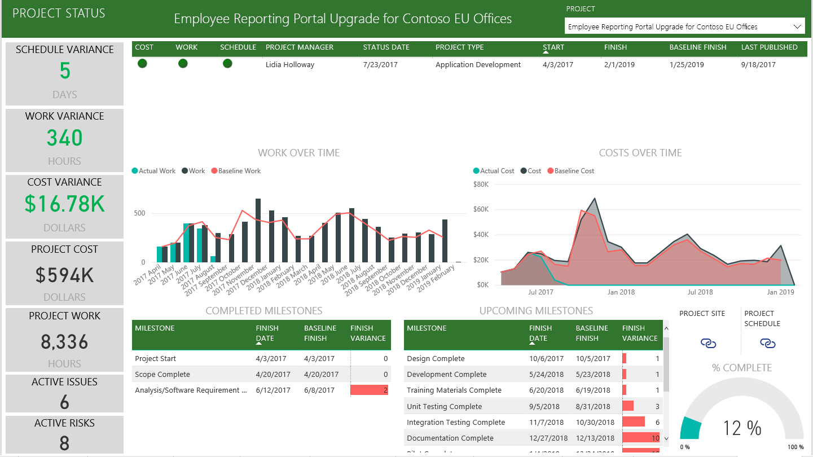

# Connettersi a Project Web App con Power BI
Microsoft Project Web App è una soluzione online flessibile per la gestione del portfolio di progetti (PPM) e le attività quotidiane. Consente alle organizzazioni di essere operative da subito, definire le priorità degli investimenti nel portfolio di progetti e offrire i vantaggi aziendali attesi. L'app modello di Project Web App per Power BI consente di recuperare informazioni dettagliate da Project Web App per la gestione di progetti, portfolio e risorse.

Connettersi all'[app modello di Project Web App](https://appsource.microsoft.com/product/power-bi/pbi_msprojectonline.pbi-microsoftprojectwebapp) per Power BI.

## Come connettersi

1. Selezionare **App** nel riquadro di spostamento e quindi **Scarica app** nell'angolo in alto a destra.

    

2. Nella casella **Servizi** selezionare **Recupera**.
   
   
3. In AppSource selezionare la scheda **App** e cercare e selezionare **Microsoft Project Web App**.
   
4. Verrà visualizzato il messaggio **Installare questa app di Power BI?** Selezionare **Installa**. 

   
5. Nel riquadro **App** selezionare **Microsoft Project Web App**. 
   
   
6. In **Operazioni iniziali con la nuova app** selezionare **Connetti dati**.
   
   
7. Nella casella di testo **URL Project Web App** immettere l'URL per l'istanza di Project Web App a cui connettersi.  Si noti che questo può differire dall'esempio se è presente un dominio personalizzato. Nella casella di testo **Lingua sito PWA**, digitare il numero corrispondente alla lingua scelta per il sito Project Web Access. Digitare la cifra "1" per l'inglese, "2" per il francese, "3" per il tedesco, "4" per il portoghese (Brasile), " 5" per portoghese (Portogallo) e "6" per lo spagnolo. 
   
   
8. Per Metodo di autenticazione selezionare **oAuth2** \> **Accedi**. Quando richiesto, immettere le credenziali di Project Web App e seguire il processo di autenticazione.

    > [!NOTE]
    > È necessario avere Visualizzatore portfolio, Program Manager o le autorizzazioni di amministratore per l'istanza di Project Web App a cui ci si connette.

9. Una notifica indicherà che è in corso il caricamento dei dati. A seconda delle dimensioni dell'account l'operazione potrebbe richiedere alcuni minuti. Quando Power BI ha terminato di importare i dati, verrà visualizzato il contenuto della nuova area di lavoro. Può essere necessario aggiornare il set di dati per ottenere gli aggiornamenti più recenti. 

    Dopo l'importazione dei dati in Power BI, nel riquadro di spostamento vengono visualizzati il report con 13 pagine e il set di dati. 

10. Una volta pronti i report, si può iniziare a esplorare i dati di Project Web App. L'app modello contiene 13 pagine di report avanzate e dettagliate per la panoramica portfolio (6 pagine di report), panoramica risorse (5 pagine di report) e stato progetto (2 pagine di report). 

    
   
    
   
    

**Altre operazioni**

* Anche se la pianificazione prevede che il set di dati venga aggiornato quotidianamente, è possibile modificarne la frequenza di aggiornamento o provare ad aggiornarlo su richiesta usando **Aggiorna ora**.

**Espandere l'app modello**

Scaricare il [file PBIT GitHub](https://github.com/OfficeDev/Project-Power-BI-Content-Packs) per personalizzare e aggiornare ulteriormente il pacchetto di contenuto.

## Passaggi successivi
[Introduzione a Power BI](service-get-started.md)

[Recuperare dati in Power BI](service-get-data.md)

