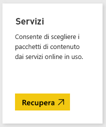
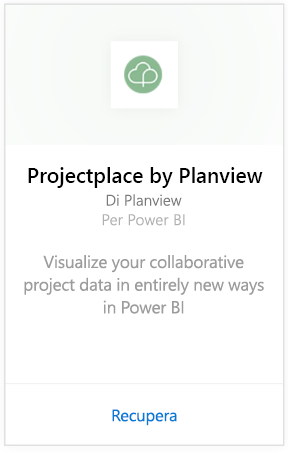
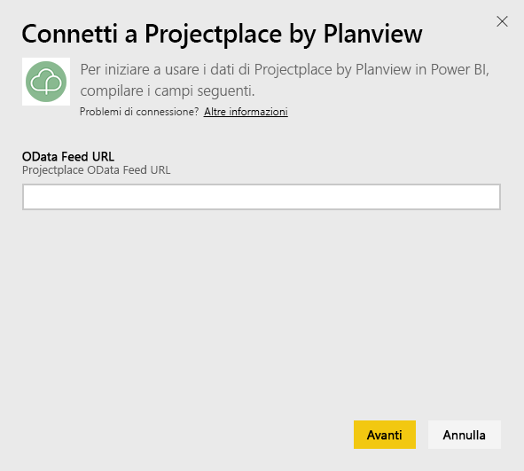
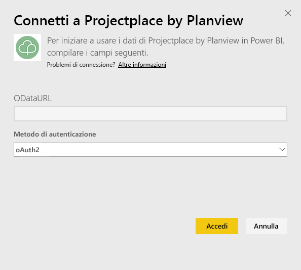
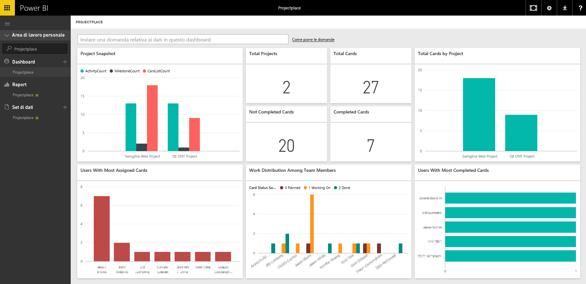

# Connettersi a Projectplace di Planview con Power BI
Con il pacchetto di contenuto Projectplace di Planview è possibile visualizzare i dati di un progetto di collaborazione in modi del tutto nuovi direttamente in Power BI. Usare le credenziali di accesso a Projectplace per visualizzare in modo interattivo statistiche di progetto di importanza fondamentale, scoprire chi sono i membri del team più attivi e produttivi e identificare schede e le attività a rischio per i progetti nell'account Projectplace. È anche possibile estendere il dashboard e i report predefiniti per ottenere le informazioni più importanti.

[Connettersi al pacchetto di contenuto Projectplace per Power BI](https://app.powerbi.com/getdata/services/projectplace)

>[!NOTE]
>Per importare i dati di Projectplace in Power BI è necessario essere un utente di Projectplace. Vedere i requisiti aggiuntivi indicati di seguito.

## Come connettersi
1. Selezionare **Recupera dati** nella parte inferiore del riquadro di spostamento sinistro.
   
    
2. Nella casella **Servizi** selezionare **Recupera**.
   
    
3. Nella pagina di Power BI, selezionare **Projectplace by Planview**, quindi selezionare **Recupera**:  
   
    
4. Nella casella di testo URL feed OData immettere l'URL per il feed OData di Projectplace che si vuole usare, come illustrato nella figura seguente:
   
    
5. Nell'elenco di Metodo di autenticazione, selezionare **OAuth** se non è già selezionato. Premere **Accedi** e seguire il flusso di accesso.  
   
   
6. Nel riquadro a sinistra, selezionare **Projectplace** dall'elenco dei dashboard. Power BI Importa i dati di Projectplace nel dashboard. Si noti che il caricamento dei dati può richiedere un po' di tempo.  
   
    Il dashboard contiene riquadri che consentono di visualizzare i dati dal database Projectplace. L'immagine seguente illustra un esempio del dashboard Projectplace predefinito in Power BI.
   
    

**Altre operazioni**

* Provare a [porre una domanda nella casella Domande e risposte](power-bi-q-and-a.md) nella parte superiore del dashboard
* [Cambiare i riquadri](service-dashboard-edit-tile.md) nel dashboard.
* [Selezionare un riquadro](service-dashboard-tiles.md) per aprire il report sottostante.
* Anche se la pianificazione prevede che il set di dati venga aggiornato quotidianamente, è possibile modificare la frequenza di aggiornamento o provare ad aggiornarlo su richiesta usando **Aggiorna ora**

## Requisiti di sistema
Per importare i dati di Projectplace in Power BI è necessario essere un utente di Projectplace. Questa procedura presuppone che sia stato già effettuato l'accesso alla home page di Microsoft Power BI con un account Power BI. Se non si ha un account Power BI, creare un nuovo account Power BI gratuito nella home page di Power BI e quindi fare clic su Recupera dati.

## Passaggi successivi
[Introduzione a Power BI](service-get-started.md)

[Power BI - Concetti di base](service-basic-concepts.md)

