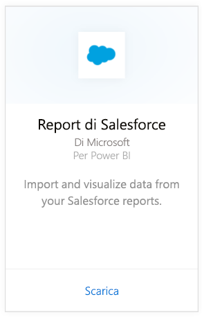
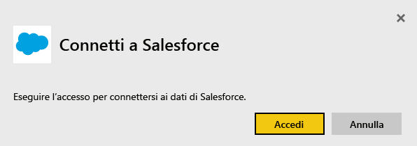
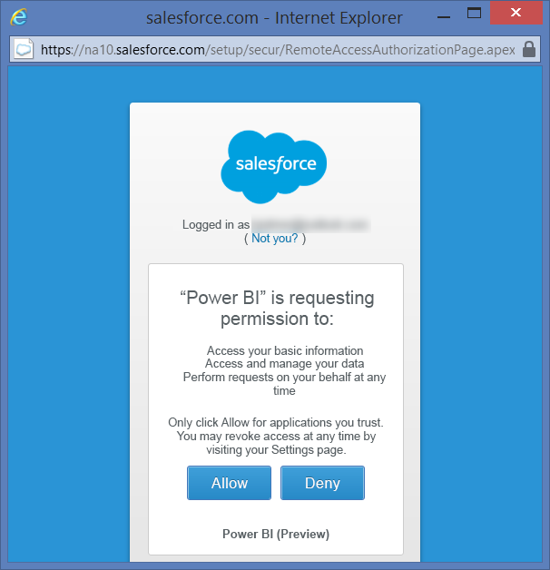
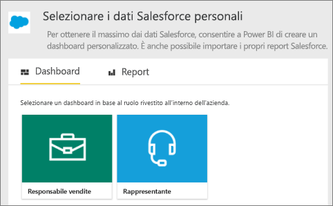
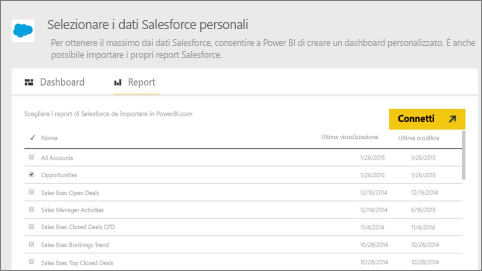
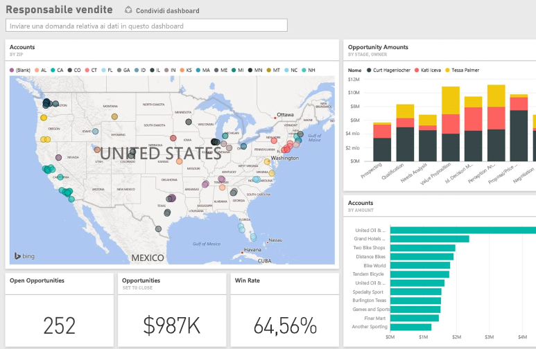

# Connettersi a Salesforce con Power BI
Con Power BI è possibile connettersi facilmente all'account di Salesforce.com. La creazione di questa connessione consente di recuperare i dati e di disporre automaticamente di un dashboard e dei report correlati basati sui dati.

Connettersi al [pacchetto di contenuto Salesforce](https://app.powerbi.com/getdata/services/salesforce) per Power BI oppure leggere altre informazioni sull'[integrazione di Salesforce](https://powerbi.microsoft.com/integrations/salesforce) con Power BI.

## Come connettersi
1. Selezionare **Recupera dati** nella parte inferiore del riquadro di spostamento sinistro.
   
    
2. Nella casella **Servizi** selezionare **Recupera**.
   
    
3. Fare clic su **Salesforce** e selezionare **Recupera**.  
   
   
4. Selezionare **Accedi** per avviare il flusso di accesso.
   
    
5. Quando richiesto, immettere le credenziali di Salesforce. Fare clic su **Consenti** per permettere a Power BI di accedere alle informazioni e ai dati di base di Salesforce.
   
   
6. Per configurare gli elementi da importare in Power BI, usare l'opzione dell'elenco a discesa:
   
   * **Dashboard**
     
     Selezionare un dashboard predefinito in base a un utente tipo, ad esempio **Responsabile vendite**. Questi dashboard consentono di importare un set specifico di dati standard da Salesforce e non includeranno campi personalizzati.
     
     
   * **Report**
     
     Selezionare uno o più report personalizzati dell'account di Salesforce. Questi report corrisponderanno alle visualizzazioni in Salesforce e possono includere dati di oggetti o campi personalizzati.
     
     
     
     Se non viene visualizzato alcun report, aggiungerli o crearli nell'account di Salesforce e provare nuovamente a connettersi.
7. Fare clic su **Connetti** per avviare il processo di importazione. Durante l'importazione viene visualizzata una notifica che indica che l'operazione è in corso. Una volta completata l'importazione, vengono visualizzati un dashboard, report e set di dati per i dati di Salesforce elencati nel riquadro di spostamento sinistro.
   
   

È possibile modificare il dashboard per visualizzare i dati nel modo desiderato. È possibile porre una domanda in Domande e risposte o fare clic su un riquadro per [aprire il report sottostante](service-dashboard-tiles.md) e [modificare i riquadri](service-dashboard-edit-tile.md) nel dashboard.

**Altre operazioni**

* Provare a [porre una domanda nella casella Domande e risposte](service-q-and-a.md) nella parte superiore del dashboard
* [Cambiare i riquadri](service-dashboard-edit-tile.md) nel dashboard
* [Selezionare un riquadro](service-dashboard-tiles.md) per aprire il report sottostante
* Anche se la pianificazione prevede che il set di dati venga aggiornato quotidianamente, è possibile modificare la frequenza di aggiornamento o provare ad aggiornarlo su richiesta usando **Aggiorna ora**

## Requisiti di sistema
* Connessione effettuata con un account di Salesforce con accesso API abilitato
* Autorizzazione concessa all'app Power BI durante l'accesso
* Account con un numero di chiamate API disponibili sufficiente per eseguire il pull e aggiornare i dati
* Un token di autenticazione valido è necessario per l'aggiornamento. Assicurarsi di non importare più di cinque set di dati di Salesforce, perché Salesforce prevede un limite di cinque token di autenticazione per applicazione.

## Risoluzione dei problemi
Se si verificano errori, esaminare i requisiti riportati sopra. Tenere anche presente che attualmente non è supportato l'accesso a un dominio personalizzato o sandbox.

## Passaggi successivi
[Introduzione a Power BI](service-get-started.md)

[Recuperare i dati](service-get-data.md)

