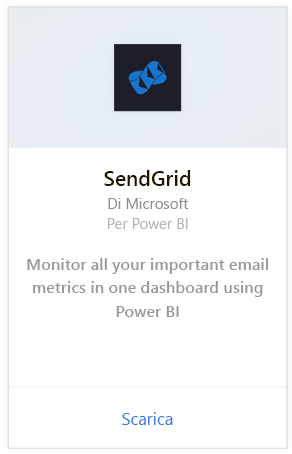
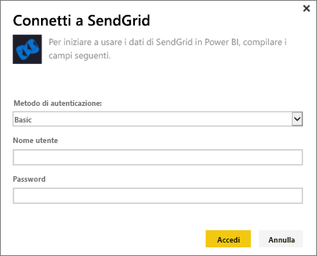
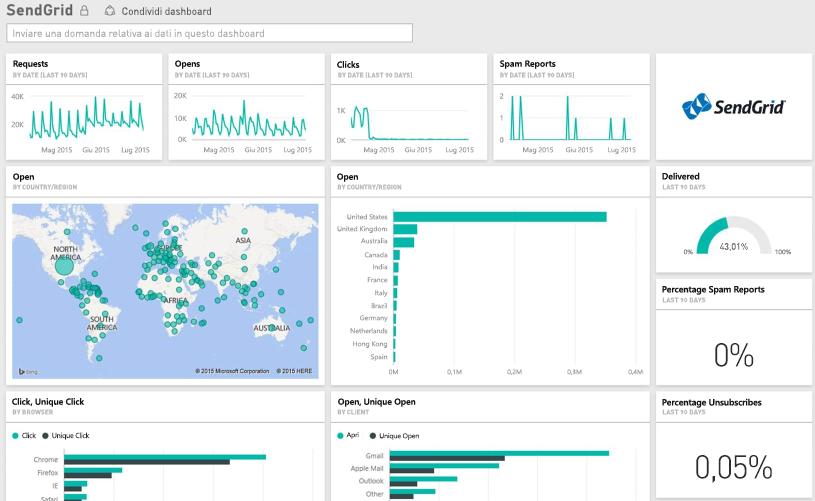

# Connettersi a SendGrid con Power BI
Il pacchetto di contenuto di Power BI per SendGrid consente di estrarre informazioni dettagliate e statistiche dal account di SendGrid. Grazie al pacchetto di contenuto SendGrid è possibile visualizzare le statistiche di SendGrid in un dashboard.

Connettersi al [pacchetto di contenuto SendGrid](https://app.powerbi.com/getdata/services/sendgrid) per Power BI.

## Come connettersi
1. Selezionare **Recupera dati** nella parte inferiore del riquadro di spostamento sinistro.
   
    
2. Nella casella **Servizi** selezionare **Recupera**.
   
    
3. Selezionare il pacchetto di contenuto **SendGrid** e fare clic su **Recupera**.
   
    
4. Quando richiesto, specificare nome utente e password di SendGrid. Selezionare **Accedi**.
   
   
5. Dopo l'importazione dei dati in Power BI, nel riquadro di spostamento sinistro vengono visualizzati il nuovo dashboard, il nuovo report e il nuovo set di dati, popolato con le statistiche relative ai messaggi di posta elettronica degli ultimi 90 giorni. I nuovi elementi sono contrassegnati con un asterisco giallo \*.
   
   

**Altre operazioni**

* Provare a [porre una domanda nella casella Domande e risposte](power-bi-q-and-a.md) nella parte superiore del dashboard
* [Cambiare i riquadri](service-dashboard-edit-tile.md) nel dashboard.
* [Selezionare un riquadro](service-dashboard-tiles.md) per aprire il report sottostante.
* Anche se la pianificazione prevede che il set di dati venga aggiornato quotidianamente, è possibile modificare la frequenza di aggiornamento o provare ad aggiornarlo su richiesta usando **Aggiorna ora**

## Cosa è incluso
Nel dashboard di SendGrid vengono visualizzate le statistiche seguenti:

* Statistiche generali sulla posta elettronica, ovvero richieste, messaggi recapitati e non recapitati, messaggi di posta indesiderata bloccati, rapporti sui messaggi di posta indesiderata e così via.
* Statistiche sulla posta elettronica ordinate per categoria
* Statistiche sulla posta elettronica ordinate per area geografica
* Statistiche sulla posta elettronica ordinate per ISP
* Statistiche sulla posta elettronica ordinate per dispositivo, client e browser

## Passaggi successivi
[Introduzione a Power BI](service-get-started.md)

[Recuperare i dati](service-get-data.md)

