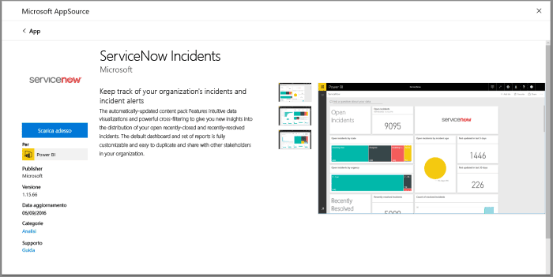
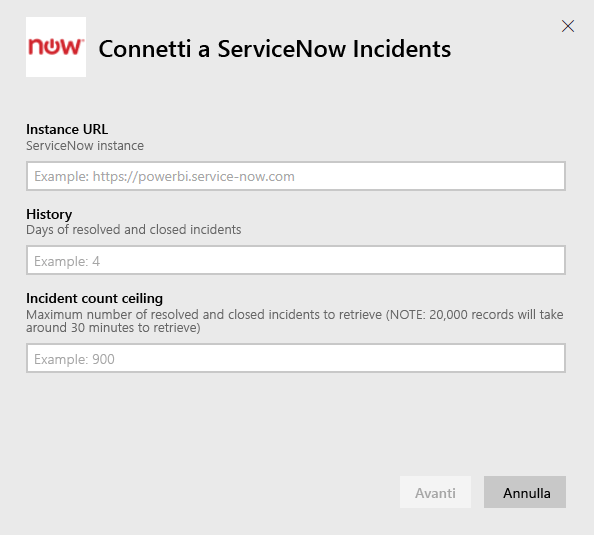
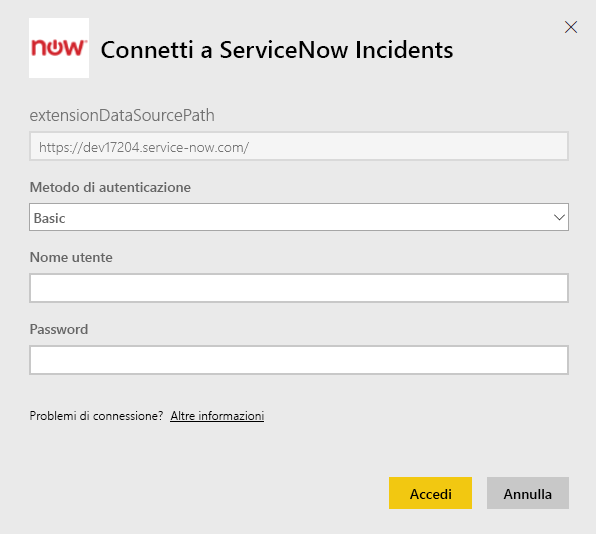
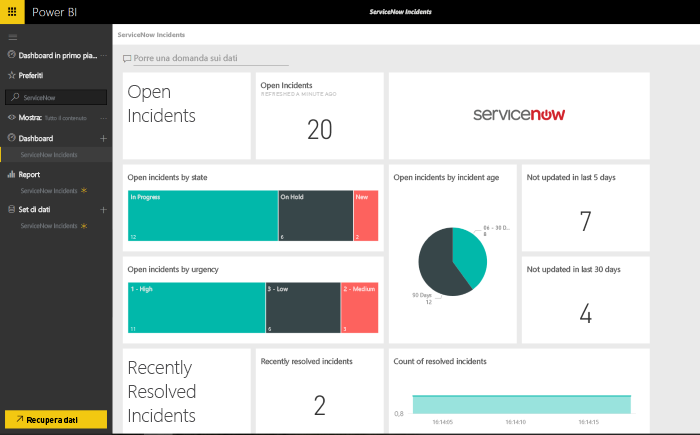

# Connettersi a ServiceNow con Power BI per la segnalazione di eventi imprevisti
ServiceNow offre più prodotti e soluzioni per la gestione commerciale, operativa e IT che consentono di migliorare il business. Questo pacchetto di contenuto include vari report e approfondimenti sugli eventi aperti, risolti di recente e chiusi di recente.  

Connettersi al pacchetto di contenuto Power BI per [ServiceNow Incidents](https://app.powerbi.com/getdata/services/servicenow).

## Come connettersi
1. Selezionare **Recupera dati** nella parte inferiore del riquadro di spostamento sinistro.
   
    
2. Nella casella **Servizi** selezionare **Recupera**.
   
    
3. Selezionare **ServiceNow Incidents** \> **Scarica**.
   
   
4. Specificare l'URL dell'istanza di ServiceNow e l'intervallo di giorni/record da includere. Tenere presente che l'importazione si interrompe quando viene raggiunto un limite.
   
   
5. Quando richiesto, immettere le credenziali **Basic** per ServiceNow. Si noti che l'accesso Single Sign-On non è attualmente supportato. Più avanti sono fornite informazioni più dettagliate sui requisiti di sistema.
   
   
6. Al termine del flusso di accesso, verrà avviato il processo di importazione. Al termine nel riquadro di spostamento verranno visualizzati un nuovo dashboard, un nuovo report e un nuovo set di dati. Selezionare il dashboard per visualizzare i dati importati.
   
    

**Altre operazioni**

* Provare a [porre una domanda nella casella Domande e risposte](power-bi-q-and-a.md) nella parte superiore del dashboard
* [Cambiare i riquadri](service-dashboard-edit-tile.md) nel dashboard.
* [Selezionare un riquadro](service-dashboard-tiles.md) per aprire il report sottostante.
* Anche se la pianificazione prevede che il set di dati venga aggiornato quotidianamente, è possibile modificare la frequenza di aggiornamento o provare ad aggiornarlo su richiesta usando **Aggiorna ora**

## Requisiti di sistema
Per connettersi è necessario:  

* Un account che abbia accesso a yourorganization.service-now.com con l'autenticazione di base (l'accesso Single Sign-On non è supportato in questa versione)  
* Un account con il ruolo rest_service e l'accesso in lettura alla tabella degli eventi  

## Risoluzione dei problemi
Se si verifica un errore relativo alle credenziali durante il caricamento, esaminare i requisiti di accesso riportati sopra. Se si hanno le autorizzazioni appropriate ma i problemi persistono, rivolgersi all'amministratore di ServiceNow per ottenere le autorizzazioni aggiuntive che potrebbero essere necessarie per l'istanza personalizzata.

Se il caricamento richiede molto tempo, verificare il numero di eventi e il numero di giorni specificati durante la connessione e provare a ridurli.

## Passaggi successivi
[Introduzione a Power BI](service-get-started.md)

[Power BI - Concetti di base](service-basic-concepts.md)

