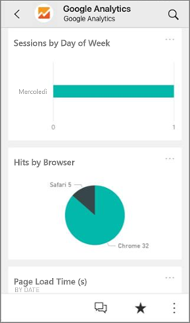
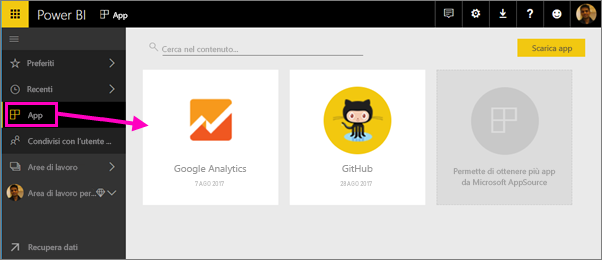
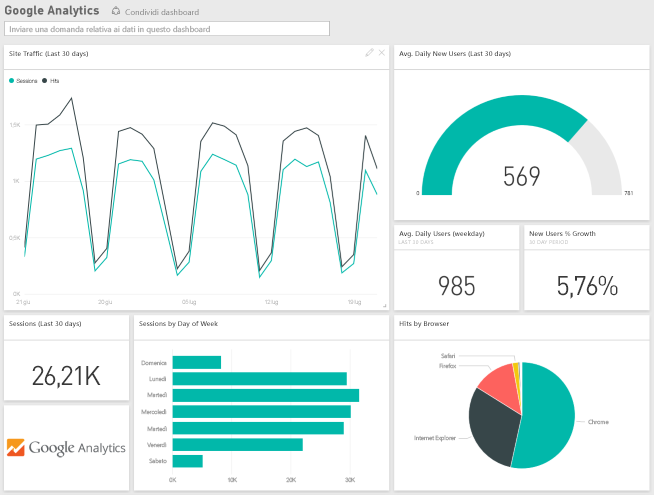
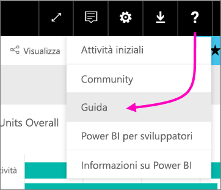

# Connettersi ai servizi usati con Power BI
È possibile connettersi a una serie di servizi usati per gestire l'attività aziendale, ad esempio Salesforce, Microsoft Dynamics e Google Analytics. Power BI inizia usando le credenziali dell'utente per connettersi al servizio e quindi crea un'app di Power BI con un dashboard e un set di report di Power BI che visualizzano automaticamente i dati e forniscono informazioni grafiche dettagliate sull'azienda.

Accedere a Power BI per visualizzare tutti i [servizi ai quali è possibile connettersi](https://app.powerbi.com/getdata/services). Il team di Power BI aggiunge regolarmente nuovi servizi.

Dopo aver installato l'app è possibile visualizzare dashboard e report nel servizio Power BI ([https://powerbi.com](https://powerbi.com)) e nelle app per dispositivi mobili di Power BI. 

## Attività iniziali
[!INCLUDE [powerbi-service-apps-get-more-apps](./includes/powerbi-service-apps-get-more-apps.md)]

## Visualizzare il dashboard e i report
Al termine dell'importazione, la nuova app verrà visualizzata nella pagina App.

1. Selezionare **App** nel riquadro di spostamento a sinistra e selezionare l'app.
   
     
2. È possibile porre una domanda digitandola in Domande e risposte o fare clic su un riquadro per aprire il report sottostante. 
   
    
   
    È possibile filtrare ed evidenziare i dati nel report, ma non è possibile salvare le modifiche.

## Cosa è incluso
Dopo la connessione a un servizio verrà visualizzata un'app appena creata con un dashboard, report e un set di dati. I dati del servizio sono incentrati su uno scenario specifico e potrebbero non includere tutte le informazioni del servizio. I dati vengono aggiornati automaticamente una volta al giorno. È possibile gestire la pianificazione selezionando il set di dati.

È anche possibile usare [Power BI Desktop](desktop-get-the-desktop.md) per connettersi ad alcuni servizi, ad esempio Google Analytics, e creare dashboard e report personalizzati.  

Per maggiori dettagli sulla connessione a servizi specifici, vedere le pagine della Guida.

## Risoluzione dei problemi
**Riquadri vuoti**  
Mentre Power BI si connette al servizio per la prima volta, nel dashboard può essere visualizzato un set di riquadri vuoti. Se viene ancora visualizzato un dashboard vuoto dopo 2 ore, è probabile che la connessione non sia riuscita. Se non è stato visualizzato un messaggio di errore con le informazioni sulla risoluzione del problema, inviare un ticket di supporto.

* Selezionare l'icona del punto interrogativo (**?**) nell'angolo superiore destro e scegliere **Guida**.
  
    

**Informazioni mancanti**  
Il dashboard e i report includono contenuto del servizio incentrato su uno scenario specifico e non includono tutte le informazioni del servizio. Se nel pacchetto di contenuto manca una metrica specifica, aggiungere una proposta nella pagina del [Supporto di Power BI](https://support.powerbi.com/forums/265200-power-bi).

## Consigli per servizi
Se l'utente usa un servizio che vorrebbe suggerire per un'app di Power BI, può segnalarlo nella pagina del [Supporto di Power BI](https://support.powerbi.com/forums/265200-power-bi).

Se si usa un servizio per il quale si vorrebbe compilare un'app, è possibile [inviare la candidatura](https://azure.microsoft.com/marketplace/programs/certified/apply/) e selezionare "Pubblicare un pacchetto di contenuto di Power BI" per iniziare.

## Passaggi successivi
* [Cosa sono le app in Power BI?](service-install-use-apps.md)
* [Recuperare dati in Power BI](service-get-data.md)
* Altre domande? [Provare a rivolgersi alla community di Power BI](http://community.powerbi.com/)

