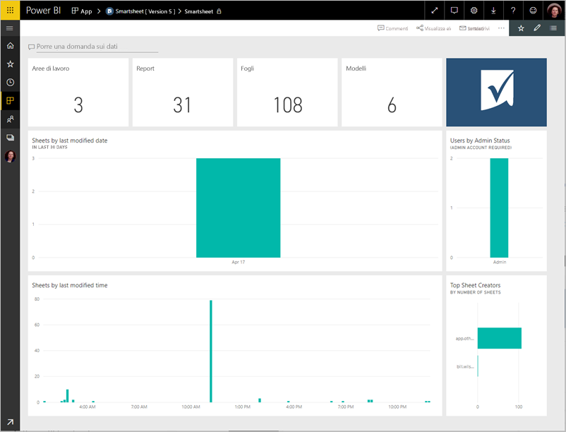
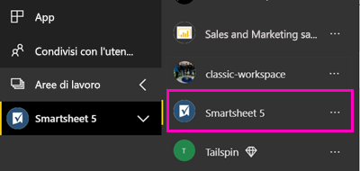
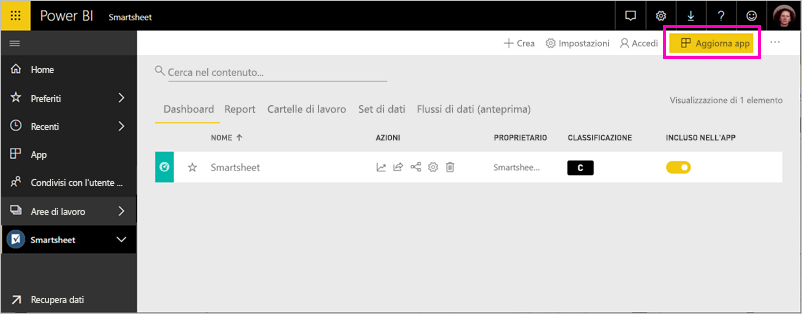

# Connettersi a Smartsheet con Power BI
Questo articolo illustra il pull dei dati dall'account di Smartsheet con un'app di modello di Power BI. Smartsheet offre una piattaforma semplice per la collaborazione e la condivisione di file. L'app di modello Smartsheet per Power BI offre un dashboard, report e set di dati che mostra una panoramica del proprio account Smartsheet. È anche possibile usare [Power BI Desktop](desktop-connect-to-data.md) per connettersi direttamente a singoli fogli nell'account. 

Dopo aver installato l'app per il modello, è possibile modificare il dashboard e report. Quindi è possibile distribuirla come app per i colleghi all'interno dell'organizzazione.

Connettere il [Smartsheet modello app](https://app.powerbi.com/groups/me/getdata/services/smartsheet) per Power BI.

>[!NOTE]
>Un account amministratore Smartsheet è preferito per la connessione e il caricamento dell'app di modello di Power BI perché dispone di accesso aggiuntivo.

## Come connettersi

[!INCLUDE [powerbi-service-apps-get-more-apps](./includes/powerbi-service-apps-get-more-apps.md)]

3. Selezionare **Smartsheet** \> **Scarica adesso**.
4. Nelle **installare questa App di Power BI?** selezionate **installare**.
4. Nel **Apps** riquadro, selezionare la **Smartsheet** riquadro.

    

6. Nelle **iniziare con la nuova app**, selezionare **connettere dati**.

    

4. In Metodo di autenticazione selezionare **oAuth2 \> Accedi**.
   
   Quando richiesto, immettere le credenziali di Smartsheet e seguire il processo di autenticazione.
   
   
   
   

5. Dopo che Power BI Importa i dati, viene aperto il dashboard di Smartsheet.
   
   

## Modificare e distribuire l'app

È stata installata l'app di modello Smartsheet. Ciò significa che è inoltre stata creata l'area di lavoro di app di Smartsheet. Nell'area di lavoro, è possibile modificare il report e dashboard e quindi distribuirlo come una *app* ai colleghi all'interno dell'organizzazione. 

1. Per visualizzare tutto il contenuto dell'area di lavoro nuovo Smartsheet, nella barra di spostamento a sinistra, selezionare **aree di lavoro** > **Smartsheet**. 

    

    Questa vista è l'elenco di contenuto per l'area di lavoro. Nell'angolo superiore destro, vedrai **Aggiorna app**. Quando si è pronti per distribuire l'app con i colleghi, ovvero si apprenderà come iniziare. 

    

2. Selezionare **Reports** e **i set di dati** per visualizzare gli altri elementi nell'area di lavoro.

    Conoscenza [distribuzione di app](service-create-distribute-apps.md) ai colleghi.

## Cosa è incluso
Smartsheet modello app per Power BI include una panoramica dell'account di Smartsheet, ad esempio il numero di aree di lavoro, report e fogli di stile è disponibile, modifica e così via. Gli utenti amministratori visualizzate anche alcune informazioni sugli utenti del proprio sistema, ad esempio principali creatori di fogli.  

Per connettersi direttamente a singoli fogli nell'account, è possibile usare il connettore Smartsheet in [Power BI Desktop](desktop-connect-to-data.md).  

## Passaggi successivi

* [Creare le nuove aree di lavoro in Power BI](service-create-the-new-workspaces.md)
* [Installare e usare app in Power BI](consumer/end-user-apps.md)
* [Connettersi all'app di Power BI per servizi esterni](service-connect-to-services.md)
* Domande? [Provare a rivolgersi alla community di Power BI](http://community.powerbi.com/)